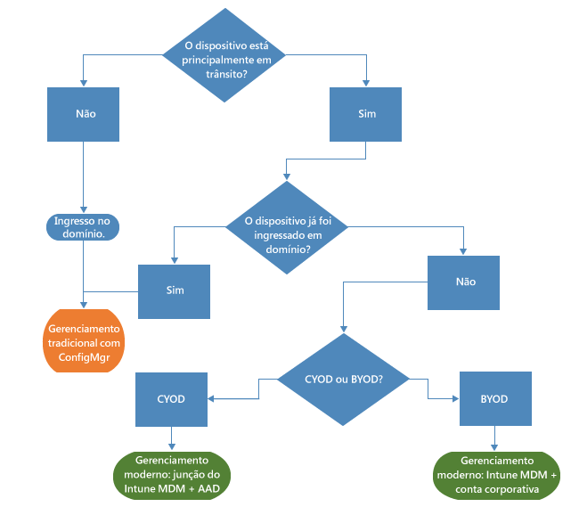
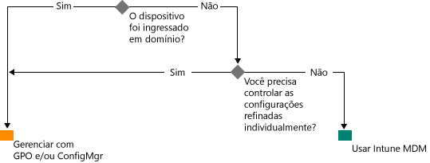

# Caminho para o gerenciamento do Windows Moderno com o Microsoft Intune

O uso de dispositivos pessoais para o trabalho, bem como os funcionários que trabalham fora do escritório, está mudando a forma como as organizações gerenciam dispositivos. Enquanto determinadas partes de algumas organizações podem exigir um controle mais profundo e granular dos dispositivos, outras empresas estão adotando um gerenciamento mais leve, baseado em cenários, que capacita a força de trabalho moderna.

O Windows 10 dá continuidade à tradição do Windows de fornecer os sistemas operacionais com o melhor gerenciamento para organizações. O Windows dá suporte a um gerenciamento e uma segurança profundos por meio de tecnologias como Política de Grupo, Active Directory e System Center Configuration Manager. Ele também oferece uma abordagem que prioriza os dispositivos móveis e a nuvem, com um gerenciamento simplificado e moderno que usa soluções de gerenciamento de dispositivos baseados em nuvem, como o Microsoft EMS (Enterprise Mobility Suite). Inovações futuras do Windows, fornecidas pelo Windows como serviço, são complementadas por serviços de nuvem que se movem de forma veloz, como o Microsoft Intune, o Azure Active Directory, o Azure Rights Management Service, o Office 365 e a Windows Store para Empresas.

As organizações de TI têm maior flexibilidade, com oportunidades de se beneficiarem com a inovação e a economia de custos. Este documento oferece diretrizes sobre estratégias para implantar e gerenciar o Windows 10. Ele também fornece insights sobre o pensamento estratégico da Microsoft com relação às ferramentas de gerenciamento de dispositivos. Enquanto pensa nas bases do gerenciamento e como você deseja aplicá-las a dispositivos diferentes, leve em consideração os quatro estágios do ciclo de vida do dispositivo a seguir:

## Implantação e provisionamento

Diferente da implantação tradicional do SO, que exige complexas operações de TI, o gerenciamento de dispositivos moderno abre as portas para o "gerenciamento pronto para uso". A TI quer transformar com facilidade novos dispositivos em dispositivos totalmente configurados e totalmente gerenciados, sem refazer imagens.  O provisionamento dinâmico nunca foi tão fácil, com a tecnologia de serviços de gerenciamento de dispositivos baseados em nuvem como o Microsoft Intune. Você também pode criar pacotes de provisionamento independentes com o ICD (Designer de Configuração e Imagens) do Windows. É claro que ainda damos suporte a técnicas tradicionais de geração de imagens, de modo que as organizações podem implantar imagens personalizadas usando o System Center Configuration Manager.

## Identidade e autenticação

O Windows 10 e serviços como o Azure Active Directory abrem novas possibilidades para identidade, a autenticação e o gerenciamento baseados em nuvem. Cenários como BYOD e CYOD estão fazendo com que as empresas repensem a forma como os usuários acessam aplicativos e recursos corporativos. Você pode imaginar o gerenciamento de usuários e dispositivos se enquadrando nestas duas categorias:

- Dispositivos corporativos (CYOD) ou pessoais (BYOD) usados por usuários móveis para aplicativos SaaS como o Office 365.

  O Windows 10 permite o autoprovisionamento dos dispositivos pelos funcionários. Dispositivos corporativos podem configurar facilmente o acesso corporativo com o Ingresso do Azure AD. Da mesma forma, uma nova experiência simplificada de BYOD permite aos usuários adicionar sua conta de trabalho ao Windows e acessar recursos de trabalho em dispositivos pessoais. A combinação do Ingresso do Azure AD e do registro automático do MDM do Intune leva os dispositivos ao estado de gerenciamento corporativo em [uma etapa simples](https://blogs.technet.microsoft.com/ad/2015/08/14/windows-10-azure-ad-and-microsoft-intune-automatic-mdm-enrollment-powered-by-the-cloud/), tudo na nuvem. o Ingresso do Azure AD também é uma ótima solução para funcionários temporários, parceiros ou outros funcionários em meio período. Essas contas podem ser mantidas separadas do domínio local do AD, mas ainda têm o acesso necessário a recursos corporativos.
- Computadores e tablets ingressados no domínio que usam aplicativos e recursos tradicionais que exigem autenticação ou acessam recursos altamente confidenciais ou sigilosos locais

  Dispositivos Windows 10 ingressados em um domínio do Active Directory local serão registrados automaticamente no Azure AD, de modo que os usuários podem aproveitar os benefícios adicionais da experiência do Windows 10, como logon único em recursos de nuvem e locais de todos os lugares, roaming empresarial de configurações, o Microsoft Passport for Work e o Windows Hello. Computadores e tablets ingressados no domínio devem continuar sendo gerenciados com o cliente do System Center Configuration Manager ou a Política de Grupo.

Examine as funções em sua organização. Identifique usuários ou dispositivos que exigem o Ingresso no domínio e considere passar outros usuários para o Azure AD. Você pode ler mais [neste artigo](https://azure.microsoft.com/en-us/documentation/articles/active-directory-azureadjoin-windows10-devices/) sobre como o Windows 10 e o Azure AD otimizam o acesso a recursos de trabalho em uma variedade de dispositivos e cenários.

Uma árvore de decisão generalizada pode ser semelhante a esta. Exceções se aplicam em alguns casos, é claro.

## Definições e configuração

O nível de gerenciamento necessário, os dispositivos e os dados gerenciados e os requisitos de setor podem definir seus requisitos de configuração. Enquanto isso, os funcionários frequentemente estão preocupados com a TI aplicando políticas rígidas a seus dispositivos pessoais, mas ainda querem ter acesso ao email e a documentos corporativos. O Windows 10 fornece um conjunto consistente de configurações em tablets, PCs e telefones por meio de uma camada comum de MDM. A abordagem de MDM apela para configurações que atingem a intenção do administrador sem expor todas as configurações possíveis. Por outro lado, a Política de Grupo expõe configurações refinadas que o administrador controla individualmente. Um benefício do MDM é que ele permite que os administradores apliquem configurações mais amplas de gerenciamento de aplicativo, privacidade e segurança por meio de ferramentas mais leves e eficientes. Isso faz do MDM a melhor opção para dispositivos que estão constantemente em movimento.

Muitas organizações ainda precisam gerenciar computadores ingressados no domínio em um nível granular, como as 1.500 configurações de política de grupo do Internet Explorer ou as bastante específicas regras de Firewall do Windows. Nesses casos, a Política de Grupo e o System Center Configuration Manager continuam sendo opções de gerenciamento excelentes. A Política de Grupo é a melhor maneira de configurar granularmente computadores e tablets Windows ingressados no domínio conectados à rede corporativa usando ferramentas baseadas no Windows. A Microsoft continua adicionando configurações de Política de Grupo com cada nova versão do Windows. Para uma configuração granular com implantação de software robusta, atualizações do Windows e implantação do SO, o Configuration Manager continua sendo a solução recomendada.

## Atualizar dispositivos Windows

Com o Windows como serviço, as organizações de TI não precisam mais executar complexos processos complexos de geração de imagens (limpar e carregar) com cada nova versão do Windows. Seja no CB (Branch Atual) ou no CBB (Branch Atual para Negócios), os dispositivos recebem as atualizações mais recentes de recursos e qualidade por meio de processos simples de patch, que geralmente são automáticos. O MDM com o Intune fornecem ferramentas para aplicar atualizações do Windows em computadores cliente na empresa. O Configuration Manager traz recursos avançados de gerenciamento e acompanhamento dessas atualizações, incluindo as janelas de manutenção e regras de implantação automática.

## Resumo

Enquanto pensa no caminho para o gerenciamento de dispositivos moderno em sua organização, considere os passos que você pode tomar para iniciar sua jornada.

1. **Há investimentos que você pode fazer hoje.** Quais componentes do gerenciamento de dispositivos tradicional é preciso reter e onde você pode modernizar? Quer você tome medidas para minimizar a geração de imagens personalizadas, reavaliar o gerenciamento de configurações ou rever a autenticação e a conformidade, os benefícios podem ser imediatos.

2. **Avalie os diferentes casos de uso em seu ambiente.** Há grupos de dispositivos que podem se beneficiar de um gerenciamento mais leve e simples? Dispositivos BYOD, por exemplo, são candidatos naturais para o gerenciamento baseado em nuvem. Usuários ou dispositivos que lidam com dados mais regulamentados podem exigir um domínio do AD local para autenticação. O Configuration Manager e o EMS lhe fornecem a flexibilidade de preparar a implementação de cenários de gerenciamento modernos enquanto lida com dispositivos diferentes da maneira mais apropriada para as necessidades de sua empresa. A escolha é sua.

## O que fazer em seguida

- **Avalie as necessidades de gerenciamento do seu ambiente.** Uma solução pode não atender a todas as suas necessidades, dependendo das pessoas, de sua mobilidade, dos dispositivos e dos dados que elas acessam.
- **Considere os requisitos.** Com o Windows 10, o Configuration Manager e o Enterprise Mobility Suite, você tem a flexibilidade de lidar com ferramentas de gerenciamento, geração de imagens, autenticação e configurações para qualquer cenário.
- **Dê passos pequenos.** A mudança para um gerenciamento de dispositivos moderno não precisa ser uma transformação instantânea.
- **Otimize seus investimentos existentes.** No processo de mudança do gerenciamento local tradicional para o gerenciamento baseado em nuvem moderno, tire proveito da arquitetura híbrida flexível do Configuration Manager e do Intune. Conforme recursos adicionais ficarem disponíveis no modelo de MDM/identidade de nuvem, a Microsoft está comprometida em fornecendo um caminho claro do gerenciamento tradicional ao moderno.

<!--HONumber=Sep16_HO2-->

