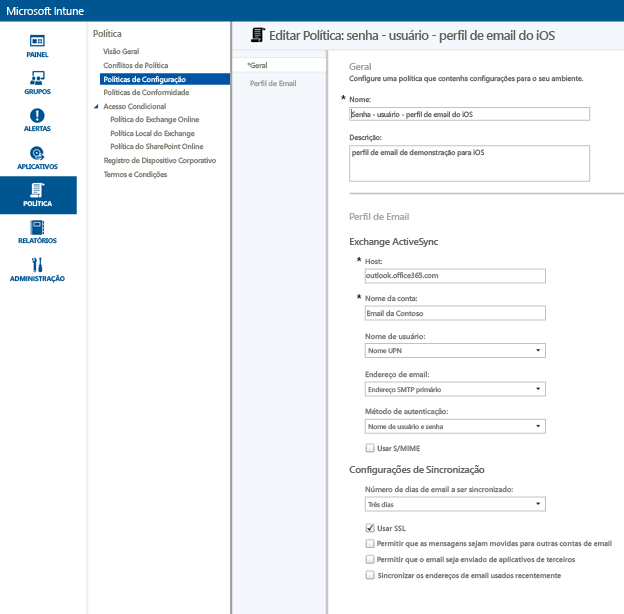
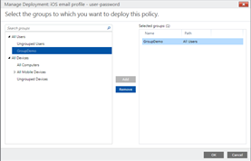
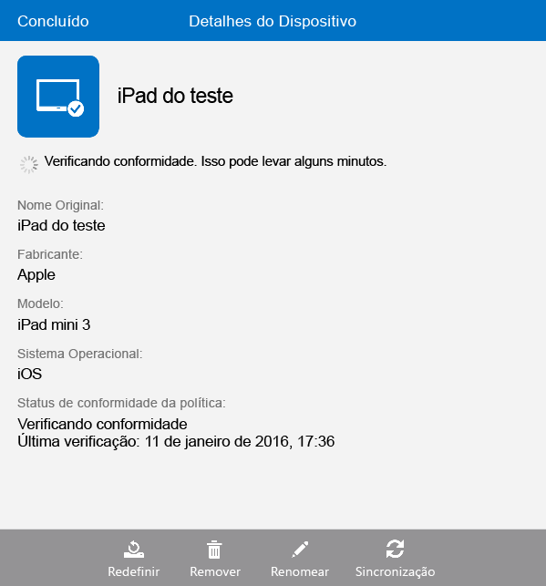

# Configurar o acesso ao email para dispositivos iOS usando o Microsoft Intune
Quando dispositivos são registrados no Intune, você pode configurá-los para que seus usuários possam acessar o email da empresa. Uma maneira de fazer isso para tipos específicos de dispositivos é criar e implantar um **perfil de email**. Perfis de email são um tipo de política do Intune que configura e conecta um dispositivo do usuário ao serviço de email da empresa.
Usar um perfil de email torna o acesso ao email automático para os dispositivos registrados, o que evita que você precise configurar o dispositivo manualmente. Um perfil de email também garante que todos os usuários finais estejam configurando o acesso da mesma maneira e com as mesmas configurações básicas.

## Objetivos deste passo a passo

- Criar e implantar um perfil de email para dispositivos iOS
- Verificar se a política de perfil de email foi aplicada com êxito

## O que é necessário antes de começar este passo a passo

- Um servidor Exchange, seja local ou hospedado no Azure como parte de sua assinatura do Office/E3.
- O nome do host do servidor do Exchange da sua empresa. Trata-se do FQDN (nome de domínio totalmente qualificado), por exemplo, **contosodemo55.onmicrosoft.com**.
- Um grupo de usuários no qual o perfil de email será implantado. Se tiver concluído o passo a passo [Start a Microsoft Intune trial and deploy iOS PIN policy (Iniciar uma avaliação do Microsoft Intune e implantar políticas de PIN iOS)](start-a-microsoft-intune-trial-and-deploy-ios-pin-policy.md), você poderá usar o grupo de usuários **GroupDemo** criado para ele.
- Dispositivos iOS registrados nos quais o perfil será implantado. Mais uma vez, se tiver concluído o passo a passo [Start a Microsoft Intune trial and deploy iOS PIN policy (Iniciar uma avaliação do Microsoft Intune e implantar políticas de PIN iOS)](start-a-microsoft-intune-trial-and-deploy-ios-pin-policy.md), você terá registrado alguns dispositivos iOS.

## Etapas para criar e implantar um perfil de email para dispositivos iOS

Para este passo a passo, usaremos o servidor Exchange hospedado que vem com uma assinatura de avaliação.
1. No console do Intune, clique em **Política** e em **Adicionar Política**.

2. Na caixa de diálogo **Criar Nova política**, expanda **iOS**, selecione **Perfil de Email** e clique em **Criar Política**.  

3. Na página de criação da política, insira um nome para a política, como **Perfil de email de iOS - usuário - senha** e uma descrição. Você pode ter vários perfis de email para diferentes tipos de dispositivos e diferentes métodos de autenticação, de modo que pode usar o nome para indicar do que se trata o perfil.
4. Insira o nome do host do Exchange. Como estamos usando o servidor Exchange hospedado no Azure, como nome do host simplesmente inserimos: **outlook.office365.com**

5. Insira o nome da conta que será exibido para os usuários do dispositivo para ajudá-los a identificar o serviço de email. Por exemplo, **Email da Contoso**.
6. Como estamos usando nome de usuário e senha para autenticar o usuário para o serviço do Exchange, deixe as configurações de usuário e senha da forma como estão.
7. Ajuste as configurações de sincronização para atender às suas necessidades. Por enquanto, basta usar os padrões, a menos que haja uma configuração específica que você deseje alterar.  
8. Clique em **Salvar Política**.
9. Será exibida uma caixa de diálogo perguntando se você deseja implantar a política agora. Clique em **Sim**.

10. Na janela que aparece em seguida, selecione o grupo de usuários no qual deseja implantar o perfil de email, clique em **Adicionar** e clique em **OK**.  
  
Após você clicar em **OK**, a política começará a fluir para os dispositivos registrados dentro de um ou dois minutos.

## Etapas para verificar se o perfil foi aplicado com êxito

Para verificar se o perfil foi aplicado, você precisará ter acesso a um dos dispositivos nos quais implantou o perfil de email.
1. No dispositivo iOS, abra o aplicativo Mail.
O aplicativo solicitará o nome de usuário e a senha do email do usuário.  

2. Insira o nome de usuário e a senha da conta de email do Exchange do usuário e toque em **OK**.
 O aplicativo Mail abre na conta do Exchange e o email começa a sincronizar com o dispositivo.

3. Verifique as configurações da conta do aplicativo Mail para certificar-se de que o nome da conta seja o mesmo que você inseriu no perfil de email (por exemplo, **Email da Contoso**) e de que as configurações de sincronização estejam definidas corretamente.

  
  Se parecer que o perfil de email não foi aplicado automaticamente ao dispositivo, você poderá aplicar a política manualmente usando o aplicativo do Portal da Empresa no dispositivo.
1. Abra o aplicativo do Portal da Empresa.
2. Toque em **Meus Dispositivos**.
3. Toque no nome de seu dispositivo.

4. Toque em **Sincronização** > **Verificar Conformidade**.
 Após alguns instantes, o perfil de email é aplicado ao dispositivo. Depois disso, você pode seguir as etapas de verificação para certificar-se de que o perfil foi aplicado corretamente.

## Consulte também
[Guia de avaliação do Intune](get-started-with-a-30-day-trial-of-microsoft-intune.md)

<!--HONumber=Jul16_HO3-->

