---
# required metadata

title: Inicie uma avaliação do Microsoft Intune e implante políticas de PIN iOS | Microsoft Intune
description:
keywords:
author: Staciebarker
manager: jeffgilb
ms.date: 04/28/2016
ms.topic: article
ms.prod:
ms.service: microsoft-intune
ms.technology:
ms.assetid: 06cb9a73-0f17-44b3-b334-86c98020316e

# optional metadata

#ROBOTS:
#audience:
#ms.devlang:
ms.reviewer: jeffgilb
ms.suite: ems
#ms.tgt_pltfrm:
#ms.custom:

---

# Inicie uma avaliação do Microsoft Intune e implante políticas de PIN iOS
Estas instruções passo a passo ajudarão você a configurar uma avaliação do Intune e configurar uma política de PIN para dispositivos iOS. Para obter uma lista das outras tarefas de avaliação comuns do Intune que você pode tentar, consulte [Common Microsoft Intune evaluation tasks (Tarefas de avaliação comuns do Microsoft Intune)](common-microsoft-intune-evaluation-tasks.md).

## Examinar os pré-requisitos para essa tarefa

-   Computador Windows com o Internet Explorer - para realizar tarefas administrativas

-   Dispositivo iOS 7.1 ou posterior para testes de validação de políticas do usuário

-   Telefone para autenticar-se durante a inscrição da avaliação

## Criar uma conta de avaliação gratuita do Intune
> [!NOTE]
> Se você já tiver uma assinatura do Intune, ignore esta seção e vá para a próxima seção.

1.  Usando um computador Windows, clique com o botão direito do mouse em **Internet Explorer** (IE) e selecione **Navegação InPrivate**.

    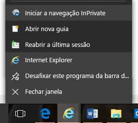

2.  Vá para o [Portal Inscrição do Intune](https://portal.office.com/Signup/Signup.aspx?OfferId=40BE278A-DFD1-470a-9EF7-9F2596EA7FF9&dl=INTUNE_A&ali=1), forneça as informações solicitadas e clique em **Avançar**.

    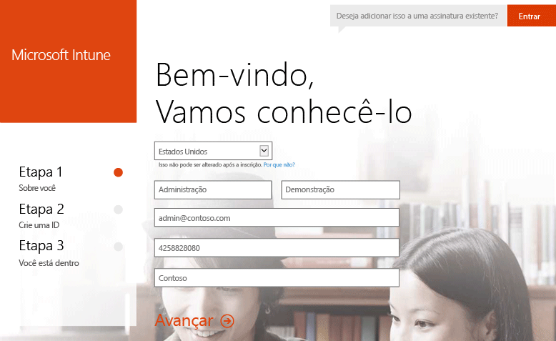

3.  Insira uma ID de usuário e senha para sua conta de administrador e clique em **Avançar**. Você usará essa ID para fazer logon no portal do Intune para fazer suas tarefas de administração.

    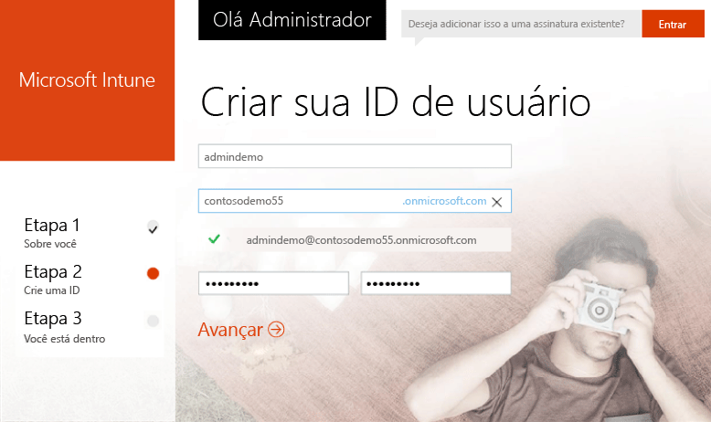

4.  Insira seu número de telefone celular e clique em **Enviar texto** para validar seu número.

    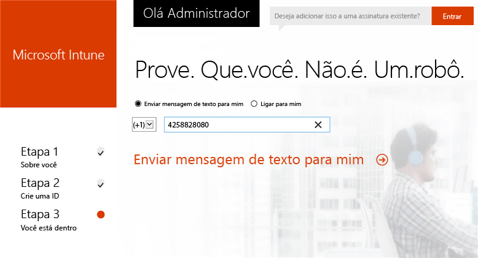

5.  Salve as informações mostradas na tela e, em seguida, clique em **Você está pronto para começar...**..

    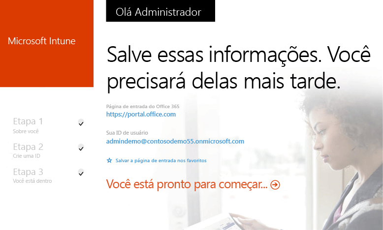

## Criar um usuário de teste

1.  Usando um computador Windows, clique em **Iniciar** para ir para a página de gerenciamento de usuário.

    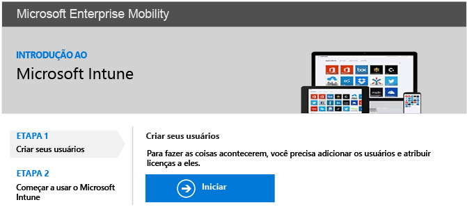

2.  Clique no botão **+** para adicionar um usuário.

    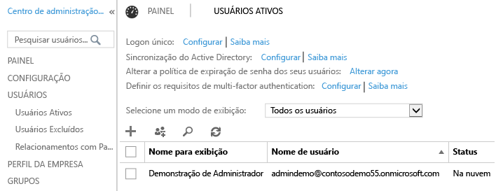

3.  Na página **Criar Nova Conta de Usuário**:

    1.  Forneça as informações de usuário de teste.

    2.  Selecione a opção **Digitar Senha**.

    3.  Desmarque a caixa de seleção **Fazer essa pessoa alterar as senhas na próxima vez que entrar**.

    4.  Clique em **Criar**.

    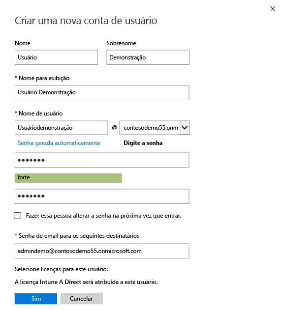

4.  Na página de confirmação de criação de usuário, clique em **Fechar**.

    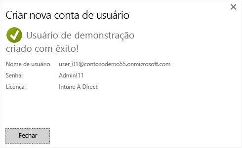

5.  Clique no botão **Atualizar** para ver o usuário de teste que você criou.

    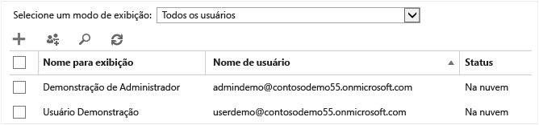

## Configurar uma política de PIN do iOS para o usuário de teste

1.  Usando um computador Windows, defina a autoridade MDM como Intune:

    1.  Vá para [Console de Gerenciamento do Intune](http://manage.microsoft.com/), faça logon com sua conta de administrador e clique em **Começar a Gerenciar Dispositivos Móveis**. A página da autoridade de Gerenciamento de Dispositivo Móvel abre.

        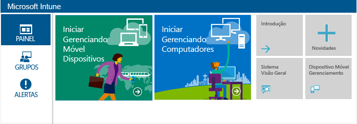

    2.  Clique no link **Definir Autoridade de Gerenciamento de Dispositivo Móvel**.

        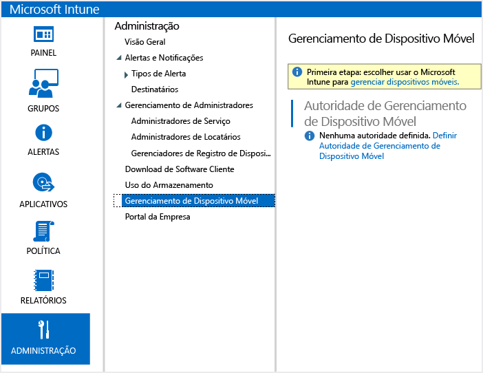

2.  Habilitar o registro de dispositivo iOS. Esse processo configura um certificado confiável entre os APNs (Apple Push Notification Service) e sua assinatura do Intune.

    1.  Clique em **Habilitar Plataforma iOS e Mac OS X**.

        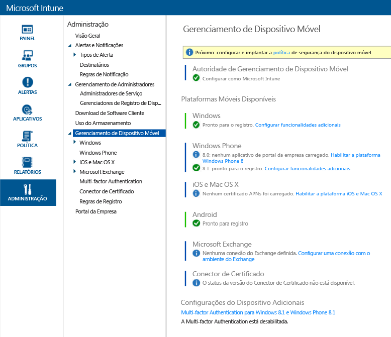

    2.  Clique em **Baixar a Solicitação de Certificado APNs**.

        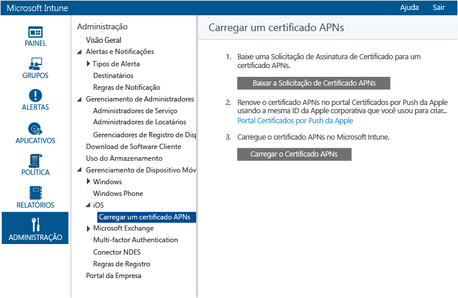

    3.  Especifique um nome de arquivo e um local para o CSR (Solicitação de Assinatura de Certificado) e, em seguida, clique em **Salvar**. Esse arquivo contém a chave pública que corresponde a uma chave privada mantida por sua assinatura do Intune.

        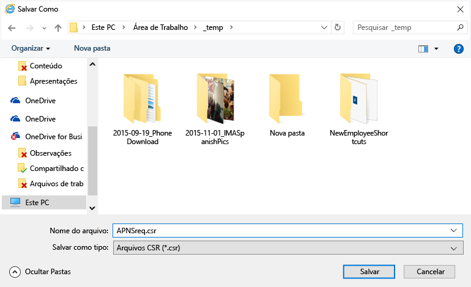

    4.  Clique em **portal Apple Push Certificates** para abrir uma nova guia.

        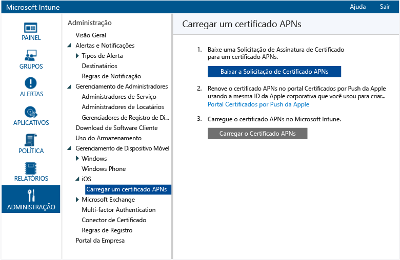

    5.  Digite sua ID Apple de usuário e a senha e clique em **Entrar**. Essa ID pode ser aquela que você usa em seu dispositivo iOS para obter aplicativos da iOS App Store.

        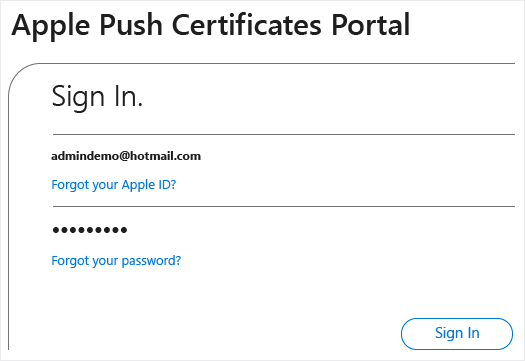

    6.  Clique em **Criar um Certificado**.

        

    7.  Leia os Termos de Uso da Apple, marque a caixa de seleção e clique em **Aceitar**.

        

    8.  Clique em **Procurar**.

        

    9. Selecione o arquivo CSR que você salvou anteriormente e clique em **Abrir**.

        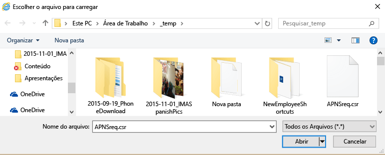

    10. Clique no botão **Carregar**.

        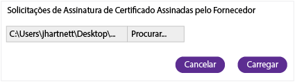

    11. Quando for solicitado a baixar um arquivo JSON, clique em **Salvar como**.

        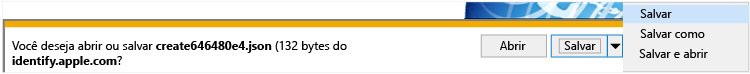

    12. Especifique um local para o arquivo JSON e clique em **Salvar**.

        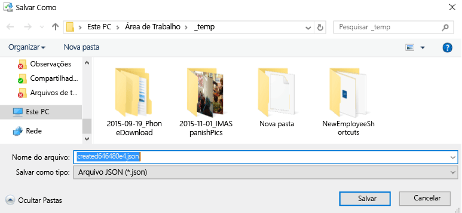

        Se sua página não for redirecionada automaticamente depois de alguns segundos, clique em **Cancelar**.

        

    13. Para recuperar o arquivo de certificado recém-criado, clique em **Baixar**.

        

    14. Quando for solicitado a baixar um arquivo PEM, clique em **Salvar como**.

        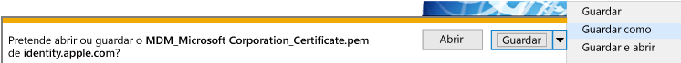

    15. Especifique um local para o arquivo PEM e clique em **Salvar**.

        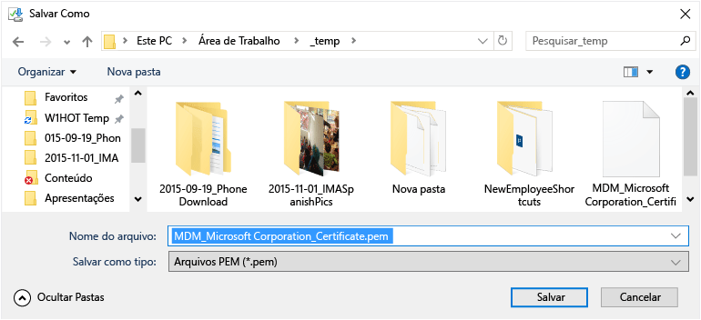

    16. Volte para a guia Console de Gerenciamento do Intune e, em seguida, clique em **Carregar Certificado APNs**.

        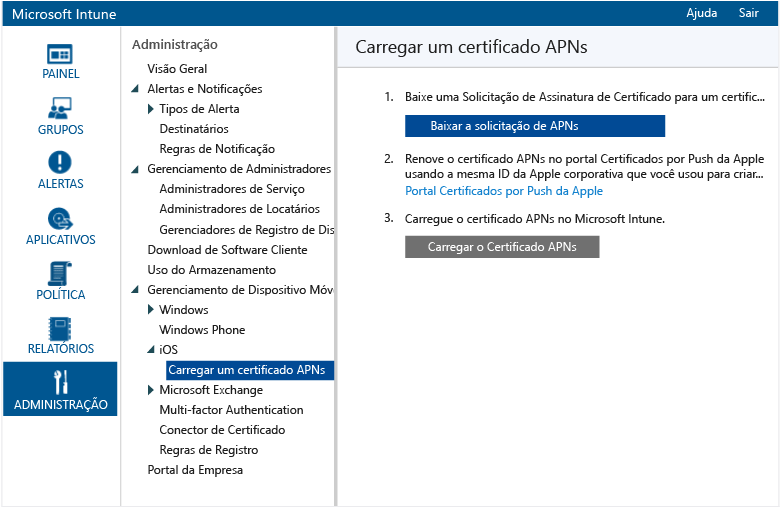

    17. Insira sua ID da Apple e clique em **Procurar**.

        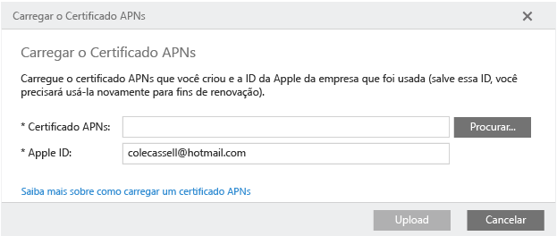

    18. Selecione o arquivo PEM que acabou salvo e clique em **Abrir**.

        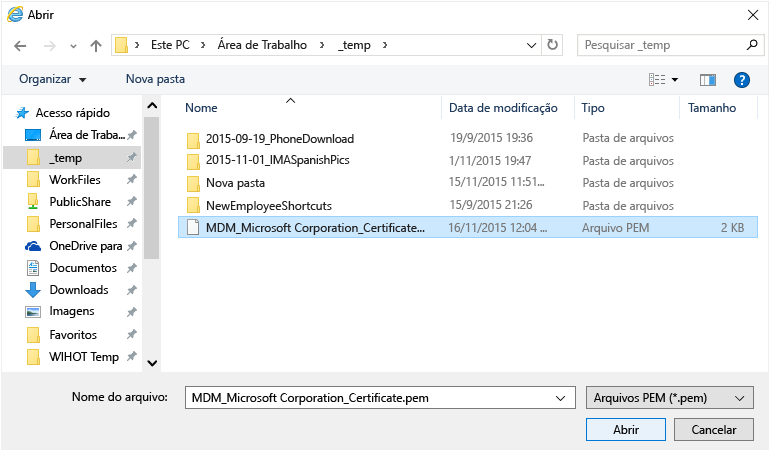

    19. Clique em **Carregar**.

        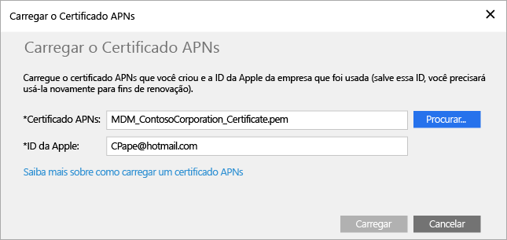

        Seu certificado APNs agora está configurado.

        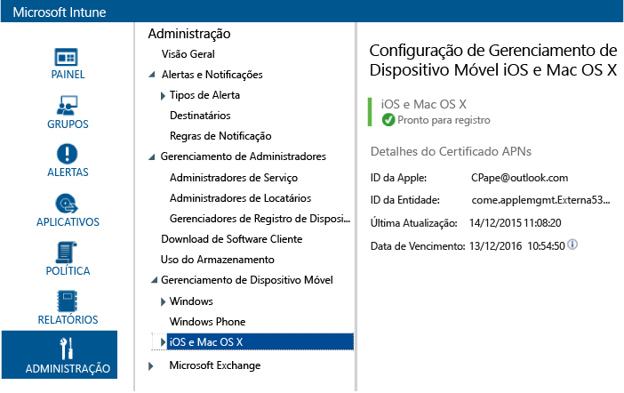

3.  Crie um grupo de usuário de teste para o direcionamento de política:

    1.  No painel esquerdo, clique em **Grupos**.

        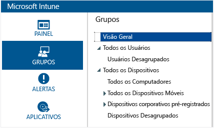

    2.  Na extremidade direita, clique em **Criar Grupo**.

        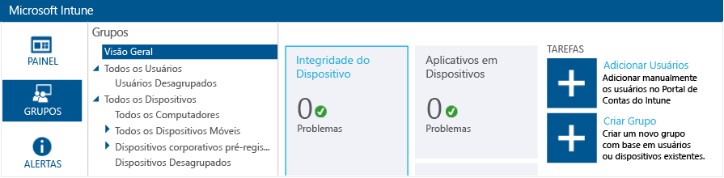

    3.  Forneça um nome de grupo, selecione **Todos os Usuários** como o grupo pai e clique **Avançar**.

        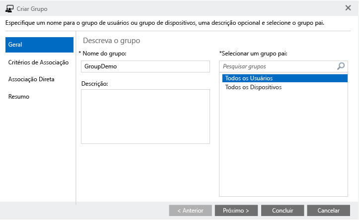

    4.  No campo **Iniciar Associação de Grupo com**, selecione **Todos os Usuários no Grupo Pai**, e clique em **Concluir**.

        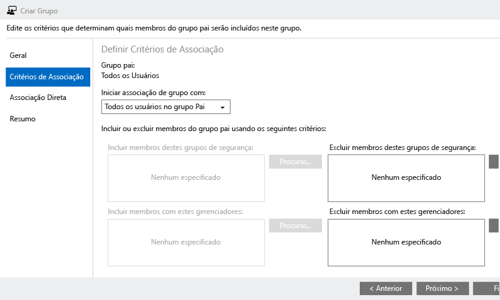

4.  Crie uma política PIN do iOS e direcione-a ao grupo de usuários de teste:

    1.  No painel esquerdo, clique em **Política**.

        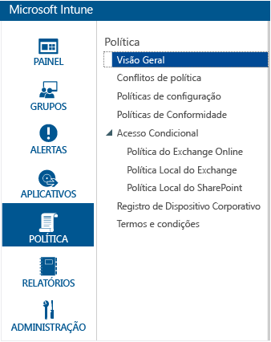

    2.  Na extremidade direita, clique em **Adicionar Política**.

        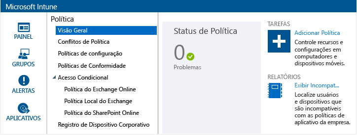

    3.  Expanda o nó do iOS, selecione a linha **Configuração Geral** e, em seguida, clique em **Criar Política**.

        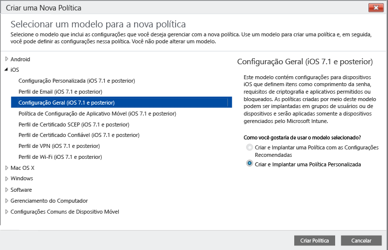

    4.  Digite um nome para a política, ative a opção **Requer uma Senha para Desbloquear Dispositivos Móveis**, e defina o **Tamanho Mínimo da Senha** para **4**.

        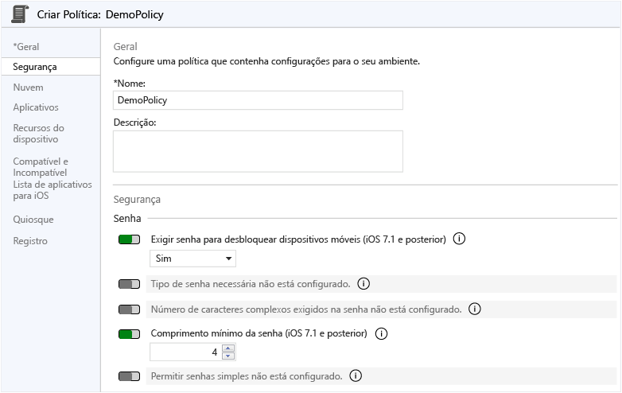

    5.  Para implantar a política, clique em **Sim**.

        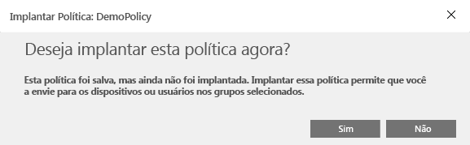

    6.  Clique no grupo de usuário criado anteriormente, clique em **Adicionar**, e clique em **OK**.

        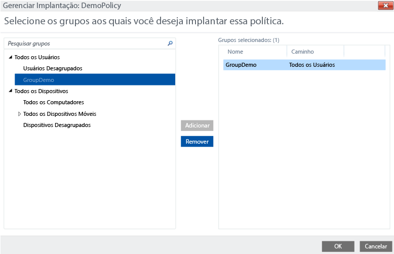

        Agora você tem uma política PIN do iOS direcionada ao seu grupo de usuários de teste.

        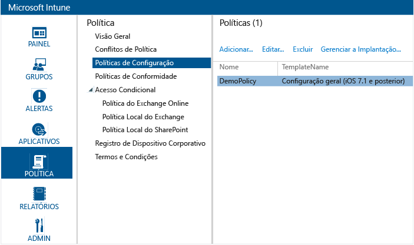

## Validar se a política é aplicada em um dispositivo iOS

1.  Em um iPad, inicie a iOS App Store, instale a versão gratuita do aplicativo **Portal da Empresa do Microsoft Intune** e abra-o.

    

2.  Digite seu nome de conta de usuário de teste e a senha e, em seguida, toque em **Entrar**.

    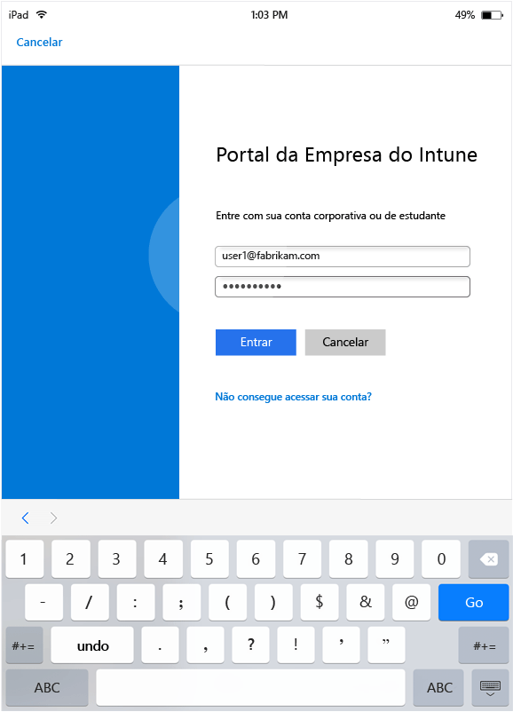

3.  Toque em **Registrar** para iniciar o registro do dispositivo no Intune.

    

4.  Na tela **Instalar Perfil**, toque em **Instalar**.

    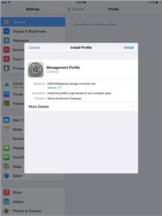

5.  No diálogo **Instalar Perfil**, toque em **Instalar**.

    

6.  Na tela **Aviso**, toque em **Instalar**.

    

7.  No diálogo **Gerenciamento Remoto**, toque **Confiar**.

    

8.  Quando o perfil de gerenciamento concluir a instalação, toque em **Concluído**. O registro agora está concluído.

    

9. Quando o registro for concluído, toque em **OK** e, em seguida, feche o aplicativo Portal da Empresa.

    

10. Quando for solicitada a configuração de uma senha, toque em **Continuar**.

    

11. Inserir sua senha, toque em **Continuar**, insira sua senha novamente e toque **Salvar**.

    

12. Pressione o botão Ligar/Desligar para bloquear seu iPad, deslize para desbloqueá-lo e você verá que será preciso inserir sua senha para desbloquear o dispositivo.

### Consulte também
[Guia de avaliação do Intune](get-started-with-a-30-day-trial-of-microsoft-intune.md)

<!--HONumber=May16_HO1-->

