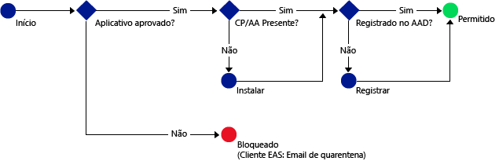

# Permitir que apenas aplicativos móveis que dão suporte às políticas de MAM do Intune acessem os serviços do Office 365
As [Políticas de gerenciamento de aplicativos móveis (MAM) do Intune](protect-apps-and-data-with-microsoft-intune.md) ajudam a proteger os dados da empresa em dispositivos registrados para gerenciamento no Intune. É possível usar as políticas MAM em **dispositivos do funcionário que não estão registrados para gerenciamento no Intune**.  Nesse caso, mesmo que você não gerencie o dispositivo, ainda é necessário se certificar de que os dados e recursos da empresa estão protegidos. Ao usar o acesso condicional para MAM (MAM CA), você pode criar uma política que permita aos aplicativos móveis que dão suporte às políticas de MAM do Intune acessar serviços do O365, como o Exchange Online.

Por exemplo, ao permitir que apenas o **aplicativo do Microsoft Outlook** acesse o Exchange Online você pode **bloquear os aplicativos de email interno no iOS e no Android**, que não têm a proteção de dados das políticas de MAM do Intune, para receber email do **Exchange Online**.

O diagrama a seguir ilustra o fluxo usado pelas políticas de AC de MAM para determinar quando permitir ou bloquear o acesso: .

Descrição das abreviações usadas nos diagramas:
* **CP**: aplicativo de Portal da Empresa
* **AA**: aplicativo Microsoft Authenticator
* **AAD**: Azure Active Directory
* **EAS**: Exchange Active Sync

## Pré-requisitos
**Antes** de configurar uma política de AC de MAM, você deve ter uma **assinatura premium do Enterprise Mobility + Security ou do Azure Active Directory** e os usuários devem ser licenciados para o EMS ou Azure AD. Para obter mais detalhes, veja a [página de preços do Enterprise Mobility](https://www.microsoft.com/en-us/cloud-platform/enterprise-mobility-pricing) ou a [página de preços do Azure Active Directory](https://azure.microsoft.com/en-us/pricing/details/active-directory/).

## Aplicativos com suporte
**Exchange Online**: **Microsoft Outlook** para Android e iOS.

Para saber mais sobre a experiência do usuário com um aplicativo que tem políticas de AC de MAM, consulte [O que esperar ao usar um aplicativo com AC do MAM](use-apps-with-mam-ca.md).

## Próximas etapas
[Criar uma política do Exchange Online para aplicativos MAM](mam-ca-for-exchange-online.md)

[Bloquear aplicativos que não têm autenticação moderna](block-apps-with-no-modern-authentication.md)

### Consulte também

[Proteger os dados do aplicativo com políticas de MAM](protect-app-data-using-mobile-app-management-policies-with-microsoft-intune.md)

<!--HONumber=Oct16_HO4-->

