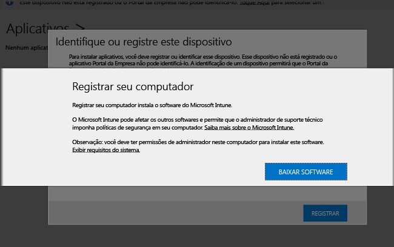

---

title: Instalar o software cliente do computador | Microsoft Intune
description: "Use este guia para ajudá-lo a ter os computadores Windows gerenciados pelo software cliente do Microsoft Intune."
keywords: 
author: staciebarker
ms.date: 07/19/2016
ms.topic: article
ms.prod: 
ms.service: microsoft-intune
ms.technology: 
ms.assetid: 64c11e53-8d64-41b9-9550-4b4e395e8c52
ms.reviewer: owenyen
ms.suite: ems
translationtype: Human Translation
ms.sourcegitcommit: 103e7065d1e2c3281f8f04808ee2546d3c7e2b53
ms.openlocfilehash: 32af8a615453b8c72e704f40dcdf0de6fbf10907


---

# <a name="install-the-intune-software-client-on-windows-pcs"></a>Instalar o cliente de software Intune em computadores Windows
Computadores Windows podem ser registrados instalando o software cliente do Intune. O software cliente do Intune pode ser instalado das seguintes maneiras:

- Instalado manualmente
- Instalado usando a Política de Grupo
- Incluído em uma imagem de disco
- Instalado pelos usuários

O cliente de software do Intune que for baixado primeiro contará com o software mínimo necessário para registrar o PC no gerenciamento do Intune. Depois que um PC for registrado, o cliente de software do Intune baixa o software cliente completo que é necessário para o gerenciamento de PC.

Esta série de downloads minimiza o tempo necessário para registrar inicialmente seu PC no Intune. Ela também garante que o cliente tenha o software mais recente disponível após a conclusão do download do segundo.

## <a name="download-the-intune-client-software"></a>Baixe o software cliente do Intune

Todos os métodos, exceto quando os usuários instalam o software cliente do Intune, exigem que você baixe o software para que ele possa ser implantado.

1.  No [Console de administração do Microsoft Intune](https://manage.microsoft.com/), clique em **Administração** &gt; **Download de Software Cliente**.

  

2.  Na página **Download de Software Cliente**, clique em **Baixar Software Cliente**. Em seguida, salve o pacote **Microsoft_Intune_Setup.zip** que contém o software em um local seguro na sua rede.

    > [!NOTE]
    > O pacote de instalação do software cliente do Intune contém informações sobre sua conta. Se usuários não autorizados obtiverem acesso ao pacote de instalação, eles poderão registrar computadores na conta representada por seu certificado integrado e poderão obter acesso aos recursos da empresa.

3.  Extraia o conteúdo do pacote de instalação para o local seguro na sua rede.

    > [!IMPORTANT]
    > Não renomeie ou remova o arquivo **ACCOUNTCERT** extraído. Caso contrário, ocorrerá uma falha na instalação do software cliente.

## <a name="deploy-the-client-software-manually"></a>Implante manualmente o software cliente

Em um computador, vá para a pasta na qual estão os arquivos de instalação do software cliente. Em seguida, execute **Microsoft_Intune_Setup.exe** para instalar o software cliente.

    > [!NOTE]
    > The status of the installation is displayed when you hover over the icon in the taskbar on the client computer.

## <a name="deploy-the-client-software-by-using-group-policy"></a>Implante o software cliente usando a Política de Grupo

1.  Na pasta que contém os arquivos **Microsoft_Intune_Setup.exe** e **MicrosoftIntune.accountcert**, execute o seguinte comando para extrair os programas de instalação baseados no Windows Installer para computadores de 32 e 64 bits:

    ```
    Microsoft_Intune_Setup.exe/Extract <destination folder>
    ```

2.  Copie os arquivos **Microsoft_Intune_x86.msi**, **Microsoft_Intune_x64.msi** e **MicrosoftIntune.accountcert** para uma localização da rede que possa ser acessada por todos os computadores nos quais o software cliente será instalado.

    > [!IMPORTANT]
    > Não separe ou renomeie os arquivos ou ocorrerá uma falha na instalação do software cliente.

3.  Use a Política de grupo para implantar o software nos computadores da sua rede.

    Para obter mais informações sobre como usar a Política de Grupo para implantar o software automaticamente, consulte a documentação do Windows Server.

## <a name="deploy-the-client-software-as-part-of-an-image"></a>Implante o software cliente como parte de uma imagem
É possível implantar o software cliente do Intune em computadores como parte de uma imagem do sistema operacional, usando o seguinte procedimento como guia:

1.  Copie os arquivos de instalação do cliente **Microsoft_Intune_Setup.exe** e **MicrosoftIntune.accountcert** na pasta **%Systemdrive%\Temp\Microsoft_Intune_Setup** no computador de referência.

2.  Crie a entrada de registro **WindowsIntuneEnrollPending** , adicionando o seguinte comando ao script **SetupComplete.cmd** :

    ```
    %windir%\system32\reg.exe add HKEY_LOCAL_MACHINE\Software\Microsoft\Onlinemanagement\Deployment /v
    WindowsIntuneEnrollPending /t REG_DWORD /d 1
    ```

3.  Adicione o seguinte comando a **setupcomplete.cmd** para executar o pacote de registro com o argumento de linha de comando /PrepareEnroll:

    ```
    %systemdrive%\temp\Microsoft_Intune_Setup\Microsoft_Intune_Setup.exe /PrepareEnroll
    ```
    > [!TIP]
    > O script **SetupComplete.cmd** permite que a Instalação do Windows efetue modificações no sistema antes que um usuário faça logon. O argumento de linha de comando **/PrepareEnroll** prepara um computador definido como destino de forma que ele seja automaticamente registrado no Intune após a conclusão da Instalação do Windows.

4.  Coloque o **SetupComplete.cmd** na pasta **%Windir%\Setup\Scripts** do computador de referência.

5.  Capture uma imagem do computador de referência e implante-a nos computadores de destino.

Quando o computador definido como destino for reiniciado após a conclusão da instalação do Windows, a chave do Registro **WindowsIntuneEnrollPending** será criada. O pacote de registro verifica se o computador está registrado. Se o computador estiver inscrito, nenhuma outra ação adicional será executada. Se o computador não estiver registrado, o pacote de registro criará uma Tarefa de registro automática do Microsoft Intune.

Quando a tarefa de Registro automático do Intune for executada no próximo horário agendado, ela verificará a existência do valor do registro **WindowsIntuneEnrollPending** e tentará registrar o computador definido como destino no Intune. Se a inscrição falhar por algum motivo, haverá uma nova tentativa na próxima vez que a tarefa for executada. As tentativas continuam por um mês.

A tarefa de registro automático do Intune, o valor do Registro **WindowsIntuneEnrollPending** e o certificado da conta serão excluídos do computador definido como destino quando o registro for concluído com êxito ou depois de um mês (o que ocorrer primeiro).

## <a name="instruct-users-to-self-enroll"></a>Instrua os usuários a se registrarem por conta própria

Os usuários podem instalar o software cliente do Intune visitando [o site do Portal da Empresa](http://portal.manage.microsoft.com). Se o portal da Web detectar que o dispositivo é um computador Windows, ele solicitará aos usuários que registrem o computador baixando o cliente de software do Intune. Após o download do software, os usuários podem instalá-lo para incluir seus computadores no gerenciamento.



## <a name="monitor-and-validate-successful-client-deployment"></a>Monitorar e validar a implantação com êxito do cliente
Use um dos procedimentos a seguir para ajudá-lo a monitorar e a validar a implantação do cliente com êxito.

### <a name="to-verify-the-installation-of-the-client-software-from-the-microsoft-intune-administrator-console"></a>Para verificar a instalação do software cliente usando o console de administrador do Microsoft Intune

1.  No [Console de administração do Microsoft Intune](https://manage.microsoft.com/), clique em **Grupos** &gt; **Todos os Dispositivos** &gt; **Todos os Computadores**.

2.  Na lista, encontre os computadores que se comunicam com o Intune ou procure um computador gerenciado específico, digitando o nome do computador (ou qualquer parte do nome) na caixa **Pesquisar dispositivos**.

3.  Examine o status do computador no painel inferior do console. Resolva todos os erros.

### <a name="to-create-a-computer-inventory-report-to-display-all-enrolled-computers"></a>Para criar um relatório de inventário do computador para exibir todos os computadores registrados

1.  No [Console de administração do Microsoft Intune](https://manage.microsoft.com/), clique em **Relatórios** &gt; **Relatórios de Inventário do Computador**.

2.  Na página **Criar Novo Relatório**, deixe todos os campos com os valores padrão (a menos que deseje aplicar filtros) e clique em **Exibir Relatório**.

3.  A página **Relatório de inventário do computador** é aberta em uma nova janela e exibe todos os computadores registrados com sucesso no Intune.

    > [!TIP]
    > Clique em qualquer cabeçalho de coluna no relatório para classificar a lista pelo conteúdo dessa coluna.


### <a name="see-also"></a>Consulte também
[Gerenciar computadores Windows com o Microsoft Intune](manage-windows-pcs-with-microsoft-intune.md)
[Solucionar problemas de instalação do cliente](../troubleshoot/troubleshoot-client-setup-in-microsoft-intune.md)


<!--HONumber=Nov16_HO5-->


