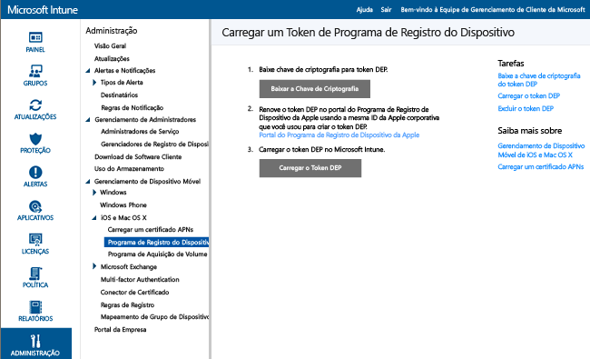
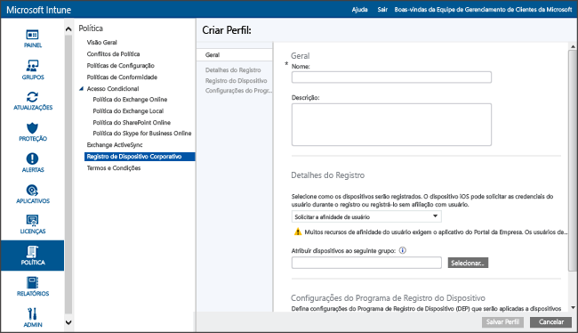

# Registrar dispositivos iOS do Programa de Registro de Dispositivos corporativos

[!INCLUDE[classic-portal](../includes/classic-portal.md)]

O Microsoft Intune pode implantar um perfil de registro que registra os dispositivos iOS comprados por meio do DEP (Programa de Registro de Dispositivo) "pelo ar". O pacote de registro pode incluir opções do assistente de instalação para o dispositivo.

## Gerenciamento de DEP da Apple para dispositivos iOS com o Microsoft Intune
Para gerenciar dispositivos iOS corporativos com o DEP (Programa de Registro de Dispositivo) da Apple, sua organização deve ingressar no DEP da Apple e obter dispositivos por meio do programa. Mais detalhes desse processo estão disponíveis em:  [https://deploy.apple.com](https://deploy.apple.com). As vantagens do programa incluem a instalação não assistida de dispositivos sem usar um cabo USB para conectar cada dispositivo a um computador.

Antes que possa registrar dispositivos iOS da empresa com o DEP, você precisa de m token do DEP da Apple. Esse token permite que o Intune sincronize informações sobre os dispositivos de sua empresa que fazem parte do DEP. Ele também permite que o Intune realize carregamentos de Perfis de registro para a Apple e atribua dispositivos para esses perfis.

1.  **Começar a gerenciar dispositivos iOS com o Microsoft Intune** 
    Antes de poder registrar dispositivos no DEP (Programa de Registro do Dispositivo) do iOS, você precisa concluir a habilitação do gerenciamento de iOS para o Intune.

2.  **Obter uma Chave de Criptografia** 
    Como usuário administrativo, abra o [console de administração do Microsoft Intune](http://manage.microsoft.com), vá até **Administrador ** &gt; **Gerenciamento de Dispositivo Móvel ** &gt; **iOS** &gt; **Programa de Registro de Dispositivo** e escolha **Baixar a Chave de Criptografia**. Salve o arquivo de criptografia (.pem) localmente. O arquivo .pem é usado para solicitar um certificado de relação de confiança do portal do Programa de registro de dispositivo da Apple.

      

3.  **Obter um token do Programa de registro de dispositivos** 
    Vá até o [Portal do Programa de Registro do Dispositivo](https://deploy.apple.com) (https://deploy.apple.com) e entre com sua ID Apple corporativa. Essa ID da Apple deve ser usada posteriormente para renovar seu token do DEP.

    1.  No [Portal do Programa de Registro do Dispositivo](https://deploy.apple.com), vá até **Programa de Registro de Dispositivo** &gt; **Gerenciar Servidores** e escolha **Adicionar Servidor MDM**.

    2.  Insira o **Nome do servidor MDM** e escolha **Avançar**. O nome do servidor é para sua referência para identificar o servidor MDM (gerenciamento de dispositivo móvel). Não é o nome ou URL do servidor Microsoft Intune.

    3.  A caixa de diálogo **Adicionar &lt;ServerName&gt;** é aberta. Escolha **Escolher Arquivo…** para carregar o arquivo .pem e clique em **Avançar**.

    4.  A caixa de diálogo **Adicionar &lt;ServerName&gt;** mostra um link **Seu Token do Servidor**. Baixe o arquivo do token (.p7m) do servidor em seu computador e escolha **Concluído**.

    Esse arquivo de certificado (.p7m) é usado para estabelecer uma relação de confiança entre os servidores do Programa de registro de dispositivo da Apple.

4.  **Adicionar o token de DEP ao Intune** 
    No [Console de administração do Microsoft Intune](http://manage.microsoft.com), acesse **Admin** &gt; **Gerenciamento de Dispositivo Móvel** &gt; **iOS** &gt; **Programa de Registro de Dispositivo** e escolha **Carregar Token de DEP**. **Vá** até o arquivo de certificado (.p7m), insira sua **ID da Apple** e escolha **Carregar**.

5.  **Adicionar Política de Registro de Dispositivo Corporativo** 
    No [Console de administração do Microsoft Intune](http://manage.microsoft.com), acesse **Política** &gt; **Registro do Dispositivo Corporativo** e selecione **Adicionar**.

    Forneça detalhes **Gerais**, incluindo **Nome** e **Descrição**, e especifique se os dispositivos atribuídos ao perfil têm afinidade de usuário ou pertencem a um grupo.
      - **Solicitar afinidade do usuário**: o dispositivo deve ser afiliado a um usuário durante a configuração inicial antes que tenha permissão para acessar dados e email da empresa como esse usuário. A **afinidade do usuário** deve ser configurada para dispositivos gerenciados por DEP que pertencem a usuários e que precisam usar o portal da empresa (ou seja, para instalar aplicativos). A MFA (autenticação multifator) não funciona durante o registro em dispositivos DEP com afinidade de usuário. Após o registro, a MFA funciona conforme o esperado nesses dispositivos. 

      > [!NOTE]
      > O DEP com afinidade do usuário requer que o ponto de extremidade misto/nome do usuário do WS-Trust 1.3 esteja habilitado para solicitar o token do usuário.

      - **Sem afinidade de usuário**: o dispositivo não está afiliado a um usuário. Use esta afiliação para dispositivos que executam tarefas sem acessar aos dados de usuário local. Aplicativos que exigem a afiliação do usuário, incluindo o aplicativo do Portal da Empresa usado para instalar aplicativos de linha de negócios, não funcionarão.

    Você também pode **Atribuir dispositivos ao seguinte grupo**. Escolha **Selecionar...** para escolher um grupo.

    [!INCLUDE[groups deprecated](../includes/group-deprecation.md)]

    Em seguida, habilite **Configurar definições do Programa de Registro do Dispositivo para esta política** para dar suporte ao DEP.

      

     As seguintes configurações estão disponíveis para dispositivos gerenciados por DEP:

     - **Departamento** – Aparece quando os usuários tocam em **Sobre a Configuração** durante a ativação
     - **Número de telefone de suporte** – Aparece quando o usuário clica no botão **Precisa de Ajuda** durante a ativação
     - **Modo de preparação** – Definido durante a ativação e não pode ser alterado sem redefinir o dispositivo de fábrica:
        - **Sem supervisão** -Recursos de gerenciamento limitados
        - **Supervisionado** - Permite mais opções de gerenciamento e desabilita o Bloqueio de Ativação por padrão
     - **Bloquear o registro do perfil o dispositivo** – Definido durante a ativação e não pode ser alterado sem uma redefinição de fábrica
        - **Desabilitar** - Permite que o perfil de gerenciamento seja removido do menu **Configurações**
        - **Habilitar** – (requer **Modo de Preparação** = **Supervisionado**) desabilita a opção de menu das Configurações do iOS para remover o perfil de gerenciamento
     - **Opções do Assistente de Instalação** – Essas configurações opcionais podem ser configuradas no menu **Configurações** do iOS.
        - **Senha** - Solicitar senha durante a ativação. Sempre exigir uma senha, a menos que o dispositivo seja protegido ou tenha o acesso controlado de alguma outra maneira (ou seja, o modo de quiosque que restringe o dispositivo a um aplicativo)
        - **Serviços de Localização** - Se habilitado, o Assistente de Instalação solicitará o serviço durante a ativação
        - **Restaurar** - Se habilitado, o Assistente de Instalação solicitará o backup do iCloud durante a ativação
        - **ID da Apple** – Se habilitado, o iOS solicitará aos usuários uma ID da Apple quando o Intune tentar instalar um aplicativo sem uma ID. Uma ID da Apple é exigida para baixar aplicativos na App Store do iOS, incluindo aqueles instalados pelo Intune.
        - **Termos e Condições** - Se habilitado, o Assistente de Instalação solicitará que os usuários aceitem os termos e as condições da Apple durante a ativação
        - **ID de Toque** - Se habilitada, o Assistente de Instalação solicitará o serviço durante a ativação
        - **Pagamento da Apple** - Se habilitado, o Assistente de Instalação solicitará o serviço durante a ativação
        - **Aplicar zoom** - Se habilitado, o Assistente de Instalação solicitará o serviço durante a ativação
        - **Siri** - Se habilitado, o Assistente de Instalação solicitará o serviço durante a ativação
        - **Enviar dados de diagnóstico para a Apple** - Se habilitado, o Assistente de Instalação solicitará o serviço durante a ativação
     -  **Habilitar o gerenciamento adicional do Apple Configurator** - Defina como **Não permitir** para impedir a sincronização de arquivos com iTunes ou gerenciamento por meio do Apple Configurator. É uma boa ideia escolher **Não permitir**, exportar configurações adicionais do Apple Configurator e implantar como um perfil de configuração do iOS Personalizado por meio do Intune em vez de usar essa configuração para permitir a implantação manual com ou sem um certificado.
        - **Não permitir** - Impede que o dispositivo se comunique via USB (desabilita emparelhamento)
        - **Permitir** – Permite que o dispositivo se comunique por meio de conexão USB para qualquer PC ou Mac
        - **Exigir certificados** - Permite o emparelhamento com um Mac com um certificado importado para o perfil de registro

6.  **Atribuir Dispositivos DEP para Gerenciamento** Vá até o [Portal do Programa de Registro de Dispositivo](https://deploy.apple.com) (https://deploy.apple.com) e entre com sua ID da Apple corporativa. Vá para **Programa de Implantação** &gt; **Programa de Registro de Dispositivo** &gt; **Gerenciar Dispositivos**. Especifique como você vai **escolher dispositivos**, forneça informações do dispositivo e especifique os detalhes por **número de série**, **número do pedido**do dispositivo ou **carregue o arquivo CSV**. Em seguida, escolha **Atribuir ao Servidor**, escolha o &lt;ServerName&gt; especificado para o Microsoft Intune e escolha **OK**.

7.  **Sincronizar Dispositivos Gerenciados por DEP** Como usuário administrativo, abra o [console de administração do Microsoft Intune](http://manage.microsoft.com), acesse **Administrador** &gt; **Gerenciamento de Dispositivo Móvel** &gt; **iOS** &gt; **Programa de Registro de Dispositivo** e escolha **Sincronizar agora**. Uma solicitação de sincronização é enviada à Apple. Para ver os dispositivos gerenciados por DEP após a sincronização, no [Console de administração do Microsoft Intune](http://manage.microsoft.com), vá até **Grupos** &gt; **Todos os Dispositivos Corporativos** &gt; **Dispositivos corporativos pré-registrados** &gt; **Pelo número de série do iOS**. No espaço de trabalho **Pelo número de série do iOS**, o **Estado** dos dispositivos gerenciados é "Não contatado" até que o dispositivo seja ligado e execute o Assistente de Configuração para ser registrado.

    Para cumprir os termos da Apple para tráfego DEP aceitável, o Intune impõe as seguintes restrições:
     -  Uma sincronização completa do DEP pode executar não mais do que uma vez a cada sete dias. Durante uma sincronização completa, o Intune atualiza cada número de série que a Apple atribuiu ao Intune, tenha o número de série sido sincronizado anteriormente ou não. Se você tentar uma sincronização completa dentro de sete dias após a sincronização completa anterior, o Intune atualizará somente os números de série ainda não listados no Intune.
     -  Qualquer solicitação de sincronização tem 10 minutos para ser concluída. Durante esse tempo ou até a solicitação ser bem-sucedida, o botão de **Sincronizar** fica desabilitado.

8.  **Distribuir dispositivos para usuários** Seus dispositivos de propriedade corporativa agora podem ser distribuídos para usuários. Quando um dispositivo iOS for ativado, ele será registrado para gerenciamento pelo Intune.

## Alterações em atribuições de grupo do Intune

A partir de dezembro de 2016, o gerenciamento de grupo de dispositivos será movido para o Azure Active Directory. Após a transição para grupos do Azure Active Directory, a atribuição de grupo não aparecerá nas opções de **Perfil de Registro Corporativo**. Como essa alteração se estenderá por uma série de meses, talvez você não veja a alteração imediatamente. Após a mudança para o novo portal, atribuições de grupos de dispositivos dinâmicos podem ser definidas com base nos nomes do Perfil de Registro Corporativo. Esse processo garante que dispositivos previamente atribuídos a um grupo de dispositivos sejam registrados automaticamente no grupo com a política e aplicativos implantados. [Saiba mais sobre os grupos do Azure Active Directory](https://azure.microsoft.com/documentation/articles/active-directory-accessmanagement-manage-groups/)

### Consulte também
[Pré-requisitos para registrar dispositivos](prerequisites-for-enrollment.md)

<!--HONumber=Jan17_HO4-->

