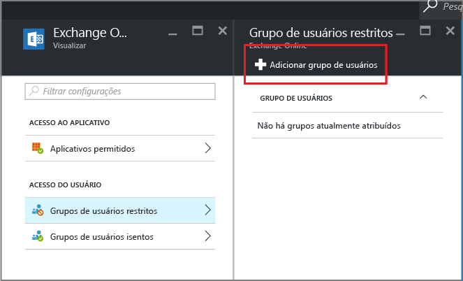

# Crie um acesso condicional para o Exchange Online para permitir apenas aplicativos com suporte para MAM

[!INCLUDE[classic-portal](../includes/classic-portal.md)]

Este tópico fornece instruções passo a passo sobre como configurar o acesso condicional para o Exchange Online para permitir apenas aplicativos móveis com suporte para políticas de gerenciamento de aplicativos móveis (MAM) do Intune.

## Criar uma política do Exchange Online
1.  Entre no [portal do Azure](https://portal.azure.com) que inclui o recurso de acesso do aplicativo. Caso você seja novo na experiência do portal do Azure, leia o tópico [Portal do Azure para políticas de MAM](azure-portal-for-microsoft-intune-mam-policies.md).

2.  Escolha **Mais serviços** e digite "Intune".

3.  Escolha **Proteção de Aplicativo do Intune**.

4.  Na folha **Gerenciamento de aplicativo móvel do Intune**, escolha **Todas as Configurações**.

5.  Na seção **Acesso condicional**, escolha **Exchange Online**.

    

6. Na folha **Aplicativos permitidos**, escolha a opção **Permitir aplicativos que dão suporte às políticas de aplicativo do Intune** para permitir que somente aplicativos com suporte para as políticas de MAM do Intune acessem o Exchange Online. Ao selecionar essa opção, a lista de aplicativos com suporte é exibida.

    >[!NOTE]
    >Todos os clientes de email do Exchange Active Sync, incluindo os de email interno no iOS e no Android que se conectam ao Exchange Online, serão impedidos de enviar ou receber emails. Em vez disso, os usuários receberão um único email informando que eles precisam usar o aplicativo de email do Outlook.

7. Para aplicar essa política aos usuários, abra a folha **Grupos de usuários com restrições** e escolha **Adicionar grupo de usuário**. Selecione um ou mais grupos de usuários ao(s) qual(is) essa política deve ser aplicada.

    

8. Você pode desejar que alguns usuários no grupo de usuários que você selecionou na etapa anterior não sejam afetados por essa política. Nesses casos, adicione o grupo de usuários à lista de grupos de usuários isentos. Na folha **Exchange Online**, escolha **Grupos de usuários isentos**. Escolha **Adicionar grupo de usuário** para abrir a lista de grupos de usuários. Selecione os grupos que você deseja isentar dessa política.  

## Modifique uma política existente
### Adicione ou exclua grupos de usuários

Para **excluir um grupo de usuários** da lista de **grupos de usuários com restrições**, abra a folha **Grupos de usuários com restrições**, realce o grupo de usuários que você deseja excluir e, em seguida, clique em **reticências(...)** para ver a opção **Excluir**. Escolha **Excluir** para remover o grupo de usuários da lista. Você pode seguir o mesmo procedimento para remover um grupo de usuários da lista do **grupo de usuários isentos**.

## Próximas etapas
[Bloquear aplicativos que não têm autenticação moderna](block-apps-with-no-modern-authentication.md)
### Consulte também
[Proteger dados de aplicativos com políticas de MAM](protect-app-data-using-mobile-app-management-policies-with-microsoft-intune.md)

<!--HONumber=Jan17_HO4-->

