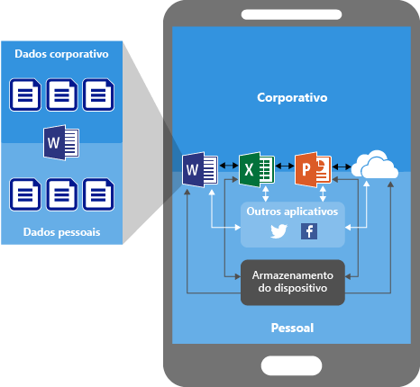
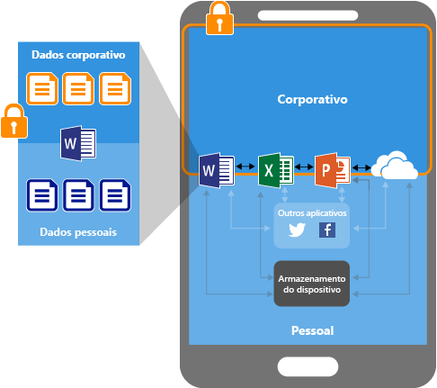
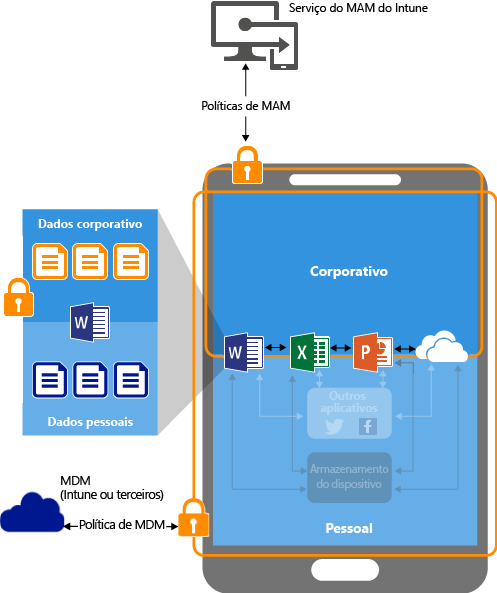
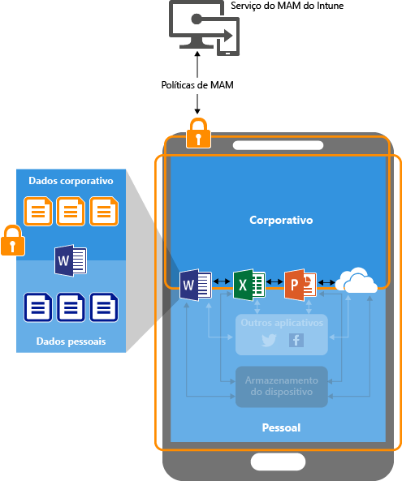

# Proteger dados de aplicativo usando políticas de gerenciamento de aplicativo móvel com o Microsoft Intune

[!INCLUDE[classic-portal](../includes/classic-portal.md)]

## Como proteger os dados do aplicativo
Os funcionários usam dispositivos móveis para tarefas de pessoais e corporativas. Embora seja necessário verificar se seus funcionários estão produtivos, você também deseja evitar a perda de dados, intencional ou acidental.  Além disso, você deseja ter a capacidade de proteger os dados corporativos que os funcionários acessam usando dispositivos não gerenciados.

É possível usar as políticas de MAM (Gerenciamento de Aplicativo Móvel) do Intune para ajudar a proteger os dados da sua empresa. Como as políticas de MAM do Intune podem ser usadas **independentemente de qualquer solução de MDM (Gerenciamento de Dispositivo Móvel)**, é possível usá-las para proteger os dados da sua empresa registrando ou não os dispositivos em uma solução de gerenciamento de dispositivo. Implementando as **políticas de nível de aplicativo**, você pode restringir o acesso aos recursos da empresa e manter os dados dentro do alcance do seu departamento de TI.

É possível configurar as políticas de MAM para aplicativos em execução em dispositivos que são:

-   **Registrados com o Microsoft Intune:** os dispositivos dessa categoria normalmente são dispositivos corporativos.

-   **Registrados em uma solução de terceiros de MDM:** os dispositivos dessa categoria normalmente são dispositivos corporativos.

  > [!NOTE]
  > Não recomendamos usar políticas de MAM com soluções de contêiner seguro ou gerenciamento de aplicativos móveis de terceiros.

-   **Não registrados em nenhuma solução de MDM:** os dispositivos dessa categoria normalmente são dispositivos de funcionários que não são gerenciados ou registrados no Intune ou outras soluções de MDM.

> [!IMPORTANT]
> É possível criar políticas de gerenciamento para aplicativos móveis do Office que se conectam aos serviços do Office 365. As políticas de MAM não têm suporte em aplicativos que se conectam aos serviços do Exchange, Skype for Business ou SharePoint local.

## Benefícios do uso de políticas de MAM

-   **Elas ajudam a proteger os dados da empresa no nível do aplicativo.** Como o gerenciamento de aplicativos móveis não requer gerenciamento de dispositivos, é possível proteger os dados da empresa em dispositivos gerenciados e não gerenciados. O gerenciamento concentra-se na identidade do usuário, o que elimina a necessidade de gerenciar dispositivos.

-   **A produtividade do usuário não é afetada e as políticas não são aplicadas quando ao usar o aplicativo em um contexto pessoal.** As políticas são aplicadas somente em um contexto corporativo, que proporciona a capacidade de proteger dados da empresa sem tocar em dados pessoais.

Há benefícios adicionais em usar MDM com políticas de MAM, e as empresas podem usar MAM com e sem MDM ao mesmo tempo. Por exemplo, um funcionário pode usar um telefone da empresa e um tablet particular. Nesse caso, o telefone da empresa é registrado no MDM e protegido pelas políticas de MAM e o dispositivo pessoal é protegido somente pelas políticas de MAM.

- **O MDM garante que o dispositivo estará protegido.** Por exemplo, você pode exigir um PIN acessar o dispositivo ou pode implantar aplicativos gerenciados para o dispositivo. Também é possível implantar aplicativos em dispositivos por meio da solução MDM, para ter mais controle sobre o gerenciamento de aplicativo.

- **Políticas de MAM garantem que as proteções de camada de aplicativo estejam em vigor.** Por exemplo, é possível ter uma política que exige um PIN para abrir um aplicativo em um contexto corporativo, impedir dados de serem compartilhados entre aplicativos e impedir que os dados de aplicativo da empresa sejam salvos em um local de armazenamento pessoal.

## Dispositivos em que há suporte para MAM
Atualmente, há suporte para políticas de MAM em:
-   iOS 8.1 ou posterior
-   Android 4 ou posterior

>[!NOTE]
>Os dispositivos Windows não são compatíveis com o MAM sem um cenário de registro. No entanto, quando registra dispositivos Windows 10 no Intune, você pode usar a Proteção de Informações do Windows, que oferece funcionalidades semelhantes. Para obter detalhes, consulte [Proteger seus dados empresariais usando a WIP (Proteção de Informações do Windows)](https://technet.microsoft.com/itpro/windows/keep-secure/protect-enterprise-data-using-wip).

##  Como as políticas de MAM protegem os dados do aplicativo

###  Aplicativos sem políticas de MAM

Ao usar aplicativos sem restrições, os dados corporativos e pessoais podem se misturar. Os dados corporativos podem acabar em locais como um armazenamento pessoal ou serem transferidos para aplicativos fora do seu alcance, resultando na perda de dados. As setas no diagrama mostram a movimentação de dados irrestrita entre aplicativos (corporativos e pessoais) e locais de armazenamento.

### Proteção de dados com políticas de MAM

É possível usar as políticas de MAM para impedir que os dados da empresa sejam salvos no armazenamento local do dispositivo, bem como restringir a movimentação de dados para outros aplicativos que não estão protegidos pelas políticas de MAM. As configurações de política de MAM incluem:
- Políticas de realocação de dados como **Evitar Salvar Como** e **Restringir recortar, copiar e colar**.
- As configurações de política de acesso como **Exigir PIN simples para acesso** e **Bloquear a execução de aplicativos gerenciados em dispositivos com jailbreak ou raiz**.

### A proteção de dados com políticas de MAM nos dispositivos gerenciados por uma solução de MDM

**Para dispositivos registrados em uma solução MDM**: o diagrama anterior mostra as camadas de proteção que as políticas MDM e MAM oferecem juntas.

A solução MDM:

-   Registra o dispositivo.

-   Implanta aplicativos no dispositivo.

-   Fornece gerenciamento e a conformidade contínuos no dispositivo.

**As políticas de MAM adicionam valor porque:**

-   Ajudam a proteger os dados da empresa contra vazamento de serviços e aplicativos de consumidor.

-   Aplicam restrições (salvar como, área de transferência, PIN etc.) aos aplicativos móveis.

-   Apagam os dados da empresa dos aplicativos sem removê-los do dispositivo.

### Proteção de dados com políticas de MAM para dispositivos sem registro

O diagrama anterior ilustra como as políticas de proteção de dados funcionam no nível do aplicativo sem MDM.

Para dispositivos BYOD não registrados em nenhuma solução MDM, as políticas de MAM podem ajudar a proteger os dados da empresa no nível do aplicativo.

Contudo, existem algumas limitações a serem consideradas:

-   Não é possível implantar aplicativos no dispositivo. O usuário precisa obter os aplicativos na loja.

-   Não é possível provisionar perfis de certificado nesses dispositivos.

-   Não é possível configurar as configurações de Wi-Fi e VPN da empresa nesses dispositivos.

## Várias identidades

Aplicativos que dão suporte a várias identidades permitem usar contas diferentes (pessoal e corporativa) para acessar os mesmos aplicativos quando políticas de MAM são aplicadas somente quando os aplicativos são usados no contexto de trabalho.  

Por exemplo, quando o usuário inicia o aplicativo OneDrive usando sua conta de trabalho, ele não pode mover os arquivos para um local de armazenamento pessoal. No entanto, quando ele usa o OneDrive com sua conta pessoal, ele pode copiar e mover dados do seu OneDrive pessoal sem restrições.  

Todos os aplicativos móveis do Office dão suporte ao acesso de várias identidades.

##  Próximas etapas
- [Prepare-se para configurar políticas de gerenciamento de aplicativos móveis](get-ready-to-configure-mobile-app-management-policies-with-microsoft-intune.md)

- [Criar e implantar políticas de gerenciamento de aplicativo móvel com o Microsoft Intune](create-and-deploy-mobile-app-management-policies-with-microsoft-intune.md)

<!--HONumber=Jan17_HO4-->

