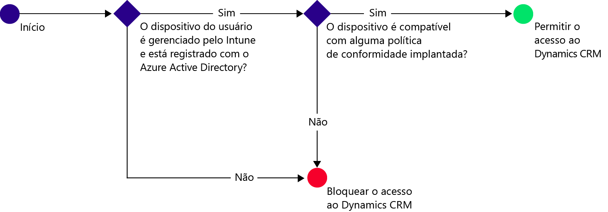
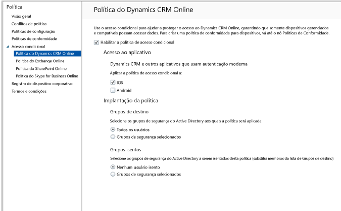

# Proteger o acesso ao Dynamics CRM Online com o Intune

[!INCLUDE[classic-portal](../includes/classic-portal.md)]

É possível controlar o acesso ao Microsoft Dynamics CRM Online de dispositivos iOS e Android usando acesso condicional do Microsoft Intune.  Acesso condicional do Intune tem dois componentes:
* Uma [política de conformidade do dispositivo](introduction-to-device-compliance-policies-in-microsoft-intune.md), com a qual o dispositivo deve estar em conformidade para ser considerado compatível.
* Uma [política de acesso condicional](restrict-access-to-email-and-o365-services-with-microsoft-intune.md), na qual você especifica as condições que o dispositivo deve atender para acessar o serviço.

Para saber mais sobre como o acesso condicional funciona, leia o artigo [Protect access to email, 0365, and other services](restrict-access-to-email-and-o365-services-with-microsoft-intune.md) (Proteger o acesso ao email, O365 e outros serviços).

> [!IMPORTANT]
> Para implantar o acesso condicional, é necessário ter assinaturas do Intune e do Azure Active Directory Premium e os usuários devem estar licenciados para ambos os produtos. A **assinatura do EMS (Enterprise Mobility + Security)** inclui tanto assinaturas do Intune quanto do Azure Active Directory Premium. Para obter mais detalhes, consulte a página de preços do [Enterprise Mobility](https://www.microsoft.com/en-us/cloud-platform/enterprise-mobility-pricing). Se você não tiver a assinatura do EMS, poderá obter uma assinatura para o Azure Active Directory Premium. Veja a [página de preços do Azure Active Directory](https://azure.microsoft.com/en-us/pricing/details/active-directory/).

Quando um determinado usuário tenta usar o aplicativo Dynamics CRM em seu dispositivo, ocorre a seguinte avaliação:

O dispositivo que precisa acessar o Dynamics CRM Online deve ser:
* **Android** ou **iOS**.
* **Registrado** no Intune.
* **Compatível** com qualquer política de conformidade do Intune implantada.

O estado do dispositivo é armazenado no Azure Active Directory, que concede ou bloqueia o acesso com base nas condições que você especificar.

Se uma condição não for atendida, o usuário receberá uma das seguintes mensagens de erro ao se conectar:
* Se o dispositivo não estiver registrado no Intune ou no Azure Active Directory, será exibida uma mensagem com instruções sobre como instalar o aplicativo do Portal da Empresa e registrá-lo.
* Se o dispositivo não for compatível, será exibida uma mensagem que direciona o usuário ao site do Portal da Empresa do Microsoft Intune ou ao aplicativo do Portal da Empresa, em que ele pode encontrar informações sobre o problema e como corrigi-lo.

## Configurar acesso condicional para o Dynamics CRM Online  
### Etapa 1: Configurar grupos de segurança do Active Directory

Antes de começar, configure os grupos de segurança do Active Directory do Azure para a política de acesso condicional. Você pode configurar esses grupos no **Centro de administração do Office 365**. Use esses grupos para afetar ou isentar os usuários da política. Quando um usuário é afetado por uma política, cada dispositivo que ele usa deve ser compatível para que possa acessar os recursos.

Você pode especificar dois tipos de grupos para usar com a política do Dynamics CRM:
* **Grupos de destino**. Contém grupos de usuários aos quais a política se aplica.
* **Grupos isentos**. Contém grupos de usuários isentos da política.

Se um usuário estiver nos dois grupos, ele ficará isento da política.

### Etapa 2: Configurar e implantar uma política de conformidade
[Crie](create-a-device-compliance-policy-in-microsoft-intune.md) e [implante](deploy-and-monitor-a-device-compliance-policy-in-microsoft-intune.md) uma política de conformidade para todos os dispositivos que serão afetados pela política. Esses são todos os dispositivos usados pelos usuários nos Grupos de destino.

> [!NOTE]
> Enquanto as políticas de conformidade são implantadas em grupos do Intune, as políticas de acesso condicional são destinadas a grupos de segurança do Azure Active Directory.

> [!IMPORTANT]
> Se você não tiver implantado uma política de conformidade, os dispositivos serão tratados como compatíveis.

Quando estiver pronto, continue na Etapa 3.
### Etapa 3: Configurar a política do Dynamics CRM
Em seguida, configure a política para exigir que somente dispositivos gerenciados e compatíveis possam acessar o Dynamics CRM. Essa política será armazenada no Azure Active Directory.

1.  No console de administração do Intune, escolha **Política > Acesso Condicional > Política do Dynamics CRM Online**.

  

2.  Escolha **Habilitar política de acesso condicional**.
3.  Em **Acesso ao aplicativo**, você pode optar por aplicar a política de acesso condicional a:
  * **iOS**
  * **Android**
4.  Em **Grupos de Destino**, escolha **Modificar** para selecionar os grupos de segurança do Azure Active Directory aos quais a política será aplicada. Você pode optar por aplicá-la a todos os usuários ou apenas a um grupos seleto de usuários.
5.  Opcionalmente, em **Grupos Isentos**, escolha **Modificar** para selecionar os grupos de segurança do Azure Active Directory que são isentos dessa política.
6.  Quando terminar, selecione **Salvar**.

Você configurou o acesso condicional ao Dynamics CRM. Não é necessário implantar a política de acesso condicional, ela entra em vigor imediatamente.
##  Monitorar a conformidade e políticas de acesso condicional

No espaço de trabalho **Grupos** , você pode exibir o status de acesso condicional de seus dispositivos.

Escolha qualquer grupo de dispositivos móveis e, então, na guia **Dispositivos**, escolha um dos seguintes **Filtros**:
* **Dispositivos não registrados com o AAD**. Esses dispositivos estão bloqueados do Dynamics CRM.
* **Dispositivos que não são compatíveis**. Esses dispositivos estão bloqueados do Dynamics CRM.
* **Dispositivos registrados com o AAD e que são compatíveis**. Esses dispositivos podem acessar o Dynamics CRM.

##  Próximas etapas
* [Proteger o acesso ao Exchange Online](restrict-access-to-exchange-online-with-microsoft-intune.md)

* [Proteger o acesso ao Exchange local](restrict-access-to-exchange-onpremises-with-microsoft-intune.md)
* [Proteger o acesso ao SharePoint Online](restrict-access-to-sharepoint-online-with-microsoft-intune.md)

* [Proteger o acesso ao Skype for Business Online](restrict-access-to-skype-for-business-online-with-microsoft-intune.md)

<!--HONumber=Jan17_HO4-->

