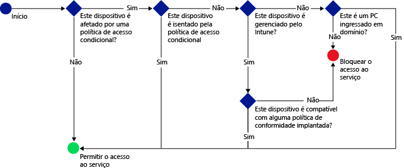

# Proteger o acesso a email, Office 365 e outros serviços com o Microsoft Intune

[!INCLUDE[classic-portal](../includes/classic-portal.md)]

É possível proteger o acesso ao email de sua empresa, a serviços do Office 365 como **Exchange no Local**, **Exchange Online**, **Exchange Online Dedicado**, **SharePoint Online**, **Skype for Business Online** e a outros serviços usando o Acesso Condicional do EMS (Enterprise Mobility + Security). Essa funcionalidade permite que você garanta que o acesso ao email de sua empresa e a serviços do Office 365 é restrito aos dispositivos que estão em conformidade com as regras de acesso condicional definidas no console de administração do Intune ou no Portal Clássico do Azure.
## Como funciona o acesso condicional?
É possível usar as configurações de política de conformidade para avaliar a conformidade de um dispositivo. Uma política de acesso condicional usa a avaliação para restringir ou permitir o acesso a um serviço específico. Quando você usa uma política de acesso condicional em combinação com uma política de conformidade do dispositivo, apenas os dispositivos que estão em conformidade poderão acessar o serviço. A política de conformidade e a política de acesso condicional são implantadas para o usuário. Qualquer dispositivo que o usuário utiliza para acessar os serviços é verificado quanto à conformidade com as políticas.

Tenha em mente que o usuário que está usando o dispositivo deve ter uma política de conformidade implantada para que o dispositivo seja avaliado quanto à conformidade.
Se nenhuma política de conformidade for implantada para o usuário, o dispositivo será tratado como compatível e nenhuma restrição de acesso será aplicada.

Quando dispositivos não atendem às condições definidas na política, o usuário final é guiado pelo processo de registro do dispositivo e correção do problema que está impedindo o dispositivo de ser compatível.

Um fluxo típico do acesso condicional:

## Considerações sobre instalação

### Licenciamento

O Microsoft Intune e o Azure AD (Azure Active Directory) Premium trabalham diretamente juntos para fornecer várias camadas de controle por meio do acesso condicional do EMS. Se você desejar implantar políticas de acesso condicional usando o Intune, será necessário ter a licença dos dois produtos.

**Licenças do Azure AD Premium** podem ser adquiridas como um serviço independente ou ser adquiridas (juntamente com o Intune) como parte do Enterprise Agreement. Se você tiver implantado políticas de acesso condicional com o Intune, garanta que você obteve as **licenças adequadas do EMS** ou do Azure AD Premium.

- Saiba mais sobre a [página de preços do Enterprise Mobility](https://www.microsoft.com/en-us/cloud-platform/enterprise-mobility-pricing) ou a [página de preços do Azure Active Directory](https://azure.microsoft.com/en-us/pricing/details/active-directory/).

Além disso, garanta que os usuários aos quais você pretende aplicar as políticas de acesso condicional [recebem as licenças do Azure AD Premium ou do EMS](/Intune/get-started/start-with-a-paid-subscription-to-microsoft-intune-step-4.md).

### Configurações de conformidade do dispositivo

Para configurar o acesso condicional, configure uma política de conformidade do dispositivo e uma política de acesso condicional. A política de conformidade inclui configurações como senha, criptografia e se um dispositivo tem ou não jailbreak. O dispositivo deve atender a essas regras para ser considerado compatível.

- Saiba mais sobre a [política de conformidade do dispositivo e como ela funciona](introduction-to-device-compliance-policies-in-microsoft-intune.md).

### Política de acesso condicional

Você pode definir uma política de acesso condicional para proteger o acesso com base em:
- Status de conformidade do dispositivo.
- Plataforma em execução no dispositivo.
- Tipos de aplicativos usados para acessar os serviços.

Ao contrário de outras políticas do Intune, você não implanta políticas de acesso condicional. Em vez disso, depois de configurar a política e selecionar os usuários que devem ter a política, a política é aplicada a todos os usuários de destino. Quando um usuário é afetado por uma política, cada dispositivo que ele usa deve ser compatível para que possa acessar os recursos.

## Próximas etapas

2. [Criar uma política de conformidade do dispositivo](create-a-device-compliance-policy-in-microsoft-intune.md).

2.  Criar uma política de acesso condicional para um dos seguintes produtos/serviços em nuvem da Microsoft:
> [!div class="op_single_selector"]
  - [Criar uma política de acesso condicional para o Exchange Online](restrict-access-to-exchange-online-with-microsoft-intune.md)
  - [Criar uma política de acesso condicional para o Exchange Local](restrict-access-to-exchange-onpremises-with-microsoft-intune.md)
  - [Criar uma política de acesso condicional para o novo Exchange Online Dedicado](restrict-access-to-exchange-online-with-microsoft-intune.md)
  - [Criar uma política de acesso condicional para o Exchange Online Dedicado herdado](restrict-access-to-exchange-onpremises-with-microsoft-intune.md)
  - [Criar uma política de acesso condicional para o SharePoint Online](restrict-access-to-sharepoint-online-with-microsoft-intune.md)
  - [Criar uma política de acesso condicional para o Skype for Business Online](restrict-access-to-skype-for-business-online-with-microsoft-intune.md)
  - [Criar uma política de acesso condicional para o Dynamics CRM Online](restrict-access-to-dynamics-crm-online-with-microsoft-intune.md)

<!--HONumber=Jan17_HO2-->

