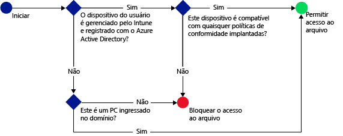
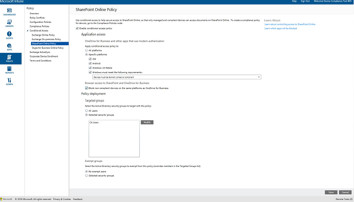
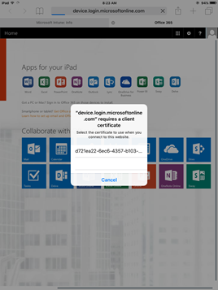

# Restringir o acesso ao SharePoint Online com o Microsoft Intune
Use o acesso condicional [!INCLUDE[wit_firstref](../includes/wit_firstref_md.md)] para controlar o acesso a arquivos localizados no SharePoint Online.
O acesso condicional tem dois componentes:
- Uma política de conformidade do dispositivo, com a qual o dispositivo deve estar em conformidade para ser considerado compatível.
- Uma política de acesso condicional, na qual você especifica as condições que o dispositivo deve atender para acessar o serviço.
Para saber mais sobre como o acesso condicional funciona, leia o tópico [Restringir acesso a email, O365 e outros serviços](restrict-access-to-email-and-o365-services-with-microsoft-intune.md).

Você implanta a conformidade e políticas de acesso condicional para os usuários. Qualquer dispositivo que o usuário utiliza para acessar os serviços é verificado quanto à conformidade com as políticas.

Quando um usuário tenta se conectar a um arquivo usando um aplicativo com suporte em seu dispositivo, como o OneDrive, ocorre a seguinte avaliação:

**Antes** de configurar uma política de acesso condicional para o SharePoint Online, você precisa:
- Ter uma **assinatura do SharePoint Online** e os usuários devem ser licenciados para o SharePoint Online.
- Ter uma **assinatura do Enterprise Mobility + Security** ou do **Azure Active Directory Premium** e ter os usuários licenciados para o EMS ou o Azure AD. Para obter mais detalhes, veja a [página de preços do Enterprise Mobility](https://www.microsoft.com/en-us/cloud-platform/enterprise-mobility-pricing) ou a [página de preços do Azure Active Directory](https://azure.microsoft.com/en-us/pricing/details/active-directory/).

  Para se conectar aos arquivos necessários, o dispositivo precisa:
-   Estar **registrado** no [!INCLUDE[wit_nextref](../includes/wit_nextref_md.md)] ou em um computador ingressado no domínio.

-   **Registrado** no Azure Active Directory (isso ocorre automaticamente quando o dispositivo for registrado com o [!INCLUDE[wit_nextref](../includes/wit_nextref_md.md)]).

-   **Compatível** com alguma política de conformidade [!INCLUDE[wit_nextref](../includes/wit_nextref_md.md)] implantada.

O estado do dispositivo é armazenado no Azure Active Directory, que concede ou bloqueia o acesso a arquivos com base nas condições que você especifica.

Se uma condição não for atendida, o usuário receberá uma das seguintes mensagens ao entrar:

-   Se o dispositivo não estiver registrado no [!INCLUDE[wit_nextref](../includes/wit_nextref_md.md)] ou não estiver registrado no Azure Active Directory, será exibida uma mensagem com instruções sobre como instalar o aplicativo do Portal da Empresa e registrá-lo.

-   Se o dispositivo não for compatível, será exibida uma mensagem que direciona o usuário ao site do Portal da Empresa [!INCLUDE[wit_nextref](../includes/wit_nextref_md.md)], no qual ele pode encontrar informações sobre o problema e como corrigi-lo.

**O acesso condicional não se aplica ao compartilhamento externo**. Para saber como evitar o compartilhamento externo em seu locatário ou conjunto de sites, consulte [Gerenciar o compartilhamento externo para o ambiente do SharePoint Online](https://support.office.com/en-us/article/Manage-external-sharing-for-your-SharePoint-Online-environment-C8A462EB-0723-4B0B-8D0A-70FEAFE4BE85?ui=en-US&rs=en-US&ad=US).

>[!NOTE]
>Se você habilitar o acesso condicional para o SharePoint Online, recomendamos que desabilite o domínio na lista, conforme descrito no tópico [Remove-SPOTenantSyncClientRestriction](https://technet.microsoft.com/en-us/library/dn917451.aspx).  

## Suporte para dispositivos móveis
Há suporte para os recursos a seguir:
- iOS 8.0 e posterior
- Android 4.0 e posterior, Samsung Knox Standard 4.0 ou posterior
- Windows Phone 8.1 e posterior

É possível restringir o acesso ao SharePoint Online quando acessado por um navegador em dispositivos **iOS** e **Android**. O acesso será permitido somente de navegadores com suporte em dispositivos compatíveis:
* Safari (iOS)
* Chrome (Android)
* Intune Managed Browser (iOS e Android 5.0 e posteriores)

**Navegadores sem suporte serão bloqueados**.

## Suporte para computadores
Há suporte para os recursos a seguir:
- Windows 8.1 e posterior (quando os computadores são registrado com o Intune)
- Windows 7.0, Windows 8.1 ou Windows 10 (quando os computadores estão ingressados no domínio),
> [!NOTE]
>Para usar o acesso condicional em PCs com Windows 10, você deve atualizar esses PCs com a Atualização de Aniversário do Windows 10.

  - Computadores ingressados no domínio devem ser configurados para [se registrarem automaticamente](https://azure.microsoft.com/en-us/documentation/articles/active-directory-conditional-access-automatic-device-registration/) no Azure Active Directory. O Registro de Dispositivos do Azure AD será ativado automaticamente para clientes do Intune e do Office 365. Clientes que já tiverem implantado o Serviço de Registro de Dispositivos do ADFS não verão dispositivos registrados no seu Active Directory local.

  - Se a política estiver definida para exigir o ingresso no domínio e o computador não estiver ingressado no domínio, uma mensagem será exibida para que o usuário entre em contato com o administrador de TI.

  - Se a política estiver definida para exigir ingresso no domínio ou conformidade e o computador não atender a nenhum dos dois requisitos, será exibida uma mensagem com instruções sobre como instalar o aplicativo do Portal da Empresa e realizar o registro.
  >[!NOTE]
  >Não há suporte ao acesso condicional em computadores que executam o cliente de computador Intune.

[A autenticação moderna do Office 365 deve estar habilitada](https://support.office.com/en-US/article/Using-Office-365-modern-authentication-with-Office-clients-776c0036-66fd-41cb-8928-5495c0f9168a) e ter todas as atualizações mais recentes do Office.

A autenticação moderna leva as credenciais baseadas na ADAL (Biblioteca de Autenticação do Active Directory) aos clientes Windows com Office 2013 e permite mais segurança, como a **autenticação multifator** e a **autenticação baseada em certificado**.

## Configurar o acesso condicional para o SharePoint Online

### Etapa 1: Configurar grupos de segurança do Active Directory
Antes de começar, configure os grupos de segurança do Active Directory do Azure para a política de acesso condicional. É possível configurar esses grupos no **Centro de administração do Office 365** ou no **Portal de conta do Intune**. Use esses grupos para afetar ou isentar os usuários da política. Quando um usuário é afetado por uma política, cada dispositivo que ele usa deve ser compatível para que possa acessar os recursos.

Você pode especificar dois tipos de grupo em uma política do SharePoint Online:

-   **Grupos de destino**: contém grupos de usuários aos quais a política se aplica.

-   **Grupos isentos**: contém grupos de usuários isentos da política.

Se um usuário estiver nos dois grupos, ele ficará isento da política.

### Etapa 2: Configurar e implantar uma política de conformidade
Se ainda não tiver feito isso, crie e implante uma política de conformidade para todos os usuários aos quais a política do SharePoint Online se destinará.

> [!NOTE]
> Enquanto as políticas de conformidade são implantadas em grupos [!INCLUDE[wit_nextref](../includes/wit_nextref_md.md)], as políticas de acesso condicional são destinadas a grupos de segurança do Azure Active Directory.

Para obter detalhes sobre como configurar a política de conformidade, consulte [Criar uma política de conformidade](create-a-device-compliance-policy-in-microsoft-intune.md).

> [!IMPORTANT]
> Se você não tiver implantado uma política de conformidade, os dispositivos serão tratados como compatíveis.

Quando estiver pronto, continue na **Etapa 3**.

### Etapa 3: Configurar a política do SharePoint Online
Em seguida, configure a política para exigir que somente dispositivos gerenciados e compatíveis possam acessar o SharePoint Online. Essa política será armazenada no Azure Active Directory.

#### 

>[!NOTE]
> Também é possível criar uma política de acesso condicional para dispositivos do Intune no console de gerenciamento do Azure AD (a política é conhecida como o **política de acesso condicional com base no dispositivo** no Azure AD). Além disso, é possível criar outras políticas de acesso condicional, como a autenticação multifator. Também é possível definir políticas de acesso condicional para aplicativos empresariais de terceiros com suporte do Azure AD, como Salesforce e Box. Para obter mais detalhes, consulte [Como definir a política de acesso condicional com base no dispositivo do Azure Active Directory para controle de acesso dos aplicativos conectados do Azure Active Directory](https://azure.microsoft.com/en-us/documentation/articles/active-directory-conditional-access-policy-connected-applications/).

1.  No [Console de administração do Microsoft Intune](https://manage.microsoft.com), escolha **Política** > **Acesso Condicional** > **Política do SharePoint Online**.

2.  Selecione **Habilitar política de acesso condicional para o SharePoint Online**.

3.  Em **Acesso ao aplicativo**, é possível optar por aplicar a política de acesso condicional a:

    -   **Todas as plataformas**

        Isso requer que qualquer dispositivo usado para acessar o **SharePoint Online** seja registrado no Intune e esteja compatível com as políticas. Qualquer aplicativo cliente que use a **autenticação moderna** está sujeito à política de acesso condicional. Se a plataforma não tiver suporte do Intune, o acesso ao **SharePoint Online** será bloqueado.

        Selecionar a opção **Todas as plataformas** significa que o Azure Active Directory aplicará essa política a todas as solicitações de autenticação, independentemente da plataforma relatada pelo aplicativo cliente. Todas as plataformas precisarão ser registradas e se tornarem compatíveis, exceto:
        *   Dispositivos Windows, que precisarão ser registrados e compatíveis, ingressados no domínio com o Active Directory local ou ambas as opções.
        * Plataformas sem suporte, como Mac. No entanto, os aplicativos que usam autenticação moderna provenientes dessas plataformas ainda estarão bloqueados.

    -   **Plataformas específicas**

         A política de acesso condicional se aplicará a qualquer aplicativo cliente que usar a autenticação moderna nas plataformas que você especificar.

     Para computadores Windows, o computador deve estar ingressado no domínio ou ser compatível e estar registrado em [!INCLUDE[wit_nextref](../includes/wit_nextref_md.md)]. Você pode definir os seguintes requisitos:

     -   **Os dispositivos devem estar ingressados no domínio ou ser compatíveis.** Escolha essa opção se quiser que os computadores estejam ingressados no domínio ou sejam compatíveis com as políticas definidas em [!INCLUDE[wit_nextref](../includes/wit_nextref_md.md)]. Se um computador não atender a esses requisitos, será solicitado que o usuário registre o dispositivo com [!INCLUDE[wit_nextref](../includes/wit_nextref_md.md)].

     -   **Os dispositivos devem estar ingressados no domínio.** Escolha essa opção para exigir que os computadores estejam ingressados no domínio para acessar o Exchange Online. Se um PC não estiver ingressado no domínio, o acesso ao email será bloqueado e será solicitado que o usuário entre em contato com o administrador de TI.

     -   **Os dispositivos devem ser compatíveis.** Escolha essa opção para exigir que os computadores sejam compatíveis e estejam registrados em [!INCLUDE[wit_nextref](../includes/wit_nextref_md.md)]. Se um computador não estiver registrado, será exibida uma mensagem com instruções sobre como registrá-lo.

4.   Em **Acesso do navegador** ao SharePoint Online e OneDrive for Business, é possível optar por permitir o acesso ao Exchange Online somente por meio de navegadores com suporte: Safari (iOS) e Chrome (Android). O acesso de outros navegadores será bloqueado. As mesmas restrições de plataforma que você selecionou para acesso de aplicativo para o OneDrive também se aplicam aqui.

  Em dispositivos **Android**, os usuários devem habilitar o acesso do navegador. Para isso, o usuário deve habilitar a opção **Habilitar Acesso do Navegador** no dispositivo registrado da seguinte maneira:
  1.    Abra o aplicativo do **Portal da Empresa**.
  2.    Vá para a página **Configurações** por meio das reticências (...) ou do botão de menu do hardware.
  3.    Pressione o botão **Habilitar Acesso do Navegador**.
  4.    No navegador Chrome, saia do Office 365 e reinicie o Chrome.

  Em plataformas **iOS** e **Android**, para identificar o dispositivo usado para acessar o serviço, o Azure Active Directory emite um certificado de protocolo TLS para o dispositivo. O dispositivo exibe o certificado com uma solicitação ao usuário final para selecionar o certificado, conforme mostrado nas capturas de tela a seguir. O usuário deve selecionar esse certificado antes que seja possível usar o navegador.

  **iOS**

  

  **Android**

  
5.  Em **Grupos de Destino**, escolha **Modificar** para selecionar os grupos de segurança do Azure Active Directory aos quais a política se aplica. Você pode optar por aplicá-la a todos os usuários ou apenas a um grupos seleto de usuários.

6.  Opcionalmente, em **Grupos Isentos**, escolha **Modificar** para selecionar os grupos de segurança do Azure Active Directory que são isentos dessa política.

7.  Quando terminar, selecione **Salvar**.

Não é necessário implantar a política de acesso condicional, ela entra em vigor imediatamente.

### Etapa 4: monitorar políticas de acesso condicional e conformidade
No espaço de trabalho **Grupos**, você pode exibir o status de seus dispositivos.

Selecione qualquer grupo de dispositivos móveis. Em seguida, na guia **Dispositivos**, escolha um dos seguintes **Filtros**:

-   **Dispositivos não registrados com o AAD**. Esses dispositivos estão bloqueados do SharePoint Online.

-   **Dispositivos que não são compatíveis**. Esses dispositivos estão bloqueados do SharePoint Online.

-   **Dispositivos registrados com o AAD e que são compatíveis**. Esses dispositivos podem acessar o SharePoint Online.

### Consulte também
[Restringir o acesso a email e serviços do O365 com o Microsoft Intune](restrict-access-to-email-and-o365-services-with-microsoft-intune.md)

<!--HONumber=Dec16_HO2-->

