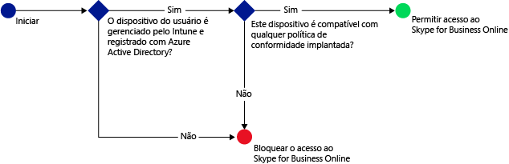
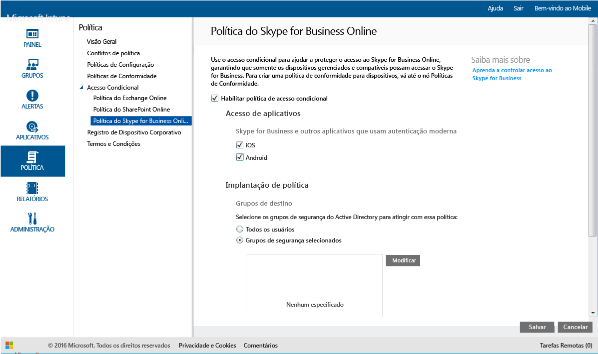

# Restringir o acesso ao Skype for Business Online com o Microsoft Intune
Use a política de acesso condicional para controlar o acesso ao **Skype for Business Online**.
O acesso condicional tem dois componentes:
- Uma política de conformidade do dispositivo, com a qual o dispositivo deve estar em conformidade para ser considerado compatível.
- Uma política de acesso condicional, na qual você especifica as condições que o dispositivo deve atender para acessar o serviço.
Para saber mais sobre como o acesso condicional funciona, leia o artigo [Restringir acesso a email e a serviços do O365](restrict-access-to-email-and-o365-services-with-microsoft-intune.md).

Quando um determinado usuário tenta usar o Skype for Business Online em seu dispositivo, ocorre a seguinte avaliação:

**Antes** de configurar uma política de acesso condicional para o Skype for Business Online, você precisa:
- Ter uma **assinatura do Skype for Business Online** e atribuir a licença do Skype for Business Online aos usuários.
- Ter uma **assinatura do Enterprise Mobility + Security** ou do **Azure Active Directory Premium** e ter os usuários licenciados para o EMS ou o Azure AD. Para obter mais detalhes, veja a [página de preços do Enterprise Mobility](https://www.microsoft.com/en-us/cloud-platform/enterprise-mobility-pricing) ou a [página de preços do Azure Active Directory](https://azure.microsoft.com/en-us/pricing/details/active-directory/).

-   [Habilitar a autenticação moderna](https://docs.microsoft.com/en-us/intune/deploy-use/restrict-access-to-skype-for-business-online-with-microsoft-intune) para o Skype for Business Online.
-  Todos os seus usuários devem estar usando o **Skype for Business Online**. Se você tiver uma implantação com o Skype for Business Online e o Skype for Business local, a política de acesso condicional não será aplicada aos usuários.

O dispositivo que precisa acessar o Skype for Business Online deve:

-   Ser um dispositivo **Android** ou **iOS**.

-   Estar **registrado** no [!INCLUDE[wit_nextref](../includes/wit_nextref_md.md)].

-   Ser **compatível** com qualquer política de conformidade do [!INCLUDE[wit_nextref](../includes/wit_nextref_md.md)] implantada.

O estado do dispositivo é armazenado no Azure Active Directory, que concede ou bloqueia o acesso com base nas condições que você especificar.

Se uma condição não for atendida, o usuário receberá uma das seguintes mensagens de erro ao se conectar:

-   Se o dispositivo não estiver registrado no [!INCLUDE[wit_nextref](../includes/wit_nextref_md.md)] ou no Azure Active Directory, será exibida uma mensagem com instruções sobre como instalar o aplicativo do Portal da Empresa e registrá-lo.

-   Se o dispositivo não for compatível, será exibida uma mensagem que direciona o usuário para o site do Portal da Empresa [!INCLUDE[wit_nextref](../includes/wit_nextref_md.md)] ou para o aplicativo do Portal da Empresa, no qual ele pode encontrar informações sobre o problema e como corrigi-lo.

## Configurar o acesso condicional ao Skype for Business Online

### Etapa 1: Configurar grupos de segurança do Azure Active Directory
Antes de começar, configure os grupos de segurança do Active Directory do Azure para a política de acesso condicional. Você pode configurar esses grupos no **Centro de administração do Office 365**. Esses grupos serão usados para afetar ou isentar os usuários da política. Quando um usuário é afetado pela política, cada dispositivo que ele usa deve ser compatível para que possa acessar os recursos.

Você pode especificar dois tipos de grupos para usar com a política do Skype for Business:

-   **Grupos de destino**: contém grupos de usuários aos quais a política se aplica.

-   **Grupos isentos**: contém grupos de usuários isentos da política.

Se um usuário estiver nos dois grupos, ele ficará isento da política.

### Etapa 2: Configurar e implantar uma política de conformidade
[Crie](create-a-device-compliance-policy-in-microsoft-intune.md) e [implante](deploy-and-monitor-a-device-compliance-policy-in-microsoft-intune.md) uma política de conformidade para todos os dispositivos que serão afetados pela política. Esses seriam todos os dispositivos usados pelos usuários nos **Grupos de destino**.

> [!NOTE]
> Enquanto as políticas de conformidade são implantadas em grupos [!INCLUDE[wit_nextref](../includes/wit_nextref_md.md)], as políticas de acesso condicional são destinadas a grupos de segurança do Azure Active Directory.

> [!IMPORTANT]
> Se você não tiver implantado uma política de conformidade, os dispositivos serão tratados como compatíveis.

Quando estiver pronto, continue na **Etapa 3**.

### Etapa 3: Configurar a política do Skype for Business Online
Em seguida, configure a política para exigir que somente dispositivos gerenciados e compatíveis possam acessar o Skype for Business Online. Essa política será armazenada no Azure Active Directory.

1.  No [Console de administração do Microsoft Intune](https://manage.microsoft.com), escolha **Política** > **Acesso Condicional** > **Política do Skype for Business Online**.

  

2.  Selecione **Habilitar política de acesso condicional**.

3.  Em **Acesso ao aplicativo**, você pode optar por aplicar a política de acesso condicional a:

    -   **iOS**

    -   **Android**

4.  Em **Grupos de Destino**, escolha **Modificar** para selecionar os grupos de segurança do Azure Active Directory aos quais a política será aplicada. Você pode optar por aplicá-la a todos os usuários ou apenas a um grupos seleto de usuários.

5.  Opcionalmente, em **Grupos Isentos**, escolha **Modificar** para selecionar os grupos de segurança do Azure Active Directory que são isentos dessa política.

6.  Quando terminar, selecione **Salvar**.

Você configurou o acesso condicional ao Skype for Business Online. Não é necessário implantar a política de acesso condicional, ela entra em vigor imediatamente.

## Monitorar a conformidade e políticas de acesso condicional
No espaço de trabalho **Grupos** , você pode exibir o status de acesso condicional de seus dispositivos.

Selecione qualquer grupo de dispositivos móveis. Em seguida, na guia **Dispositivos**, escolha um dos seguintes **Filtros**:

* **Dispositivos que não estão registrados com o AAD**: esses dispositivos estão bloqueados do Skype for Business Online.

* **Dispositivos que não são compatíveis**: esses dispositivos estão bloqueados do Skype for Business Online.

* **Dispositivos registrados com o AAD e que são compatíveis**: esses dispositivos podem acessar o Skype for Business Online.

<!--HONumber=Dec16_HO2-->

