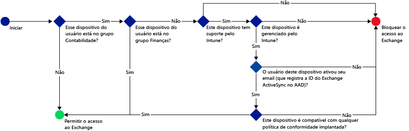
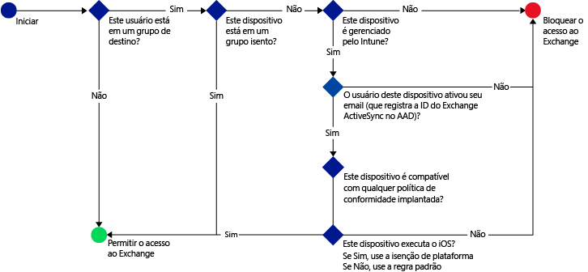
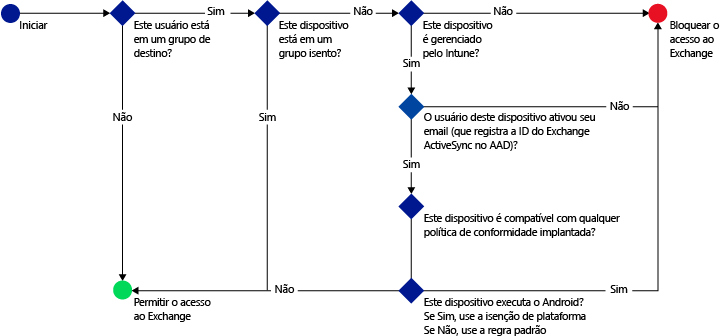

# Proteger o acesso a email com o Microsoft Intune: cenários de exemplo

[!INCLUDE[classic-portal](../includes/classic-portal.md)]

## Cenário 1: impedir que usuários usem dispositivos não compatíveis para acessar o Exchange Online
### Requisitos do cenário
- Todos os usuários do grupo de segurança **Contabilidade** do Azure Active Directory deverão ser impedidos de acessar o Exchange Online se o dispositivo não for compatível com uma política de conformidade implantada por você.
- Se existirem quaisquer usuários nesse grupo que não têm suporte do [!INCLUDE[wit_nextref](../includes/wit_nextref_md.md)], seu acesso ao Exchange Online deverá ser bloqueado no dispositivo.
- Os usuários do grupo de segurança **Finanças** do Azure Active Directory devem ser isentos da política, mesmo que também estejam no grupo de segurança **Contabilidade**.

Para fazer isso, configure uma política de acesso condicional para o Exchange Online com as seguintes configurações:

- Selecione **Habilitar política de acesso condicional**.

- Selecione as plataformas a que você deseja permitir o acesso de aplicativos com autenticação moderna.
- Para aplicativos do Exchange ActiveSync, selecione **Bloquear dispositivos incompatíveis em plataformas com suporte do Microsoft Intune** e **Bloquear todos os outros dispositivos em plataformas sem suporte do Microsoft Intune.**
-   Na seção **Grupo de destino**, em **Grupos de segurança selecionados**, escolha o grupo de usuários **Contabilidade**.

-   Na seção **Grupo isento**, em **Grupos de segurança selecionados**, escolha o grupo de usuários **Finanças**.

O fluxo a seguir é usado no cenário para decidir quais dispositivos podem acessar o Exchange Online:

## Cenário 2: todos os dispositivos iOS que acessam o Exchange local devem ser gerenciados pelo Intune
### Requisitos do cenário
- Somente dispositivos que executam o iOS devem ter acesso permitido ao Exchange local.
- Os dispositivos também devem estar registrados no Intune e atender às regras da política de conformidade antes que possam ser usados para acessar o Exchange.

Para fazer isso, configure a seguinte política de acesso condicional para o Exchange local com as seguintes configurações:

-   Escolha a opção **Bloquear o acesso de aplicativos de email ao Exchange local se o dispositivo não for compatível ou não estiver registrado no Microsoft Intune**. Ao escolher essa opção, a política de acesso condicional é habilitada, o que requer que todos os dispositivos sejam registrados no Microsoft Intune e obedeçam às regras da política de conformidade antes que possam acessar o Exchange.

-   Para configurações avançadas do Exchange Active Sync, crie:

  -   Uma exceção de plataforma que permite que dispositivos que executam iOS acessem o Exchange.   

  -   Uma regra padrão que especifica que quando um dispositivo não está coberto pela regra de exceção de plataforma, ele deve ser impedido de acessar o Exchange. Essa regra garante que dispositivos que não executam o iOS sejam impedidos de acessar o Exchange.

O fluxo a seguir é usado para decidir quais dispositivos podem acessar o Exchange:

## Cenário 3: nenhum dispositivo Android pode acessar o Exchange local
### Requisitos do cenário
- Todos os dispositivos Android devem ser impedidos de acessar o Exchange.
- Todos os outros dispositivos com suporte podem acessar o Exchange se forem gerenciados pelo [!INCLUDE[wit_nextref](../includes/wit_nextref_md.md)].

Para fazer isso, configure uma política de acesso condicional para o Exchange local com as seguintes configurações:

-   Escolha a opção **Bloquear o acesso de aplicativos de email ao Exchange local se o dispositivo não for compatível ou não estiver registrado no Microsoft Intune**. Ao selecionar essa opção, exige-se que todos os dispositivos sejam registrados no Intune e atendam às regras da política de conformidade.

- Para configurações avançadas do Exchange Active Sync, crie:
  -   Uma exceção de plataforma que bloqueia o acesso de dispositivos que executam Android ao Exchange. Essa regra garante que os dispositivos Android não sejam usados para acessar o Exchange.

  -   Uma regra padrão que especifica que quando um dispositivo não é coberto por outras regras, ele deve ter permissão para acessar o Exchange. Essa regra padrão garante que os dispositivos que executam plataformas diferentes do Android, mas com suporte do Microsoft Intune, possam ser usados para acessar o Exchange. No entanto, eles deverão estar registrados no Intune e atender às regras de política de conformidade.

O fluxo a seguir é usado para decidir quais dispositivos podem acessar o Exchange:

<!--HONumber=Jan17_HO4-->

