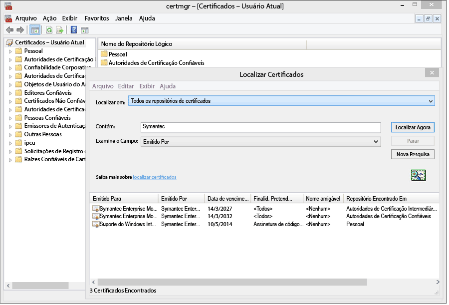
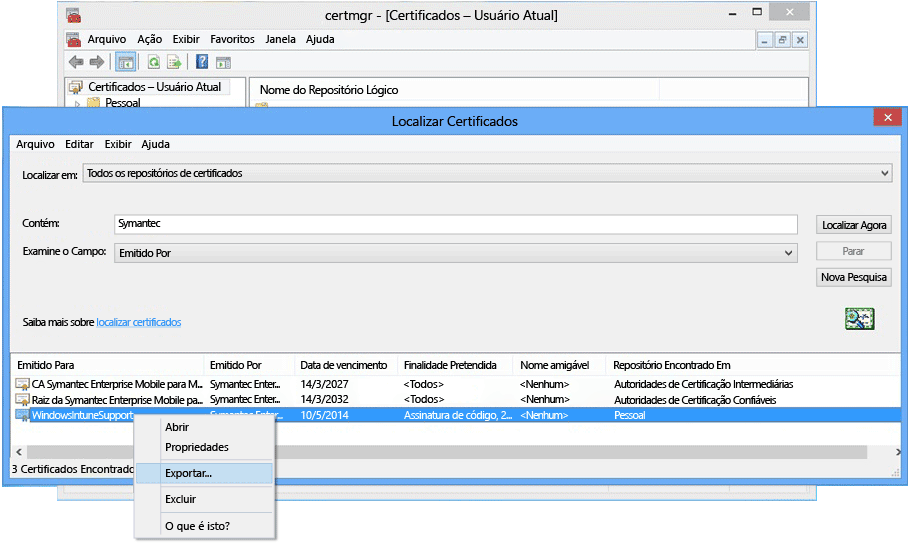

# <a name="sign-line-of-business-apps-so-they-can-be-deployed-to-windows-devices-with-intune"></a>Assine aplicativos da linha de negócios para que possam ser implantados em dispositivos Windows com o Intune

[!INCLUDE[classic-portal](../includes/classic-portal.md)]

Como administrador do Intune, é possível implantar aplicativos da linha de negócios (LOB) em dispositivos Windows e Windows 10 Mobile, incluindo o aplicativo de Portal da Empresa. Para implantar aplicativos .appx ou. xap em dispositivos Windows 10 Mobile e Windows 10 ou implantar qualquer aplicativo LOB em dispositivos Windows Phone 8.1 ou Windows 8.1, você deve obter um **Certificado de Assinatura de Código Móvel Empresarial da Symantec**. Somente o certificado da Symantec é confiável para esses aplicativos para os respectivos dispositivos Windows. Você pode usar sua própria autoridade de certificação para aplicativos do Windows 10 e "universal". Esse certificado é necessário para:

-   Assinar o aplicativo do Portal da Empresa para implantação em Computadores Windows, dispositivos Windows 10 Mobile e dispositivos Windows Phone

-   Assinar os aplicativos de linha de negócios da empresa para que o Intune possa implantá-los nos dispositivos Windows

As etapas a seguir o ajudarão a obter os certificados necessários e assinar os aplicativos. Você precisa ter uma conta do centro de desenvolvimento do Windows Phone e adquirir um certificado Symantec.


1. **Ingressar no Centro de Desenvolvimento do Windows Phone**<br>
   Ingresse no [Centro de Desenvolvimento do Windows Phone](http://go.microsoft.com/fwlink/?LinkId=268442) usando as informações de conta corporativa para efetuar logon e comprar usando sua conta corporativa. Essa solicitação precisará ser autorizada por um executivo da empresa antes que você receba um certificado de assinatura de código.

2. **Obter um certificado corporativo do Symantec**<br>
  Compre um certificado pelo [site do Symantec](http://go.microsoft.com/fwlink/?LinkId=268441) usando sua ID do Symantec. Depois de comprar o certificado, o aprovador corporativo designado por você para sua conta do Centro de Desenvolvimento do Windows Phone receberá um email pedindo a aprovação da solicitação do certificado. Para obter mais informações sobre o requisito de certificado do Symantec, consulte [Why Windows Phone requires a Symantec certificate? (Por que o Windows Phone exige um certificado da Symantec?)](https://technet.microsoft.com/en-us/library/dn764959.aspx#BKMK_Symantec) Perguntas frequentes sobre o registro de dispositivos Windows.

3.  **Importar certificados**<br>
    Assim que a solicitação tiver sido aprovada, você receberá um email com instruções para importar os certificados. Siga as instruções no email para importar os certificados.

4.  **Verificar os certificados importados**<br>
    Para verificar se os certificados foram importados corretamente, acesse o snap-in **Certificados**, clique com o botão direito do mouse em **Certificados** e selecione **Localizar Certificados**. No campo **Contém** , digite “Symantec” e clique em **Encontrar agora**. Os certificados que você importou devem aparecer nos resultados.

    

5. **Exportar um certificado de assinatura**<br>
    Após ter verificado se os certificados estão presentes, você pode exportar o arquivo .pfx para assinar o portal da empresa. Selecione o certificado do Symantec com a “assinatura por código” de **Finalidade**. Clique com o botão direito do mouse no certificado de assinatura por código e selecione **Exportar**.

    

    No **Assistente para Exportação de Certificados**, selecione **Sim, exportar a chave privada** e clique em **Avançar**. **Selecione Troca de Informações Pessoais –PKCS #12 (.PFX)** e marque **Incluir todos os certificados no caminho de certificação se possível**. Conclua o assistente. Para obter mais informações, consulte [How to Export a Certificate with the Private Key (Como exportar um certificado com uma chave privada)](http://go.microsoft.com/fwlink/?LinkID=203031).

6.  **Carregar o aplicativo no Intune**<br>
    Carregue o arquivo de aplicativo assinado e seu certificado de assinatura por código para disponibilizar o aplicativo a seus usuários finais.

    1.  No [console de administração do Intune](http://manage.microsoft.com), clique em **Administração** &gt; **Windows Phone**.

    2.  Clique em **Carregar Arquivo do Aplicativo Assinado** e entre com sua ID do administrador do Intune.

    3.  Adicione o arquivo de certificado (.pfx) que você exportou para **Certificado de assinatura por código** e crie uma senha para o certificado.

    4.  Conclua o assistente.

## <a name="example-download-sign-and-deploy-the-company-portal-app-for-windows-devices"></a>Exemplo: baixar, assinar e implantar o aplicativo do Portal da Empresa em dispositivos Windows

Você pode implantar o aplicativo do Portal da Empresa em dispositivos Windows, incluindo dispositivos Windows Phone e Windows 10 Mobile, com Intune em vez de instalar da Windows Store. Você deve baixar o aplicativo de Portal da Empresa e assiná-lo com seu certificado.  Isso só é necessário se os usuários não usam o Armazenamento da Empresa e você deseja implantar o Portal da Empresa em dispositivos Windows Phone 8.1.


1.  **Baixe o aplicativo do Portal da Empresa**

    Para implantar o aplicativo do Portal da Empresa usando o Intune, é possível baixar o [Aplicativo do Portal da Empresa do Microsoft Intune para Windows Phone 8.1](http://go.microsoft.com/fwlink/?LinkId=615799) no Centro de Download e executar o arquivo de extração automática (.exe). Esse arquivo contém dois arquivos:

    -   CompanyPortal.appx – Aplicativo de instalação do Portal da Empresa para Windows Phone 8.1

    -   WinPhoneCompanyPortal.ps1 – Um script do PowerShell que você pode usar para assinar o arquivo do aplicativo do Portal da Empresa para que ele pode ser implantado em dispositivos Windows Phone 8.1

    Como alternativa, você pode baixar o Portal da Empresa do Windows Phone 8.1 (pacote licenciado offline) ou o Portal da Empresa do Windows 10 (pacote licenciado offline) da [Windows Store para Empresas](http://businessstore.microsoft.com/). O aplicativo de Portal da Empresa precisará ser adquirido com uma licença offline e o pacote apropriado baixado para uso offline. As listagens de plataforma Windows 8 e Windows Phone 8 na seleção fazem referência às suas contrapartes 8.1. Para obter detalhes sobre como fazer isso com o Intune, consulte [Gerenciar aplicativos adquiridos na Windows Store para Empresas](manage-apps-you-purchased-from-the-windows-store-for-business-with-microsoft-intune.md).

2.  **Baixar o SDK do Windows Phone** Baixe o SDK do Windows Phone 8.0](http://go.microsoft.com/fwlink/?LinkId=615570) e instale o SDK em seu computador. O SDK é necessário para gerar um token de registro do aplicativo.

3.  **Gerar um arquivo AETX** Gere um arquivo de token de registro do aplicativo (.aetx) por meio do arquivo Symantec PFX usando o AETGenerator.exe, parte do SDK do Windows Phone 8.0. Para obter instruções de como criar um arquivo AETX, consulte [Como gerar um token de registro de aplicativo para o Windows Phone](https://msdn.microsoft.com/library/windows/apps/jj735576.aspx)

4.  **Baixar o SDK do Windows para Windows 8.1** Baixe e instale o [SDK do Windows Phone](http://go.microsoft.com/fwlink/?LinkId=613525) (http://go.microsoft.com/fwlink/?LinkId=613525). Observe que o script do PowerShell incluído com o aplicativo do Portal da Empresa usa o local de instalação padrão, `${env:ProgramFiles(x86)}\Windows Kits\8.1`. Se instalar em outro lugar, você deve incluir o local em um parâmetro de cmdlet.

5.  **Assinar código do aplicativo usando o PowerShell** Como administrador, abra o **Windows PowerShell** no computador host instalado com o SDK do Windows, o Symantec Enterprise Mobile Code Signing Certificate, navegue até o arquivo Sign-WinPhoneCompanyPortal.ps1 e execute o script.

    **Exemplo 1**

    ```
    .\Sign-WinPhoneCompanyPortal.ps1 -InputAppx 'C:\temp\CompanyPortal.appx' -OutputAppx 'C:\temp\CompanyPortalEnterpriseSigned.appx' -PfxFilePath 'C:\signing\cert.pfx' -PfxPassword '1234' -AetxPath 'C:\signing\cert.aetx'
    ```
    Este exemplo assina CompanyPortal.appx em C:\temp\ e produz o CompanyPortalEnterpriseSigned.appx. Ele usaria a senha de PFX 1234 e leria a ID do editor do arquivo PFX. Ele lê também a ID da empresa do arquivo cert.aetx.

    **Exemplo 2**

    ```
    .\Sign-WinPhoneCompanyPortal.ps1 -InputAppx 'C:\temp\CompanyPortal.appx' -OutputAppx 'C:\temp\CompanyPortalEnterpriseSigned.appx' -PfxFilePath 'C:\signing\cert.pfx' -PfxPassword '1234' -PublisherId 'OID.0.9.2342.19200300.100.1.1=1000000001, CN="Test, Inc.", OU=Test 1' -EnterpriseId 1000000001
    ```
    Este exemplo assina CompanyPortal.appx em C:\temp\ e produz o CompanyPortalEnterpriseSigned.appx. Ele usaria a senha de PFX 1234 e usaria a ID do editor especificada.

    **Parâmetros:**

    -   `-InputAppx` – O caminho local para o arquivo CompanyPortal.appx entre aspas simples. Por exemplo, 'C:\temp\CompanyPortal.appx'

    -   `-OutputAppx` – O nome de arquivo e caminho local para o aplicativo do Portal da Empresa assinado entre aspas simples. Por exemplo, 'C:\temp\CompanyPortalEnterpriseSigned.appx'

    -   `-PfxFilePath` – O nome do arquivo e o caminho local para o arquivo PFX exportado do certificado Symantec. Por exemplo, 'C:\signing\cert.pfx'

    -   `-PfxPassword` – A senha usada para assinar o arquivo PFX entre aspas simples. Por exemplo, '1234'

    -   `-AetxPath` – O caminho local para o arquivo .aetx que é usado para ler a ID da empresa, se o argumento 'EnterpriseId' não estiver definido. Este argumento ou EnterpriseId deve ser fornecido. Por exemplo, 'C:\signing\cert.aetx'

    -   `-PublisherId` - a ID do Editor da empresa. Se ausente, o campo 'Assunto' da Symantec Enterprise Mobile Code Signing Certificate será usado. Por exemplo, 'OID.0.9.2342.19200300.100.1.1=1000000001, CN="Test, Inc.", OU=Test 1'

    -   `-SdkPath` - o caminho para a pasta raiz do SDK do Windows para Windows 8.1. Esse argumento é opcional e o padrão é ${env:ProgramFiles(x86)}\Windows Kits\8.1.

    -   `-EnterpriseId` - a ID da empresa. Este argumento ou 'AetxPath' deve ser fornecido. Se esse argumento não for fornecido, a ID da empresa será lida do arquivo AETX. Por exemplo, 1000000001

6.  Implante o aplicativo do Portal da Empresa do Windows Phone 8.1 (SSP.appx). Para obter diretrizes, consulte [Implantar aplicativos no Microsoft Intune](deploy-apps-in-microsoft-intune.md).

## <a name="how-to-renew-the-symantec-enterprise-code-signing-certificate"></a>Como renovar o certificado corporativo de autenticação de código Symantec

O certificado da Symantec usado para implantar aplicativos móveis do Windows e do Windows Phone deve ser renovado periodicamente.

1.  Procure um email de renovação enviado da Symantec aproximadamente 14 dias antes da expiração do certificado. O email contém instruções da Symantec sobre como renovar o certificado corporativo.

    Para obter informações adicionais sobre certificados Symantec, visite [www.symantec.com](http://www.symantec.com) ou ligue para 1-877-438-8776 ou 1-650-426-3400.

2.  Vá até o site (exemplo: [https://products.websecurity.symantec.com/orders/enrollment/microsoftCert.do](https://products.websecurity.symantec.com/orders/enrollment/microsoftCert.do)) e faça logon com a ID do Editor da Symantec e o email endereçado associado ao certificado. Lembre-se de usar o mesmo computador para iniciar a renovação que você usará para baixar o certificado.

3.  Após a renovação ser aprovada e paga, baixe o certificado.

### <a name="how-to-install-the-updated-certificate-for-line-of-business-lob-apps"></a>Como instalar o certificado atualizado para aplicativos de linhas de negócios (LOB)

1.  Assine a versão mais recente do seu aplicativo de linha de negócios.

2.  Abra o [Console de Administração do Intune](https://admin.manage.microsoft.com) (https://admin.manage.microsoft.com) e vá para **Admin** &gt; **Gerenciamento de Dispositivo Móvel** &gt; **Windows Phone** e clique em **Carregar o Aplicativo Assinado**.

3.  Carregue o Portal da Empresa assinado. Você precisará de SSP.xap recentemente assinado e o novo arquivo .PFX que recebeu da Symantec ou o token de registro de aplicativo que foi criado com esse novo arquivo .PFX.

4.  Quando o upload for concluído, remova a versão antiga do Portal da Empresa no espaço de trabalho **Software**  .

5.  Assine todos aplicativos de linha de negócios de empresa novos e atualizados usando o novo certificado. Os aplicativos existentes não precisam ser assinados e reimplantados.


<!--HONumber=Dec16_HO2-->


