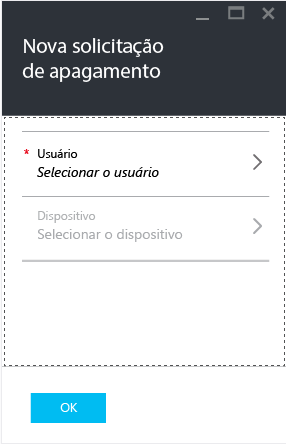
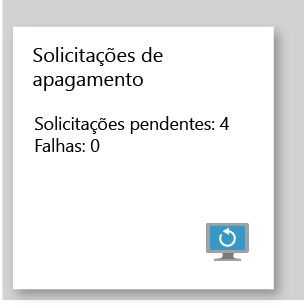

# Apagar dados de aplicativos de empresa gerenciados com o Microsoft Intune

[!INCLUDE[classic-portal](../includes/classic-portal.md)]

Quando um dispositivo é perdido ou roubado ou quando um funcionário sai da empresa, você quer ter certeza de que os dados dos aplicativos da empresa sejam removidos do dispositivo. No entanto, talvez você não queira remover dados pessoais do dispositivo, principalmente quando se trata de um dispositivo que pertence a um funcionário.

Para remover seletivamente os dados de aplicativo da empresa, crie uma solicitação de apagamento usando as etapas neste tópico. Após a solicitação ser concluída, na próxima vez que o aplicativo for executado no dispositivo, os dados da empresa serão removidos do aplicativo.
>[!NOTE]
> Contatos sincronizados diretamente do aplicativo para o catálogo de endereços nativos são removidos. Todos os contatos sincronizados do catálogo de endereços nativos com outra fonte externa não podem ser apagados. Atualmente, isso se aplica somente ao aplicativo Microsoft Outlook.

## Criar uma solicitação de apagamento

1.  Entre no Portal do Azure e escolha **Mais serviços** > **Outros** > **Intune**.

2.  Na folha do Intune, escolha **Gerenciar aplicativos**.

3.  Clique em **Nova solicitação de apagamento**. Isso abre a folha **Nova solicitação para apagar**.

    

4.  Escolha **Usuário** para abrir a folha **Usuário** e selecione o usuário cujos dados de aplicativo você deseja apagar.

5.  Escolha **Dispositivo**.  Isso abre a folha **Dispositivo** , que lista todos os dispositivos associados ao usuário selecionado.  Selecione o dispositivo que deseja apagar.

6.  Você está de volta na folha **Nova solicitação para apagar**. Escolha **OK** para fazer uma solicitação de apagamento. O serviço cria e controla uma solicitação de apagamento separada para cada aplicativo protegido no dispositivo.

## Monitorar suas solicitações de apagamento

No bloco **Solicitação de apagamento**, há um relatório resumido que mostra o status geral da solicitação de apagamento e inclui o número de falhas e solicitações pendentes. Para obter mais detalhes, siga estas etapas:

1.  Na folha do Intune, escolha **Gerenciar aplicativos**.

2.  Na folha **Solicitação de apagamento**, escolha o bloco **Solicitação de apagamento** para abrir a folha **Solicitação de apagamento**.

3.  Na folha **Solicitação de apagamento**, você pode ver a lista de suas solicitações agrupadas por usuário. Como o sistema cria uma solicitação de apagamento para cada aplicativo protegido em execução no dispositivo, você poderá ver várias solicitações de um usuário. O status indica se uma solicitação de apagamento está **pendente**, com **falha**ou **bem-sucedida**.

O usuário deve abrir o aplicativo para que o apagamento ocorra, e ele pode durar até 30 minutos após a criação da solicitação.

Apagamentos com status pendente são exibidos até serem excluídos manualmente.  Para excluir manualmente uma solicitação de apagamento, clique com o botão direito do mouse e escolha Excluir.

### Consulte também
[Proteger dados de aplicativo usando políticas de gerenciamento de aplicativo móvel](protect-app-data-using-mobile-app-management-policies-with-microsoft-intune.md)

[Usando o Portal do Azure](azure-portal-for-microsoft-intune-mam-policies.md)

<!--HONumber=Jan17_HO2-->

