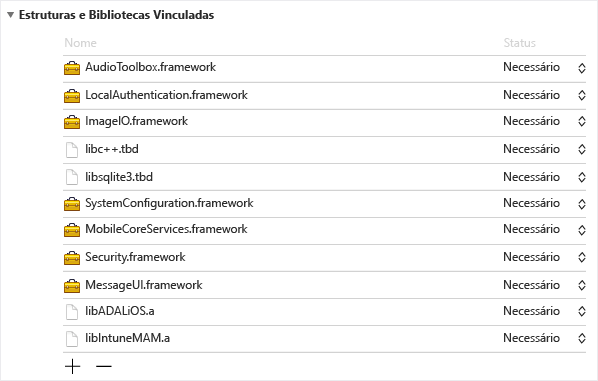
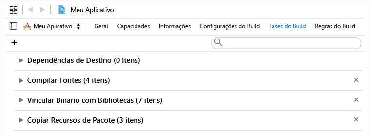
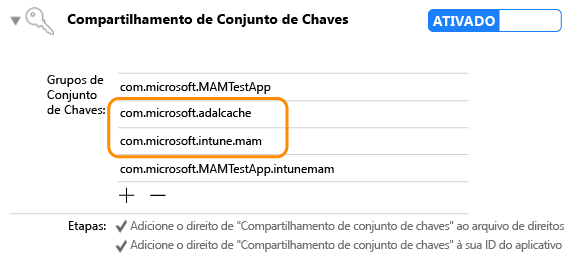

---
# required metadata

title: Guia de Desenvolvedor do SDK de Aplicativo do Microsoft Intune para iOS | Microsoft Intune
description:
keywords:
author: Msmbaldwin
manager: jeffgilb
ms.date: 04/28/2016
ms.topic: article
ms.prod:
ms.service: microsoft-intune
ms.technology:
ms.assetid: 8e280d23-2a25-4a84-9bcb-210b30c63c0b

# optional metadata

#ROBOTS:
#audience:
#ms.devlang:
ms.reviewer: jeffgilb
ms.suite: ems
#ms.tgt_pltfrm:
#ms.custom:

---

# SDK do Microsoft Intune App para o Guia do Desenvolvedor do iOS

> [!NOTE] Leia primeiro a [Get Started with Intune App SDK Guide](intune-app-sdk-get-started.md) (Introdução ao Guia de SDK de Aplicativo do Intune), que explica como preparar a integração em cada plataforma com suporte.* 

O SDK do Microsoft Intune App para iOS permite incorporar MAM (Gerenciamento) do Intune Mobile App em seu aplicativo iOS. Um aplicativo habilitado para MAM é integrado com o SDK do Intune App e permite que os administradores de TI implantem políticas para seu aplicativo móvel quando o aplicativo for gerenciado ativamente.

# Novidades no SDK

O SDK do Intune App para iOS inclui uma biblioteca estática, arquivos de recursos, cabeçalhos de API, um plist de configurações de Depuração e uma ferramenta do configurador. Aplicativos móveis podem simplesmente incluir os arquivos de recursos e um link estático para as bibliotecas para a maioria das imposições de política. Recursos de MAM avançados do Intune são aplicados por meio de APIs.
Este guia aborda o uso do seguinte ao integrar o SDK do Intune App para iOS:

* **`libIntuneMAM.a`**: a biblioteca de SDK do Aplicativo Intune. Vincule esta biblioteca ao seu projeto para habilitar MAM no seu aplicativo móvel. As instruções são encontradas na seção "Criando seu aplicativo com o SDK do Intune App" aqui.

* **`IntuneMAMResources.Bundle`**: um pacote de recursos que contém recursos usados pelo SDK. 

* **Cabeçalhos**: expõe as APIs do SDK do Intune App. Se você usar uma API, precisará incluir o arquivo de cabeçalho que contém a API. 

# Como o SDK de Aplicativos do Intune funciona

O objetivo do SDK do Intune APP para iOS é adicionar recursos de gerenciamento de aplicativos a aplicativos iOS com alterações mínimas de código. Reduzir a quantidade de alterações de código diminui o tempo de entrega, aumentando ainda a consistência e a estabilidade do seu aplicativo móvel. 

O aplicativo deve ser vinculado à biblioteca estática e incluir o pacote de recursos. O arquivo MAMDebugSettings.plist é opcional e pode ser incluído no pacote para simular políticas de MAM sendo aplicadas ao aplicativo sem a necessidade de implantá-lo por meio do Microsoft Intune. Além disso, em compilações de depuração, as políticas no arquivo MAMDebugSettings.plist podem ser aplicadas ao transferir o arquivo MAMDebugSettings.plist para diretório de Documentos do aplicativo por meio do compartilhamento de arquivos do iTunes.

# Criando seu aplicativo com o SDK do Intune App 

Conclua as etapas a seguir para habilitar o SDK do Intune App:

1. Vincule à biblioteca `libIntuneMAM.a` fazendo o seguinte:

    Arraste e solte a biblioteca libIntuneMAM.a para a lista "Estruturas e Bibliotecas Vinculadas" do projeto de destino.  

    
 
    **Observação**: ao lançar na loja de aplicativos, use a versão da libIntuneMAM.a criada para a versão de lançamento e não para a versão de depuração. A versão de lançamento estará na pasta "lançamento". A versão de depuração tem saída detalhada, o que é bom para depurar problemas com o SDK do Intune App.

2. Adicione as seguintes estruturas de iOS ao projeto (se faltarem).
    * `MessageUI.framework`
    * `Security.framework`
    * `MobileCoreServices.framework`
    * `SystemConfiguration.framework`
    * `libsqlite3.dylib`
    * `libc++.dylib`
    * `ImageIO.framework`
    * `LocalAuthentication.Framework`
    * `AudioToolbox.framework` 

    **Observação**: se o aplicativo se destina a iOS7, defina o atributo “Status” de `LocalAuthentication.Framework` como "Opcional". 

    Se “Status” não for definido, o aplicativo falhará ao iniciar no iOS7.

    **Observação**: o Xcode 7 mudou as extensões `.dylib` para `.tbd`.

3. Adicione o pacote de recursos `IntuneMAMResources.bundle` ao projeto arrastando o pacote de recursos em "Copiar Recursos do Pacote” em “Fases de Compilação”. 

    

4. Adicione `-force_load {PATH_TO_LIB}/libIntuneMAM.a` a um dos seguintes, substituindo `{PATH_TO_LIB}` pelo local do SDK do Intune App:
    * a definição da configuração de build OTHER_LDFLAGS do projeto 
    * as “Outros Sinalizadores do Vinculador” da interface do usuário 

    **Observação**: para localizar o `PATH_TO_LIB`, selecione o arquivo `libIntuneMAM.a` e escolha “Obter Informações” no menu “Arquivo”. Copie e cole as informações “Onde” (o caminho) na seção “Geral” da janela “Informações”.

5. Se seu aplicativo móvel definir uma Nib principal ou um Storyboard no seu `info.plist`, remova os campos do arquivo Storyboard Principal ou Nib Principal. Adicione os valores de Storyboard ou Nib você removeu anteriormente a um novo dicionário, chamado `IntuneMAMSettings` com os seguintes nomes de chave, conforme aplicável:
    * `MainStoryboardFile`
    * `MainStoryboardFile~ipad`
    * `MainNibFile`
    * `MainNibFile~ipad `
    
    Se seu aplicativo móvel não define um Nib ou um Storyboard no `info.plist`, essas configurações **não são necessárias**. 

    **Observação**: você pode exibir o `info.plist` em formato bruto (para ver os nomes de chave) clicando duas vezes em qualquer lugar no corpo do documento e alterando o tipo de exibição para "Mostrar Chaves/Valores Brutos".

6. Habilite o compartilhamento de conjunto de chaves (se já não estiver habilitado) clicando em “Funcionalidades” em cada destino do projeto e habilitando a opção de Compartilhamento de Conjunto de Chaves. O compartilhamento de conjunto de chaves é necessário para prosseguir para a próxima etapa.

    **Observação**: o perfil de provisionamento precisa dar suporte aos novos valores de compartilhamento de conjunto de chaves. Os grupos de acesso do conjunto de chaves devem dar suporte a um caractere curinga. Você pode verificar isso abrindo o `.mobileprovision` em um editor de texto, pesquisando por “grupos-de-acesso-de-conjunto-de-chaves” e incluindo um curinga, como por exemplo: 

       <key>keychain-access-groups</key>
       <array>
       <string>YOURBUNDLESEEDID.*</string>
       </array>

7. Depois de habilitar o compartilhamento de conjunto de chaves, siga estas etapas para criar um grupo de acesso separado no qual os dados do SDK do Intune App serão armazenados. Você pode criar um grupo de acesso do conjunto de chaves usando a interface do usuário ou o arquivo de direitos:

    Usando a interface do usuário para criar um grupo de acesso do conjunto de chaves: 
    
    * Se seu aplicativo móvel não tiver grupos de acesso do conjunto de chaves definidos, adicione a ID do pacote do aplicativo como o primeiro grupo.
    * Adicione o grupo do conjunto de chaves compartilhado com.microsoft.intune.mam. Este grupo de acesso é usado pelo SDK do Intune App para armazenar dados.  
    * Adicione o pacote de recursos `com.microsoft.adalcache` aos grupos de acesso existentes. 
 
    

    Se você estiver usando o arquivo de direitos para criar o grupo de acesso do conjunto de chaves, em vez de interface do usuário regular, você precisará acrescentar `$(AppIdentifierPrefix)` no início do arquivo de direito do grupo de acesso de conjunto de chaves. Por exemplo: `$(AppIdentifierPrefix)com.microsoft.intune.mam` e `$(AppIdentifierPrefix)com.microsoft.adalcache`.

    **Observação**: um arquivo de direitos é um arquivo XML exclusivo ao seu aplicativo móvel que é usado para especificar permissões especiais e recursos em seu aplicativo iOS.

8. Para aplicativos móveis que estão sendo desenvolvidos para iOS 9+, é necessário incluir cada protocolo que seu aplicativo móvel passa a `UIApplication canOpenURL` na matriz `LSApplicationQueriesSchemes` do arquivo `info.plist` do seu aplicativo móvel. Além disso, para cada protocolo listado, um novo protocolo precisa ser adicionado e precedido com `-intunemam`. Você também deve incluir `http-intunemam`, `https-intunemam`e `ms-outlook-intunemam` na matriz. 

9. Se o aplicativo define os esquemas de URL em seu `info.plist file`, adicione outro esquema, com um sufixo `-intunemam` para cada esquema de URL.

10. Se o aplicativo tem grupos de aplicativo definidos em seus direitos, adicione esses grupos ao dicionário `IntuneMAMSettings` sob a chave `AppGroupIdentitifiers` como uma matriz de cadeias de caracteres.

11. Vincule seu aplicativo móvel à biblioteca ADAL. A biblioteca ADAL para Objetivo C está [disponível no GitHub](https://github.com/AzureAD/azure-activedirectory-library-for-objc).

    **Observação**: o SDK do Intune App foi testado com o código da agência do agente ADAL de 19/06/2015. Verifique se você está vinculando com a versão mais recente/de trabalho da biblioteca ADAL.

12. Inclua o pacote de recursos `ADALiOSBundle.bundle resource` no projeto arrastando o pacote de recursos em "Copiar Recursos do Pacote” em “Fases de Compilação”.

13. Use a opção do vinculador `-force_load PATH_TO_ADAL_LIBRARY` ao vincular para a biblioteca.

    Adicione `-force_load {PATH_TO_LIB}/libADALiOS.a` para OTHER_LDFLAGS da configuração de build do projeto ou “Outros Sinalizadores do Vinculador” na interface do usuário. “PATH_TO_LIB” deve ser substituído pelo local da ADAL em binário. 

Se seu aplicativo móvel usa ADAL para sua própria autenticação, consulte a seção "Configurando as Configurações de Biblioteca de Autenticação do Diretório do Azure" localizada aqui.

## Telemetria 

O SDK do Intune App para iOS registra dados de telemetria em eventos de uso por padrão, que é enviada para o Microsoft Intune.

Os dados são registrados nos eventos de uso a seguir: 

1. Inicialização do aplicativo, para o Microsoft Intune obter informações sobre o uso do aplicativo habilitado para MAM por tipo de gerenciamento.

2. Chamada à API EnrollApplication para o Microsoft Intune obter informações sobre a taxa de sucesso e várias outras métricas de desempenho de chamada enrollApplication do lado do cliente.

**Observação**: se optar por não enviar dados de telemetria do SDK do Intune App para o Microsoft Intune do seu aplicativo móvel, você **deve desabilitar** a captura de telemetria pelo SDK do Intune App definindo a propriedade `MAMTelemetryDisabled` para '”YES” em `IntuneMAMSettings`.

## Definindo as configurações da ADAL (Biblioteca de Autenticação de Diretório) do Diretório do Azure (opcional)

O SDK do Intune App usa ADAL para seus cenários de inicialização condicional e autenticação. Normalmente, a ADAL requer que os aplicativos se registrem e obtenham uma ID exclusiva, conhecida como `ClientID`, entre outros identificadores, para garantir a segurança dos tokens concedidos ao aplicativo. O SDK do Intune App usa valores de registro padrão ao contatar o Active Directory do Azure.  Se o próprio aplicativo usar ADAL para seu cenário de autenticação, ele deve usar seus valores de registro existentes e substituir o padrão do SDK do Intune App para garantir que os usuários finais não sejam solicitados por autenticação duas vezes (uma vez pelo SDK do Intune App e outra pelo aplicativo). 

As etapas a seguir são necessárias se o aplicativo usar ADAL para autenticação. Se seu aplicativo móvel não depender de ADAL, nenhuma ação adicional será necessária. 

1. No `Info.plist`do projeto, em um dicionário `IntuneMAMSettings` com o nome da chave `ADALClientId`, especifique a `ClientID` a ser usada para chamadas de ADAL. 

2. No `Info.plist`do projeto, no dicionário `IntuneMAMSettings` com o nome da chave `ADALRedirectUri`, especifique a URI de Redirecionamento a ser usada para chamadas de ADAL. Você também precisa especificar o `ADALRedirectScheme` dependendo do formato de URI de redirecionamento do aplicativo.

## Criando a suas extensões (opcional) 

Ao criar extensões, siga as mesmas instruções para criar seu aplicativo móvel, conforme descrito na seção "Criando seu aplicativo com o SDK do Intune App". Além disso, atualize o arquivo info.plist do cada extensão para adicionar uma chave ContainingAppBundleId no dicionário IntuneMAMSettings com o valor da ID do pacote do aplicativo recipiente.

## Criando a suas estruturas (opcional)

Com as alterações mais recentes para o SDK do Intune App, você não precisa compilar seu aplicativo móvel com os sinalizadores do vinculador específico se seu aplicativo móvel contiver estruturas de aplicativo incorporado. 

## Arquivos de imagem de inicialização (opcional)

Quando um aplicativo habilitado para MAM é gerenciado ativamente pelo Microsoft Intune, o SDK do Intune App exibirá uma tela de inicialização ao abrir o aplicativo para indicar ao usuário que o aplicativo é gerenciado. Opcionalmente, você pode adicionar arquivos de imagem para exibir na página de inicialização "Gerenciado por sua empresa". Use as seguintes diretrizes para imagens:

* Adicione os nomes de arquivo sob o dicionário `IntuneMAMSettings` no info.plist do aplicativo com os nomes de chave `SplashIconFile` e `SplashIconFile~ipad`. 

* Tamanho da imagem e requisitos:

    * 180 x 180 para iPhone 6s Plus e iPhone 6, 120 x 120 para outros modelos de iPhone e 152 x 152 para iPad. 
    
    * Remova a extensão `.png` dos nomes de arquivo 
    
    * Use a opção do vinculador `@2x` para versões de escala x2 e o `@3x` versões de escala x3 dos arquivos de imagem. Se as imagens não tiverem o tamanho correto, elas serão redimensionados para caber. Se os valores de SplashIconFile não forem especificados, o SDK do Intune App seleciona um dos ícones do aplicativo (60 x 60 para todos os iPhones, 76 x 76 para iPad).

**Observação**: esta tela é disparada na inicialização, mas pode ser ignorada permanentemente pelo usuário.

# Definir as configurações do SDK do Intune App

O dicionário `IntuneMAMSettings` contido no `info.plist` do aplicativo é usado para configurar o SDK do Intune App. Confira a seguir uma lista de configurações com suporte. 

Algumas dessas configurações foram abordadas nas seções anteriores e outras não se aplicam a todos os aplicativos. 

Configuração  | Tipo  | Definição | Necessário?
--|--|--|--
ADALClientId  | Cadeia de caracteres  | Identificador do cliente do aplicativo AAD. | Necessário se o aplicativo usar ADAL.
ADALRedirectUri  | Cadeia de caracteres  | URI de redirecionamento do AAD do aplicativo. | Necessário se o aplicativo usar ADAL. 
AppGroupIdentifier | Matriz de cadeia de caracteres  | Matriz de grupos de aplicativo na seção de grupos de com.apple.security.application de direitos do aplicativo. | Necessário se o aplicativo usar grupos de aplicativos.
ContainingAppBundleId  | Cadeia de caracteres | Especifica a ID do pacote da extensão que contém aplicativos. | Necessário para extensões do iOS.
MainNibFile MainNibFile~ipad  | Cadeia de caracteres  | Essa configuração deve conter o nome do arquivo nib principal do aplicativo.  | Necessário se o aplicativo definir MainNibFile no seu info.plist.
MainStoryboardFile MainStoryboardFile~ipad  | Cadeia de caracteres  | Essa configuração deve conter o nome do arquivo de storyboard principal do aplicativo. | Necessário se o aplicativo definir UIMainStoryboardFile no seu info.plist.
SplashIconFile  SplashIconFile ~ ipad  | Cadeia de caracteres  | Especifica o arquivo de ícone de abertura do Intune. Consulte a seção "Arquivos de imagem na inicialização" aqui para obter mais detalhes. | Opcional.
SplashDuration | Número | Quantidade mínima de tempo em segundos que a tela inicial do Intune será exibida ao iniciar o aplicativo. O padrão é 1,5. | Opcional.
ADALLogOverrideDisabled | Booliano  | Especifica se o SDK roteará todos os logs de ADAL (incluindo chamadas de ADAL do aplicativo, se houver) para seu próprio arquivo de log. O padrão é NÃO. Defina como SIM se desejar que o aplicativo defina seu próprio retorno de chamada de log ADAL. | Opcional.

# Cabeçalhos para o SDK do Intune App 

Os seguintes Cabeçalhos incluem as chamadas de função de API necessárias para habilitar a funcionalidade do SDK do Intune App. 

    IntuneMAMAsyncResult.h
    IntuneMAMDataProtectionInfo.h
    IntuneMAMDataProtectionManager.h
    IntuneMAMFileProtectionInfo.h
    IntuneMAMFileProtectionManager.h
    IntuneMAMPolicyDelegate.h
    IntuneMAMLogger.h

# Depurando o SDK do Intune App no Xcode

Antes de testar seu aplicativo habilitado para MAM com o Microsoft Intune, você pode usar `Settings.bundle` enquanto estiver no Xcode. Isso permitirá que você defina políticas de teste sem a necessidade de uma conexão com o Intune. Para habilitar:

* Adicionar um `Settings.bundle` clicando com o botão direito na pasta de nível superior no seu projeto. Selecione "Adicionar -> Novo Arquivo" no menu. Selecione o modelo de "Pacote de Configurações" encontrado em "Recursos" para adicionar.

* Apenas em compilações de depuração, copie o `MAMDebugSettings.plist` para o `Settings.bundle`.

* Em `Root.plist` (no Settings.bundle), adicione uma preferência de “Tipo” do Painel Filho, "FileName" `MAMDebugSettings`.

* Em "Configurações -> Nome-do-Seu-Aplicativo", alterne "Habilitar Políticas de Teste".

* Inicie o aplicativo (dentro ou fora do Xcode). 

* Em "Configurações -> Nome-do-Seu-Aplicativo -> Habilitar Políticas deTteste", alterne uma política, por exemplo, “PIN”.

* Inicie o aplicativo (dentro ou fora do Xcode). Verifique se o PIN funciona conforme o esperado.

> [!NOTE] Agora você pode usar "Configurações -> Nome do Seu Aplicativo -> Habilitar Políticas de Teste" para habilitar e alternar configurações.

# Práticas Recomendadas de iOS

A seguir estão algumas práticas recomendadas para o desenvolvimento para iOS:

O sistema de arquivos iOS diferencia maiúsculas de minúsculas. Verifique se a caixa está correta para nomes de arquivo como `libIntuneMAM.a` e `IntuneMAMResources.bundle`.

Se o Xcode tiver problemas para encontrar `libIntuneMAM.a`, você pode corrigir o problema adicionando o caminho para essa biblioteca aos caminhos de pesquisa do vinculador.

<!--HONumber=May16_HO2-->

