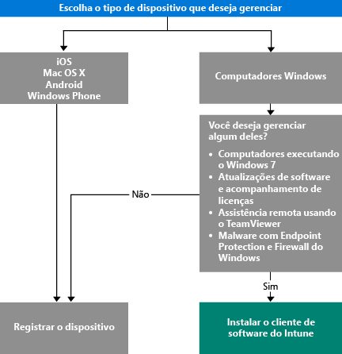

# Escolha como gerenciar dispositivos

[!INCLUDE[classic-portal](../includes/classic-portal.md)]

Para tirar proveito dos muitos recursos que o Intune oferece, como a implantação de aplicativo e o controle de configurações de dispositivo, os dispositivos devem ser *gerenciados*. A maneira como você gerencia os dispositivos depende dos recursos do Intune que deseja usar. Este tópico ajuda a escolher um método que atenda às suas necessidades.

Para gerenciar dispositivos que executam o iOS, o Mac OS X, o Android ou o Windows Phone, você deve *registrá-los*.

Para gerenciar computadores Windows, você tem duas opções:

1. Registrar o dispositivo **ou**
2. Instalar o *cliente de software do Intune*.

## Decidir qual método usar
Use este fluxo de decisão para decidir como registrar seus dispositivos gerenciados.

Inscrever os computadores Windows para obter o máximo de funcionalidade. No entanto, o cliente de software do Intune pode ser mais adequado para:

- Windows 7
- Atualizações de software do Windows e o uso de licenças
- Endpoint Protection e Firewall do Windows
- Assistência remota aos usuários usando o software TeamViewer

Para obter uma lista detalhada dos recursos de gerenciamento que você obterá com cada método, veja [Recursos de gerenciamento de dispositivo móvel](mobile-device-management-capabilities-in-microsoft-intune.md) e [Recursos do cliente de software PC Intune](windows-pc-management-capabilities-in-microsoft-intune.md).
Para saber mais sobre os dispositivos e computadores aos quais o Intune dá suporte, veja [Suporte para dispositivos móveis e computadores](https://docs.microsoft.com/intune/get-started/what-to-know-before-you-start-microsoft-intune#intune-supported-devices).

## Próximas etapas

- [Escolher como registrar dispositivos móveis](/intune/get-started/choose-how-to-enroll-devices1)
- [Gerenciar computadores Windows com o software cliente de computador do Intune](/intune/deploy-use/manage-windows-pcs-with-microsoft-intune)
- [Gerenciamento de dispositivos móveis do Exchange ActiveSync com o Microsoft Intune](/intune/deploy-use/mobile-device-management-with-exchange-activesync-and-microsoft-intune).

<!--HONumber=Dec16_HO3-->

