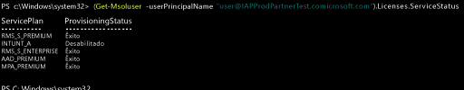

# Atribuir licenças do Intune a suas contas de usuário

[!INCLUDE[classic-portal](../includes/classic-portal.md)]

Se você adicionar usuários manualmente ou sincronizar a partir de seu Active Directory local, primeiro atribua a cada usuário uma licença do Intune para que eles possam registrar seus dispositivos no Intune.

## Atribuir uma licença do Intune no Centro de administração do Office 365

Use o [portal do Office 365](http://go.microsoft.com/fwlink/p/?LinkId=698854) para adicionar manualmente usuários baseados em nuvem e atribuir licenças a contas de usuário baseadas em nuvem e contas sincronizadas do seu Active Directory local ao Azure AD.

1.  Entre no [Portal do Office 365](http://go.microsoft.com/fwlink/p/?LinkId=698854) usando suas credenciais de administrador de locatário e escolha **Usuários** > **Usuários Ativos**.

2.  Selecione a conta de usuário a qual você deseja atribuir uma licença de usuário do Intune e escolha **Licenças de produto** > **Editar**.

3.  Mude **Intune** ou **Enterprise Mobility + Security** para **Ativado** e escolha **Salvar**.

4. Agora, a conta de usuário tem as permissões necessárias para usar o serviço e registrar os dispositivos no gerenciamento.

> [!NOTE]
> Os usuários serão exibidos no console de Administração somente após o registro de um dispositivo. Além disso, você pode selecionar um grupo de usuários para editar simultaneamente, selecionando adicionar ou substituir uma licença para todos os usuários selecionados.

## Usar o PowerShell para gerenciar seletivamente licenças de usuário do EMS
As organizações que usam o Microsoft Enterprise Mobility + Security (conhecido anteriormente como Enterprise Mobility Suite) podem ter usuários que precisam apenas do Azure Active Directory Premium ou dos serviços do Intune no pacote do EMS. Você pode atribuir um serviço ou um subconjunto de serviços usando os [cmdlets do PowerShell do Azure Active Directory](https://msdn.microsoft.com/library/jj151815.aspx).

Para atribuir seletivamente licenças de usuário para serviços do EMS, abra o PowerShell como administrador em um computador com o [Módulo do Azure Active Directory para Windows PowerShell](https://msdn.microsoft.com/library/jj151815.aspx#bkmk_installmodule) instalado. Você pode instalar o PowerShell em um computador local ou em um servidor do ADFS.

Você precisa criar uma nova definição de SKU de licença que se aplique apenas aos planos de serviço desejados. Para fazer isso, desabilite os planos que não deseja aplicar. Por exemplo, você pode criar uma definição de SKU de licença que não atribui uma licença do Intune. Para ver uma lista dos serviços disponíveis, digite:

    (Get-MsolAccountSku | Where {$_.SkuPartNumber -eq "EMS"}).ServiceStatus

Você pode executar o comando a seguir para excluir o plano de serviço do Intune. Você pode usar o mesmo método para expandir para um grupo de segurança inteiro ou pode usar filtros mais granulares.

**Exemplo 1** 
Criar um novo usuário na linha de comando e atribuir uma licença do EMS sem habilitar a parte do Intune da licença:

    Connect-MsolService

    New-MsolUser -DisplayName “Test User” -FirstName FName -LastName LName -UserPrincipalName user@<TenantName>.onmicrosoft.com –Department DName -UsageLocation US

    $CustomEMS = New-MsolLicenseOptions -AccountSkuId "<TenantName>:EMS" -DisabledPlans INTUNE_A
    Set-MsolUserLicense -UserPrincipalName user@<TenantName>.onmicrosoft.com -AddLicenses <TenantName>:EMS -LicenseOptions $CustomEMS

Verifique com:

    (Get-MsolUser -UserPrincipalName "user@<TenantName>.onmicrosoft.com").Licenses.ServiceStatus

**Exemplo 2** 
Desabilitar a parte do Intune da licença do EMS para um usuário a que já foi atribuída uma licença:

    Connect-MsolService

    $CustomEMS = New-MsolLicenseOptions -AccountSkuId "<TenantName>:EMS" -DisabledPlans INTUNE_A
    Set-MsolUserLicense -UserPrincipalName user@<TenantName>.onmicrosoft.com -LicenseOptions $CustomEMS

Verifique com:

    (Get-MsolUser -UserPrincipalName "user@<TenantName>.onmicrosoft.com").Licenses.ServiceStatus

>[!div class="step-by-step"]

>[&larr; **Sincronizar usuários ao Intune**](.\start-with-a-paid-subscription-to-microsoft-intune-step-2.md)     [**Organizar usuários e dispositivos** &rarr;](.\start-with-a-paid-subscription-to-microsoft-intune-step-5.md)  

