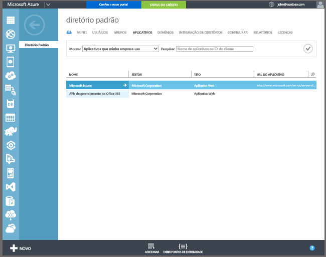

## Registro no Azure Active Directory

O registro automático permite que os usuários registrem computadores Windows 10 e dispositivos Windows 10 Mobile da empresa ou pessoais no Intune adicionando uma conta corporativa ou de estudante e concordando em ser gerenciados. Simples assim. Em segundo plano, o dispositivo do usuário registra e ingressa no Azure Active Directory. Depois de registrado, o dispositivo é gerenciado com o Intune.

**Pré-requisitos**
- Assinatura do Azure Active Directory Premium ([assinatura de avaliação](http://go.microsoft.com/fwlink/?LinkID=816845))
- Assinatura do Microsoft Intune

### Configurar o registro automático do MDM

1. No [portal de gerenciamento do Azure](https://manage.windowsazure.com) (https://manage.windowsazure.com), navegue até o nó do **Active Directory** e selecione o diretório.

2. Clique na guia **Aplicativos** e você verá **Microsoft Intune** na lista de aplicativos.

    

3. Clique na seta de **Microsoft Intune** e você verá uma página que o habilita a configurar o Microsoft Intune.

4. Clique em **Configurar** para começar a configurar o registro automático do MDM com o Microsoft Intune.

5. Especifique as URLs para o Intune:

  - **URL de Registro do MDM** – Use o valor padrão.
  - **URL de termos de uso do MDM** – use o valor padrão. Essa URL exibe os termos de uso para os usuários ao registrarem dispositivos.
  - **URL de conformidade do MDM** – use o valor padrão. Se um dispositivo estiver fora de conformidade, uma mensagem de **Acesso negado** será exibida com essa URL. A URL aponta para uma página que ajuda os usuários a entender por que o dispositivo não é compatível com a política e como eles podem colocá-lo novamente em conformidade.

6.  Especifica quais dispositivos dos usuários devem ser gerenciados pelo Microsoft Intune. Os dispositivos do Windows 10 desses usuários serão automaticamente registrados para gerenciamento com o Microsoft Intune.

  - **Todos**
  - **Grupos**
  - **Nenhum**

7. Selecione **Salvar**.

<!--HONumber=Jan17_HO1-->

