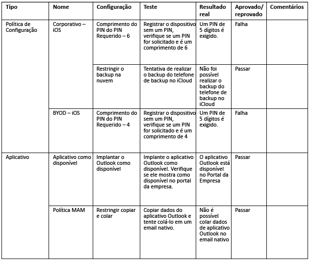
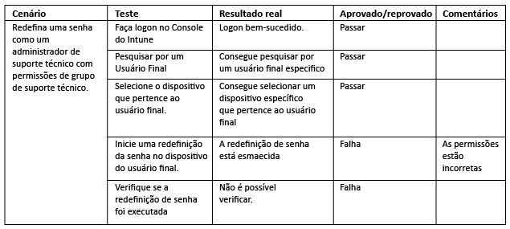
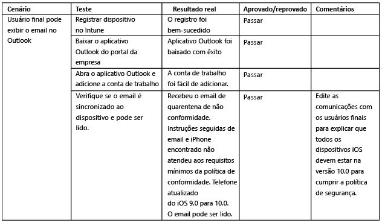

# Teste e validação do Intune

[!INCLUDE[note for both-portals](../includes/note-for-both-portals.md)]

A fase de teste deve ser realizada durante e após a fase de implementação. Você precisará ter contas, grupos e dispositivos de teste para testar todos os cenários de TI (administrador) e de usuário final (caso de uso) necessários identificados anteriormente.

É recomendável incorporar a equipe de suporte de TI/assistência técnica na fase de teste para que a documentação de suporte seja criada e a equipe de suporte de TI/assistência técnica fique satisfeita de dar suporte ao produto. Se um componente ou cenário não funcionar de acordo com os casos de uso, lembre-se de documentar as alterações necessárias e incluir o motivo da alteração.

## Antes de começar

É recomendável documentar o seguinte:

-   **Critérios de teste:** identifica os parâmetros de comparação com os quais comparar.

-   **Componentes de design:** deve haver, pelo menos, um critério de teste.

Se não houver nenhum componente de design em, pelo menos, um critério de teste alinhado a um requisito ou cenário, considere se o componente de design é necessário ou não. Além disso, garanta que você tem os seguintes itens:

-   **Contas:** as contas usadas no teste devem ser contas de teste licenciadas para o EMS e o Office 365 para testar todos os cenários de caso de uso.

-   **Dispositivos:** os dispositivos usados neste ponto devem ser dispositivos de teste que potencialmente possam ser apagados ou redefinidos para os padrões de fábrica.

-   **Componentes de integração:** todos os componentes de integração (Certificate Connector, conector de serviço a serviço do Intune para o Exchange hospedado e Exchange Connector local do Intune) devem ser instalados e configurados, se necessário.

Alterações de design podem ser necessárias para considerar problemas imprevistos. Além disso, todas as alterações de design devem ser totalmente documentadas com o motivo de cada alteração. Aqui temos um exemplo para ilustrar o que uma alteração poderia ser:

-   Você pode perceber que não atende aos requisitos do NDES (Serviço de Registro de Dispositivo de Rede) e também descobrir que os perfis de VPN e Wi-Fi podem ser configurados com uma AC raiz, atendendo aos mesmos requisitos sem uma implementação de NDES.

Você pode enfrentar desafios ou problemas que exigem diretrizes técnicas ou uma solução de problemas especializada durante o processo de teste e validação. É recomendável buscar assistência por meio dos canais do Suporte da Microsoft.

-   [Saiba como obter suporte do Intune](https://docs.microsoft.com/intune/troubleshoot/how-to-get-support-for-microsoft-intune)

-   [Dicas gerais de solução de problemas para o Microsoft Intune](https://docs.microsoft.com/intune/troubleshoot/general-troubleshooting-tips-for-microsoft-intune).

-   [Saiba como obter suporte para o Microsoft Intune.](https://docs.microsoft.com/intune/troubleshoot/how-to-get-support-for-microsoft-intune)

-   [Contatar o suporte telefônico assistido do Microsoft Intune](https://docs.microsoft.com/intune/troubleshoot/contact-assisted-phone-support-for-microsoft-intune)

## Teste de validação funcional

A validação funcional consiste em testar cada componente e configuração para determinar se estão funcionando corretamente. Veja um exemplo de teste de validação na tabela abaixo.

## Teste de validação de caso de uso

O teste de validação de caso de uso deve ser realizado para verificar se os cenários estão completos e funcionais. Há dois tipos de cenários de caso de uso: administrador de TI e usuário final.

### Administrador de TI

O teste de validação do administrador de TI deve ser realizado para validar se uma ação Administrativa executada em um dispositivo ou usuário está funcionando corretamente. Abaixo temos um exemplo de cenário de validação de ponta a ponta do administrador de TI.

### Usuário final

O teste de validação do usuário final deve ser realizado para validar se a experiência do usuário final ocorre como esperado e é apresentada corretamente em todas as comunicações com o usuário. É importante validar se a experiência do usuário final está correta, pois uma falha na validação poderá levar a taxas de adoção mais baixas e um maior volume de chamadas de assistência técnica.

## Próximas etapas

Agora que você testou e validou os cenários de caso de uso e funcionais do Intune, você está pronto para a distribuição de produção do Intune. Consulte [Recursos adicionais](additional-resources.md) para obter mais informações.

<!--HONumber=Dec16_HO5-->

