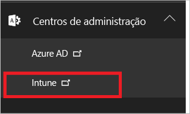
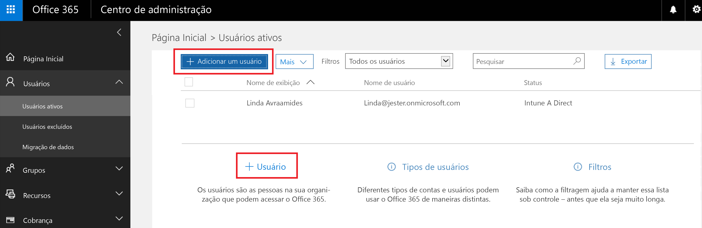
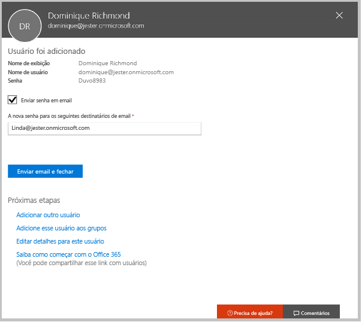
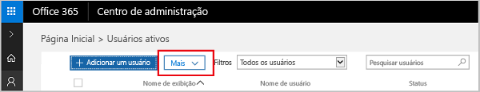

# Inscrever-se para uma avaliação gratuita do Microsoft Intune
Este artigo explica como se inscrever para uma avaliação do Intune e prepara a sua avaliação com alguns usuários para que você possa seguir o guia de avaliação associado e ver como o Intune gerencia dispositivos móveis. <!---or app data when devices are not enrolled in Intune.--->

## Suposições
Este artigo de inscrição e o guia de avaliação pressupõem que você está usando a versão de avaliação apenas para fins de avaliação e pretende iniciar com um ambiente limpo quando assinar.

Para facilitar o uso da versão de avaliação, estamos configurando um ambiente muito simples, que usa apenas o Intune e pressupõe que ele seja o único método de gerenciamento de dispositivos (conhecido como a autoridade de gerenciamento de dispositivo móvel). No entanto, neste guia, apontaremos para o conteúdo técnico mais profundo se você quiser explorar um pouco mais.

Na versão de avaliação, é possível fazer tudo o que se faz em uma versão de assinatura. A única diferença é que você está limitado a 100 contas de usuário na avaliação.

## Inscrever-se para uma avaliação
Visite a página [Inscrição do Intune](https://portal.office.com/Signup/Signup.aspx?OfferId=40BE278A-DFD1-470a-9EF7-9F2596EA7FF9&dl=INTUNE_A&ali=1#0%20) e preencha o formulário para se inscrever para uma assinatura de avaliação.

Se você tiver uma conta corporativa ou de estudante e quiser usá-la para sua avaliação do Intune, execute [estas instruções de conexão](https://docs.microsoft.com/en-us/intune/get-started/start-with-a-paid-subscription-to-microsoft-intune-step-1). No entanto, este artigo e seus guias de avaliação presumem que você não está usando uma conta dessas.

> [!TIP]
> Se a maioria de suas operações de TI e os usuários estiverem em uma localidade diferente da sua, convém definir essa localidade para a versão de avaliação para testar o desempenho.

### Considerações após a inscrição
Caso se inscreva para uma avaliação, você receberá uma mensagem de email com as informações da conta no endereço de email fornecido durante o processo de inscrição. Isso confirma que sua avaliação está ativa.

Depois de concluir o processo de inscrição, você será direcionado para uma página usada para adicionar usuários e atribuir a eles licenças usando o Centro de administração do Office 365. Na próxima vez em que entrar no Intune, você será direcionado automaticamente para o console de administração do Intune.

## Alinhar o Centro de administração e o console de administração do Intune
Há dois portais que você usará para o Intune: o Centro de administração do Office 365 ([portal.office.com](https://portal.office.com)) e o console de administração do Intune ([manage.microsoft.com](https://manage.microsoft.com)).

Normalmente, você fará seu trabalho no console de administração do Intune, mostrado abaixo. Esse é o site no qual você pode configurar e gerenciar grupos, políticas, dispositivos e aplicativos.

No entanto, você usará o Centro de administração do Office 365, mostrado abaixo, para adicionar e gerenciar os usuários e outros aspectos da sua conta, incluindo cobrança e suporte.

É possível navegar do Centro de administração do Office 365 para o console de administração do Intune. Os centros de administração estão no último item no painel de navegação à esquerda. Escolha **Intune** para abrir o console de administração do Intune em uma nova guia.

Para voltar do Intune para o Centro de administração do Office 365, escolha a tarefa **Adicionar Usuários** na página Visão geral de grupos.

## Adicionar usuários
Antes de sair do Centro de administração do Office 365 para o Intune, será necessário adicionar alguns usuários à sua conta de avaliação.

No Centro de administração do Office 365, é possível adicionar usuários individualmente ou em massa carregando um arquivo .csv. Faremos ambos para configurar sua avaliação. No entanto, em seu ambiente de produção, você provavelmente desejará aproveitar suas contas de usuário do Azure Active Directory. Saiba mais sobre isso em nosso [Guia de Introdução](https://docs.microsoft.com/en-us/intune/get-started/start-with-a-paid-subscription-to-microsoft-intune-step-3) e na seção [Próximas etapas](#Next-steps) deste artigo.

### Adicionar um usuário individual
1. Escolha uma das opções para adicionar um uso para abrir um formulário que permite que você crie um usuário. Somente os itens marcados com um asterisco (\*) são obrigatórios.

2.  Ao adicionar o usuário, a etapa final será enviar um email com sua senha temporária do Intune. Para a finalidade dessa avaliação, use seu próprio endereço de email de trabalho para receber as informações de logon e veja o email que os usuários receberão. É possível usar essas identidades de usuário para registrar dispositivos de teste. 

 

3. Se quiser atribuir a um usuário uma função administrativa, depois de criá-la, você poderá editar a função no Centro de administração do Office 365 selecionando o nome de usuário da lista de usuários e, em seguida, escolhendo **Editar** na linha de função para ver a lista de funções de usuário que você pode selecionar e atribuir a esse usuário.

 

### Importar vários usuários
1. Você encontrará o assistente para importação de vários usuários na lista **Mais**.

 

2. Para ajudá-lo a configurar corretamente o seu arquivo .csv, você poderá baixar um arquivo de modelo para preencher com os dados do usuário. Baixe o arquivo .csv que contém os cabeçalhos e as informações de usuário de exemplo para ver exatamente o tipo de dados necessário para cada campo.

 

3. Depois que você criar e salvar o arquivo .csv, escolha **Procurar** para selecionar o arquivo. Verifique e escolha **Avançar**. Os usuários serão carregados e adicionados à lista de usuários ativos.

Agora vá até o console de administração do Intune para começar a gerenciar os usuários, seus dispositivos e seus aplicativos.

> [!NOTE]
> Os usuários não aparecerão no Intune até que tenham registrado um dispositivo a ser gerenciado.

## Próximas etapas
Cenário de avaliação: [Avaliar o gerenciamento de dispositivo móvel no Microsoft Intune](mobile-device-management-trial-guide-microsoft-intune.md)

Saiba mais sobre como usar as contas de usuário do Azure Active Directory com o Intune:
- [Requisitos de identidade](https://docs.microsoft.com/en-us/active-directory/active-directory-hybrid-identity-design-considerations-overview#design-considerations-overview)
- [Requisitos de sincronização de diretórios](https://docs.microsoft.com/en-us/active-directory/active-directory-hybrid-identity-design-considerations-directory-sync-requirements)
- [Requisitos da autenticação multifator](https://docs.microsoft.com/en-us/active-directory/active-directory-hybrid-identity-design-considerations-multifactor-auth-requirements)

Saiba mais sobre como usar o [Intune com System Center Configuration Manager](https://docs.microsoft.com/en-us/sccm/mdm/understand/hybrid-mobile-device-management)

<!--HONumber=Dec16_HO2-->

