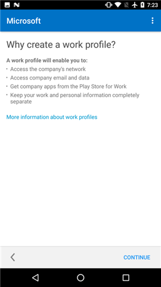

# Criar um perfil de trabalho e registrar seu dispositivo no Intune

Registrar seu dispositivo Android dá acesso a aplicativos, email e outros dados de trabalho da empresa. Como parte do registro, você configura um perfil de trabalho, que separa os dados pessoais em seu dispositivo dos dados de trabalho.

O suporte de sua empresa pode gerenciar apenas o perfil de trabalho que contém os dados de trabalho. O suporte de sua empresa não pode gerenciar dados pessoais em seu dispositivo. Saiba mais sobre [o que acontece quando você cria um perfil de trabalho](what-happens-when-you-create-a-work-profile-android.md).

Para criar um perfil de trabalho:

1.  Na tela de **Boas-vindas** do Portal da Empresa do Android, toque em **Entrar** e entre com sua conta corporativa ou de estudante. Se você ainda não instalou o aplicativo gratuito, baixe e instale-o por meio do [Google Play](https://play.google.com/store/apps/details?id=com.microsoft.windowsintune.companyportal).

    

2. Na tela **Configuração de Acesso da Empresa**, toque em **CONTINUAR**.

    

3.  Na tela **Por que criar um perfil de trabalho?**, leia sobre o que você poderá fazer e, em seguida, toque em **CONTINUAR**.

    

4.  Examine uma lista do que o suporte de sua empresa pode e não pode ver em seu dispositivo e toque em **CONTINUAR**.

    

5.  Na tela **Novidades**, leia sobre o que acontece durante o registro e, em seguida, toque em **REGISTRAR**.

    

6. Na tela **Configurar perfil de trabalho**, toque em **AVANÇAR** para permitir que o aplicativo do Portal da Empresa acesse o perfil de trabalho.

    

7. Examine a tela do Google que descreve o que o suporte de sua empresa pode fazer quando você cria um perfil de trabalho e, em seguida, toque em **OK**.

    

    Você verá algumas mensagens com os dizeres: “Configurando seu perfil de trabalho” e “Registrando seu dispositivo”.

8. Na tela **Você está quase lá!**, aguarde alguns segundos até que o aplicativo de Portal da Empresa seja aberto.

    

9. Na tela de **Boas-vindas** do Portal da Empresa do Android, toque em **Entrar** e entre com a mesma conta corporativa ou de estudante que você usou para entrar no início do processo.

10. Na tela **Configuração de Acesso da Empresa**, observe que a Configuração do Perfil de Trabalho está concluída e, em seguida, toque em **CONTINUAR**.

    

    A mensagem “Registrando seu dispositivo” aparecerá brevemente.

11. Quando a tela **Tudo pronto!** mostrar que tudo foi configurado corretamente, toque em **CONCLUÍDO**.

    

    Agora, você pode obter aplicativos da empresa na Play Store for Work.

    

Ainda precisa de ajuda? Contate o suporte da sua empresa. Para obter as informações de contato, consulte o [site do Portal da Empresa](https://go.microsoft.com/fwlink/?linkid=2010980).
