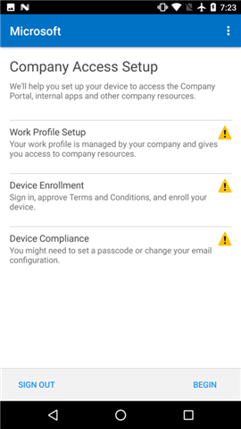
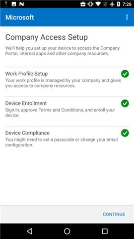

# Criar um perfil de trabalho e registrar seu dispositivo no IntuneCreate a work profile and enroll your device in Intune

Registrar seu dispositivo Android dá acesso a aplicativos, email e outros dados de trabalho da empresa.Enrolling your Android device gives you access to company email, apps, and other work data. Como parte do registro, você configura um perfil de trabalho, que separa os dados pessoais em seu dispositivo dos dados de trabalho.As part of enrollment, you set up a work profile, which separates the personal data on your device from your work data. O administrador de TI pode gerenciar apenas o perfil de trabalho, que contém os dados de trabalho.Your IT admin can manage only the work profile, which contains your work data. O administrador de TI não pode gerenciar dados pessoais em seu dispositivo.Your IT admin cannot manage the personal data on your device. Saiba mais sobre [o que acontece quando você cria um perfil de trabalho](what-happens-when-you-create-a-work-profile-android.md).Find out more about [what happens when you create a work profile](what-happens-when-you-create-a-work-profile-android.md).

Para criar um perfil de trabalho:To create a work profile:

1.  Na tela de **Boas-vindas** do Portal da Empresa do Android, toque em **Entrar** e entre com sua conta corporativa ou de estudante.On the Android Company Portal **Welcome** screen, tap **Sign in**, and then sign in with your work or school account. Se você ainda não instalou o aplicativo gratuito, baixe e instale-o por meio do [Google Play](http://play.google.com/store/apps/details?id=com.microsoft.windowsintune.companyportal).If you haven't installed the free app yet, download and install it from [Google Play](http://play.google.com/store/apps/details?id=com.microsoft.windowsintune.companyportal).

    

2. Na tela **Configuração de Acesso da Empresa**, toque em **Iniciar**.On the **Company Access Setup** screen, tap **BEGIN**.

    

3.  Na tela **Por que criar um perfil de trabalho?**, leia sobre o que você poderá fazer e, em seguida, toque em **CONTINUAR**.On the **Why create a work profile?** screen, read about what you'll be able to do, and then tap **CONTINUE**.

    

4.  Examine uma lista do que o administrador de TI pode ou não ver em seu dispositivo e toque em **CONTINUAR**.Review a list of what your IT administrator can and can't see on your device, and tap **CONTINUE**.

    

5.  Na tela **O que vem em seguida**, leia sobre o que acontecerá em seguida e toque em **CONTINUAR**.On the **What comes next** screen, read about what's going to happen next, and then tap **CONTINUE**.

    

6. Na tela **Configurar perfil de trabalho**, toque em **AVANÇAR** para permitir que o aplicativo do Portal da Empresa acesse o perfil de trabalho.On the **Set up work profile** screen, tap **NEXT** to let the Company Portal app access the work profile.

    

7. Examine a tela do Google que descreve o que o administrador de TI pode fazer quando você cria um perfil de trabalho e, em seguida, toque em **OK**.Review the Google screen that describes what your IT administrator can do when you create a work profile, and then tap **OK**.

    

    Você verá algumas mensagens com os dizeres: “Configurando seu perfil de trabalho” e “Registrando seu dispositivo”.You'll see a couple of messages that say "Setting up your work profile" and "Enrolling your device."

8. Na tela **Você está quase lá!**,On the **You're Halfway There!** aguarde alguns segundos até que o aplicativo de Portal da Empresa seja aberto.screen, wait a few seconds until the Company Portal app opens.

    

9. Na tela de **Boas-vindas** do Portal da Empresa do Android, toque em **Entrar** e entre com a mesma conta corporativa ou de estudante que você usou para entrar no início do processo.On the Android Company Portal **Welcome** screen, tap **Sign in**, and then sign in with the same work or school account that you used to sign in earlier in this process.

10. Na tela **Configuração de Acesso da Empresa**, observe que a Configuração do Perfil de Trabalho está concluída e, em seguida, toque em **CONTINUAR**.On the **Company Access Setup** screen, note that your Work Profile Setup is now complete, and then tap **CONTINUE**.

    

    A mensagem “Registrando seu dispositivo” aparecerá brevemente.You'll briefly see the message "Enrolling your device."

11. Quando a tela **Configuração de Acesso da Empresa** mostrar que tudo foi configurado corretamente, toque em **CONTINUAR**.When the **Company Access Setup** screen shows that everything has been set up correctly, tap **CONTINUE**.

    

12. Na tela **Configuração de Acesso da Empresa completa**, toque em **CONCLUÍDO**.On the **Company Access Setup complete** screen, tap **DONE**. Talvez você precise concluir etapas adicionais se o administrador de TI tiver adicionado outros requisitos.You may have to complete additional steps if your IT admin has added other requirements.

    

    Agora, você pode obter aplicativos da empresa na Play Store for Work.You can now get company apps from the Play Store for Work.

    

Ainda precisa de ajuda?Still need help? Entre em contato com o administrador de TI.Contact your IT admin. Para obter as informações de contato, consulte o [site do Portal da Empresa](http://portal.manage.microsoft.com).For contact information, check the [Company Portal website](http://portal.manage.microsoft.com).
