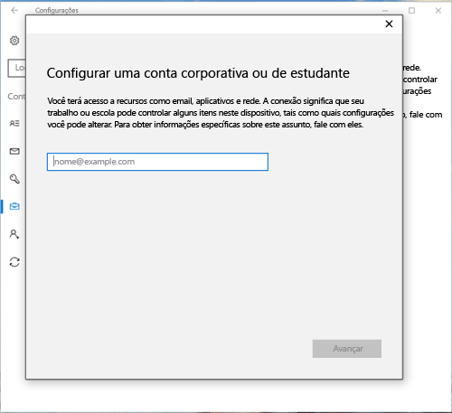
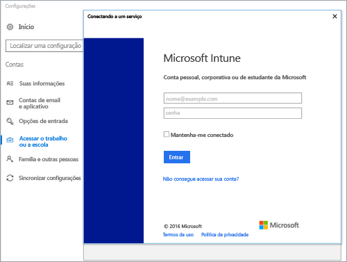

# Registrar dispositivos Windows 10 com o Portal da Empresa do Intune

Use o Portal da Empresa do Intune para registrar seu dispositivo Windows 10 sob o gerenciamento da sua organização. Este artigo descreve como registrar dispositivos com Windows 10 versão 1607 e posteriores e Windows 10 versão 1511 e anteriores. Antes de começar, certifique-se de [verificar a versão em seu dispositivo](windows-enrollment-company-portal.md#find-windows-10-version-number) para que você possa seguir as etapas corretas.  

Há suporte para o Windows 10 em vários tipos de dispositivos, incluindo desktop, telefone e tablet. As etapas de registro são as mesmas em qualquer dispositivo sendo usado. No entanto, sua tela pode parecer um pouco diferente das imagens mostradas neste artigo.  
 
> [!VIDEO https://www.youtube.com/embed/TKQxEckBHiE?rel=0]

## Registrar o dispositivo Windows 10 versão 1607 e posteriores 
Estas etapas descrevem como registrar um dispositivo que executa o Windows 10 versão 1607 e posteriores.  

1. Vá até **Iniciar**. Se você estiver usando um dispositivo Windows 10 Mobile, prossiga para a lista **Todos os Aplicativos**.

2. Abra o aplicativo **Configurações**. Se o aplicativo não estiver prontamente disponível na lista de aplicativos, acesse a barra de pesquisa e digite "configurações".

3. Selecione **Contas** > **Acessar trabalho ou escola** > **Conectar**.  

      

4. Para acessar a página de entrada do Intune da sua organização, insira seu endereço de email corporativo ou de estudante. Em seguida, selecione **Avançar**.  

     

5. Entre no Intune com sua conta corporativa ou de estudante.  

      

    Você verá uma mensagem que indica que sua empresa ou escola está registrando o dispositivo.

6. Se a sua organização exigir a configuração de um PIN do Windows Hello, será solicitado que você insira um código de verificação. Insira o código e prossiga com as etapas na tela para criar um PIN.  

7. Na tela **Tudo pronto!** , selecione **Concluir**. Agora, seu dispositivo está registrado.  

8. Para verificar sua conexão, volte para **Configurações** > **Contas** > **Acessar o trabalho ou a escola**.  Sua conta deve estar listada agora.  

      

Ainda não consegue acessar seu email corporativo ou de estudante, bem como arquivos ou outros dados? Saiba como [solucionar problemas da conta](troubleshoot-your-windows-10-device-windows.md#troubleshooting-steps-to-follow-if-you-see-access-work-or-school).  

## Registrar o dispositivo Windows 10 versão 1511 e anteriores  
Estas etapas descrevem como registrar um dispositivo que executa o Windows 10, versão 1511 e anteriores.  

1. Vá até **Iniciar**. Se você estiver usando um dispositivo Windows 10 Mobile, prossiga para a lista **Todos os Aplicativos**.

2. Abra o aplicativo **Configurações**. Se o aplicativo não estiver prontamente disponível na lista de aplicativos, acesse a barra de pesquisa e digite "configurações".

3. Selecione **Contas** > **Sua conta**.  

      

5. Selecione **Adicionar uma conta corporativa ou de estudante**.  

      

6. Entre com as suas credenciais corporativas ou de estudante.  

      

Ainda não consegue acessar seu email corporativo ou de estudante, bem como arquivos ou outros dados? Saiba como [solucionar problemas relacionados à conta](troubleshoot-your-windows-10-device-windows.md#troubleshooting-steps-to-follow-if-you-see-your-account) durante o registro.  

## Suporte do administrador de TI   

Se você for um administrador de TI e encontrar problemas durante o registro de dispositivos, confira [Solucionando problemas de registro de dispositivo do Windows no Microsoft Intune](https://support.microsoft.com/help/4469913). Este artigo lista erros comuns, suas causas e etapas para resolvê-los. 

## Próximas etapas  
Se você precisar de ajuda com o Portal da Empresa ou com o registro, entre em contato com a equipe de suporte de TI da sua empresa. Você encontrará as informações de contato dela no [site do Portal da Empresa](https://go.microsoft.com/fwlink/?linkid=2010980). Entre no site com sua conta corporativa ou de estudante.  

 

