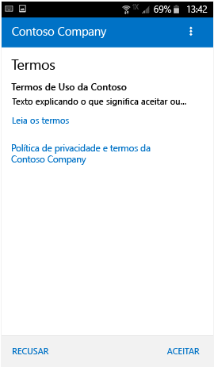
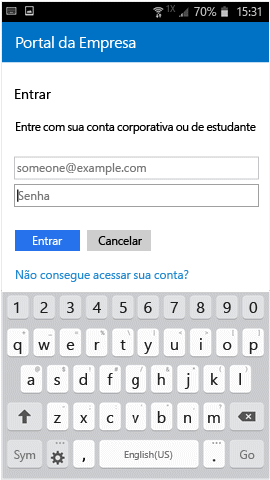

# Registrar seu dispositivo Android no Intune

Se sua empresa ou escola usa o Microsoft Intune, você pode registrar seu dispositivo Android para obter acesso a email, arquivos e outros recursos corporativos. Quando você registra os dispositivos, o departamento de TI pode gerenciar recursos corporativos ou de estudante e mantê-los seguros, dando-lhe a liberdade de usar seu dispositivo preferido para realizar o trabalho. Para saber mais sobre registro, consulte [What happens when I install and Company Portal app and enroll my device? (O que acontece quando instalo o aplicativo Portal da Empresa e registro meu dispositivo?)](what-happens-if-you-install-the-Company-Portal-app-and-enroll-your-device-in-intune-android.md)

> [!VIDEO https://channel9.msdn.com/Series/IntuneEnrollment/Android-Enrollment/player]

Essas instruções de registro destinam-se a dispositivos Samsung Knox Android e nativos. O Samsung Knox é um tipo de segurança que certos dispositivos Samsung usam para proporcionar proteção adicional além da fornecida pelo Android de maneira nativa. Para verificar se você tem um dispositivo Samsung Knox, vá para **Configurações** > **Sobre o dispositivo**. Se você não vê a “versão do Knox” listada, tem um dispositivo Android nativo.

Antes ou após o registro, você poderá ser solicitado a escolher uma categoria que melhor descreva como você usa o dispositivo. O suporte de sua empresa usa essa categoria para ajudar a verificar os aplicativos aos quais você tem acesso.

**Para registrar seu dispositivo Android:**

1.  Instale o aplicativo gratuito Portal da Empresa do Intune do [Google Play](http://play.google.com/store/apps/details?id=com.microsoft.windowsintune.companyportal).

2.  Abra o aplicativo do Portal da Empresa.

3.  Na tela de **Boas-vindas** do Portal da Empresa, toque em **Entrar** e entre com sua conta corporativa ou de estudante.

       

4.  Se o suporte de sua empresa tiver configurado termos e condições da empresa, toque em **ACEITAR** para aceitar os termos. Esta tela pode ser um pouco diferente da imagem abaixo com base na versão do Android que você está usando no momento.

    

5.  Conecte-se no aplicativo do Portal da Empresa usando sua conta e senha corporativa ou de estudante e, em seguida, toque em **Entrar**.

    

6.  Na tela **Configuração de Acesso da Empresa**, toque em **CONTINUAR**.

    

    > [!NOTE]
    > Os triângulos amarelos não significam que você já tem um erro. Esses ícones indicam que ainda há etapas a serem concluídas no processo de registro.

7.  Examine uma lista do que o suporte de sua empresa pode e não pode ver em seu dispositivo e, em seguida, toque em **CONTINUAR**.

    

9.  Na tela **Novidades**, leia sobre o que acontece durante o registro e, em seguida, toque em **REGISTRAR**.

    

10.  Se você estiver usando o Android 6.0 ou posterior, execute esta etapa. Caso contrário, vá para a próxima etapa.

    Se o suporte de sua empresa tiver configurado algumas políticas, você poderá ver as seguintes mensagens:
    -   **Permitir que o Portal da Empresa faça e gerencie chamadas telefônicas?**

        

    Se você vir essa mensagem, toque em **PERMITIR**. É seguro tocar em PERMITIR, porque a **Microsoft nunca faz nem gerencia suas chamadas telefônicas**! O Google controla o texto da mensagem, e a Microsoft não pode alterá-lo. Ao permitir o acesso, você está apenas autorizando o dispositivo a enviar o número IMEI (Identidade de Equipamentos Móveis Internacional) para o Intune. O IMEI é um número, como um número de série, que identifica exclusivamente um dispositivo móvel.

    Se você negar acesso, a mensagem será exibida novamente na próxima vez que você entrar no Portal da Empresa, mas você poderá desligar as mensagens futuras tocando na caixa **Nunca perguntar novamente**. Se você decidir posteriormente permitir o acesso, acesse **Configurações** &gt; **Aplicativos** &gt; **Portal da Empresa** &gt; **Permissões** &gt; **Telefone** e ative a permissão.

    -   **Permitir que o Portal da Empresa acesse seus contatos?**

        

        Se você vir essa mensagem, toque em **PERMITIR**. É seguro tocar em PERMITIR, porque a **Microsoft nunca acessa seus contatos!** O Google controla o texto da mensagem, e a Microsoft não pode alterá-lo. Ao permitir acesso, ele apenas autorizará o aplicativo do Portal da Empresa a criar, usar e gerenciar sua conta corporativa.

        Se você negar acesso, a mensagem será exibida novamente na próxima vez que você entrar no Portal da Empresa, mas você poderá desligar as mensagens futuras tocando na caixa **Nunca perguntar novamente**. Se você decidir posteriormente permitir o acesso, acesse **Configurações** &gt; **Aplicativos** &gt; **Portal da Empresa** &gt; **Permissões** &gt; **Telefone** e ative a permissão.

11.  Na tela **Ativar administrador do dispositivo**, clique em **Ativar**.

    

    A função de administrador do dispositivo é aquela que o Portal da Empresa precisa para gerenciar o dispositivo. Ela permite que seu administrador veja determinadas coisas - como quantas vezes você tentou desbloquear sua tela - e tome algumas atitudes.

    O importante a lembrar é que são ações realizadas em nome da segurança. O suporte de sua empresa não está tentando violar sua privacidade ou apagar suas informações sem qualquer motivo, mas quer ter certeza de que os dados corporativos são mantidos seguros.

    A Microsoft não controla essa mensagem, e sabemos que seu conteúdo pode parecer um pouco drástico. Não há uma maneira para o Portal da Empresa exibir apenas as restrições e acessos que são relevantes para sua organização. Todos são concedidos de uma vez nesta tela. Entre em contato com o suporte de sua empresa para saber mais sobre como usar as informações de contato no [site do Portal da Empresa](https://portal.manage.microsoft.com#HelpDeskDialog) se você tiver dúvidas específicas quanto ao uso individual de sua organização.

12.  Siga os prompts para inserir um PIN ou senha. Se já tiver configurado um PIN ou senha neste dispositivo, você não verá esta tela ou será solicitado a inserir um novo PIN ou senha.

    

13.  Se você estiver usando um dispositivo Samsung Knox, toque em **Confirmar** e você verá uma mensagem informando que seu dispositivo está sendo registrado. Se você estiver usando um dispositivo Android nativo, basta observar a tela abaixo mostrando que o dispositivo está sendo registrado.

    

    Esta tela mostra que seu dispositivo está sendo registrado.

    

14. Quando a tela **Configuração de Acesso da Empresa** for exibida, toque em **CONTINUAR**. Se uma mensagem indicar que o dispositivo está fora de conformidade, siga as instruções para corrigir o problema e, em seguida, toque em **CONTINUAR**.

    

    

    Você pode encontrar mais informações sobre os problemas tocando neles.

    

      

15. Na tela **Configuração de Acesso da Empresa completa**, toque em **CONCLUÍDO**. Agora, seu dispositivo está registrado.

    

Antes de tentar instalar aplicativos corporativos, acesse **Configurações** &gt; **Segurança** e ative **Fontes desconhecidas**. Se não ativar essa opção antes de tentar instalar os aplicativos, você verá a mensagem: “Instalação bloqueada”. Por motivos de segurança, seu dispositivo está definido para bloquear as instalações de aplicativos obtidos de fontes desconhecidas." Você pode tocar em **Configurações** na caixa de diálogo de erro para ir para a opção **Fontes desconhecidas**.

> [!Note]
> Se sua organização estiver usando software de gerenciamento de despesas de telecomunicações, você terá algumas etapas adicionais para concluir antes de o dispositivo estar totalmente inscrito. Saiba mais [aqui](enroll-your-device-with-telecom-expense-management-android.md).

Se houver erro ao tentar registrar o dispositivo no Intune, você poderá [enviar erros de registro ao suporte de sua empresa](send-enrollment-errors-to-your-it-admin-android.md).

Ainda precisa de ajuda? Entre em contato com o suporte de sua empresa (consulte o [site do Portal da Empresa](https://portal.manage.microsoft.com#HelpDeskDialog) para obter as informações de contato) ou escreva para a <a href="mailto:wintunedroidfbk@microsoft.com?subject=I'm having trouble with enrolling my Android device&body=Describe the issue you're experiencing here.">equipe de Android da Microsoft</a>.
