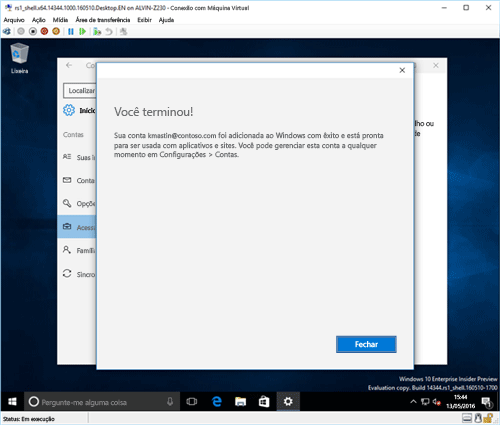

# Registrar seu dispositivo Windows 10 no Intune

> [!NOTE]
> O Windows 10 opera em todos os tipos de dispositivos. Esteja você usando uma área de trabalho, um telefone ou tablet, as etapas a seguir serão as mesmas – mesmo se elas parecerem um pouco diferentes das imagens nesta página.

<iframe src="https://channel9.msdn.com/Series/IntuneEnrollment/Windows-Enrollment/player" width="960" height="540" allowFullScreen frameBorder="0"></iframe>

1. Vá até **Iniciar**.

  - Se você estiver usando um dispositivo **Windows 10 Desktop**, acesse o **Menu Iniciar**.
  - Se você estiver usando um dispositivo **Windows 10 Mobile**, acesse a **Tela inicial** e, em seguida, passe para a lista **Todos os aplicativos**.

2.  Abra o aplicativo **Configurações** do Windows, pesquisando por "configurações" na barra de pesquisa.

3. Selecione **Contas** > **Acessar trabalho ou escola** > **Conectar**.

    

3.  Insira seu endereço de email corporativo ou de estudante e selecione **Avançar**.

    

4. Entre no Intune com sua conta corporativa ou de estudante.

    

    Você verá uma mensagem que indica que sua empresa ou escola está registrando o dispositivo.

5. Quando você vir a página **Tudo pronto!**, selecione **Fechar**. Você terminou.

  

6. Se você quiser verificar que a conexão tenha a aparência correta, vá até **Configurações**, onde você deve ver agora sua conta corporativa ou de estudante listada.

    

Se você seguiu as etapas anteriores, mas ainda não consegue acessar sua conta de email e seus arquivos corporativos ou de estudante, siga as etapas em [As etapas a serem seguidas se você vir Acessar conta corporativa ou de estudante](troubleshoot-your-windows-10-device-windows.md#troubleshooting-steps-to-follow-if-you-see-access-work-or-school).

