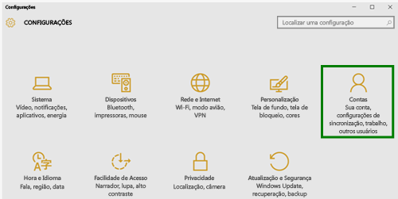
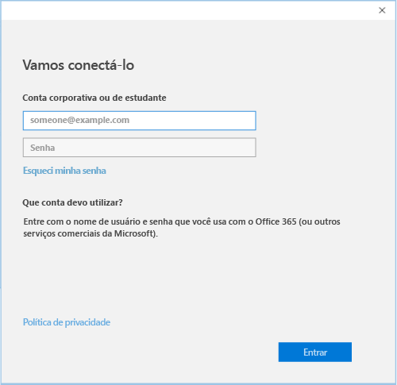

# Registrar seu dispositivo Windows 10 no Intune

  > [!NOTE]
  > O Windows 10 opera em todos os tipos de dispositivos. Esteja você usando uma área de trabalho, um telefone ou tablet, as etapas a seguir serão as mesmas – mesmo se elas parecerem um pouco diferentes das imagens nesta página.

1. Vá até **Iniciar**.

   - Se você estiver usando um dispositivo **Windows 10 Desktop**, acesse o **Menu Iniciar**.
   - Se você estiver usando um dispositivo **Windows 10 Mobile**, acesse a **Tela inicial** e, em seguida, passe para a lista **Todos os aplicativos**.

2. Abra o aplicativo **Configurações** do Windows, pesquisando por "configurações" na barra de pesquisa.

3. Selecione **Contas**.

    

4. Selecione **Sua conta**.

    

5. Selecione **Adicionar uma conta corporativa ou de estudante**.

    

6. Entre com as suas credenciais corporativas ou de estudante.

    

Ainda não consegue acessar seu email corporativo ou de estudante, bem como arquivos ou outros dados? Tente corrigir o acesso [solucionando problemas com sua conta](troubleshoot-your-windows-10-device-windows.md#troubleshooting-steps-to-follow-if-you-see-your-account). Se ainda não funcionar, você deverá entrar em contato com o suporte da sua empresa para obter ajuda.

Uma maneira fácil de obter ajuda do suporte de sua empresa é por meio das informações de contato disponíveis no aplicativo Portal da Empresa, que também permite localizar e baixar aplicativos recomendados e necessários para seu trabalho diário. É possível que você já tenha o aplicativo Portal da Empresa instalado no dispositivo. Uma maneira rápida de verificar é procurar o __Portal da Empresa__ em sua lista de __Todos os aplicativos__.

Se você não vir o Portal da Empresa na sua lista de aplicativos, siga essas etapas para instalá-lo.

1. Selecione **Iniciar** > **Loja**.

2. Selecione **Pesquisar** e digite **portal da empresa**.

3. Na lista de resultados, selecione **Portal da Empresa** > **Instalar**.

4. Selecione **Instalar** ou **Gratuito**. Não há nenhuma diferença entre essas duas opções. A opção mostrada depende de como sua organização configurou o aplicativo Portal da Empresa.
