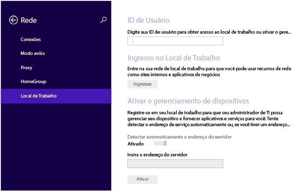
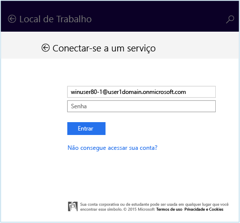
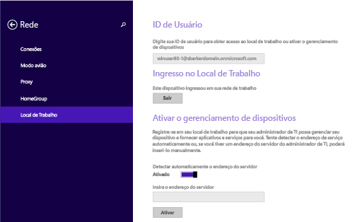
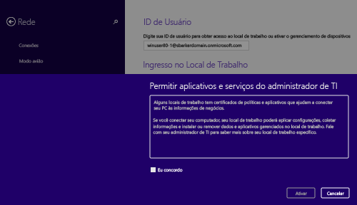
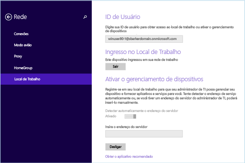

# Como registrar seu dispositivo Windows 8.1 ou Windows RT 8.1 no Intune  

Se sua empresa ou escola usa o Microsoft Intune, você pode registrar os dispositivos para obter acesso aos emails, arquivos e outros recursos da empresa. Quando você registra os dispositivos, a sua organização pode manter os dados corporativos protegidos. Para saber mais sobre registro, consulte [O que acontece quando você instala o aplicativo do Portal da Empresa e registra seu dispositivo no Intune?](what-happens-if-you-install-the-company-portal-app-and-enroll-your-device-in-intune-windows.md) e [O que o suporte da sua empresa pode ver ou não no seu dispositivo](what-info-can-your-company-see-when-you-enroll-your-device-in-intune.md).  

Para registrar seu dispositivo Windows 8.1 ou Windows RT 8.1 no Intune:  

1. No dispositivo, toque em **Configurações** &gt; **Configurações do Computador** &gt; **Rede** &gt; **Local de Trabalho**.  

      

2. Insira seu email corporativo ou de estudante para a ID de usuário, se solicitado, e toque em **Ingressar**. Se a ID de usuário não for solicitada, o endereço de email que você inseriu quando se conectou ao dispositivo será usado.  

3. Digite a senha do seu email corporativo ou de estudante.  

      

4. Em **Ativar o Gerenciamento de Dispositivo**, toque em **Ativar**.  

      

5. Na caixa de diálogo **Permitir aplicativos e serviços do suporte da empresa**, marque a caixa de seleção **Concordo** e, em seguida, toque em **Ativar**.  

      

    Após se registrar com êxito, você verá a tela a seguir.  

    

Também recomendamos que você instale o aplicativo do Portal da Empresa, que permite facilmente identificar e obter os aplicativos da empresa que são relevantes para você e para sua função. Dependendo de como a sua empresa configurou o Intune, o aplicativo do Portal da Empresa pode ter sido instalado como parte do seu processo de registro. Para verificar se você tem o aplicativo, procure o **Portal da Empresa** em sua lista de aplicativos. Se você não vir o Portal da Empresa na sua lista de aplicativos, siga essas etapas para instalá-lo.

1. Toque em **Iniciar** &gt; **Repositório**.  

2. Toque em **Pesquisar** e digite **portal da empresa**.  

3. Na lista de resultados, toque em **Portal da Empresa**.  

4. Toque em **Instalar** ou **Gratuito**. A opção mostrada depende de como sua empresa configurou o aplicativo.  

Ainda precisa de ajuda? Contate o suporte da sua empresa. Para obter suas informações de contato, consulte o [site do Portal da Empresa](https://go.microsoft.com/fwlink/?linkid=2010980).  
