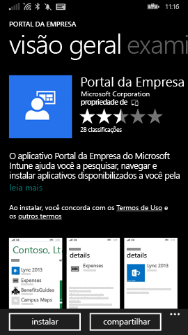
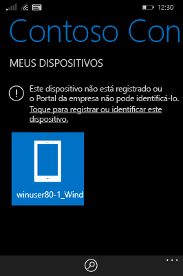
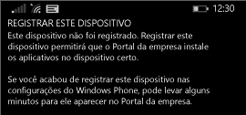
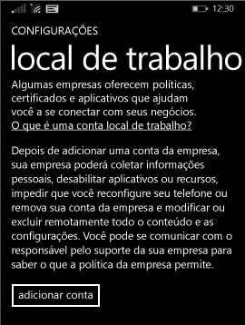

# Registrar seu dispositivo Windows Phone 8.1 no Intune  

Registre seus dispositivos para obter acesso ao email, aos arquivos e a outros recursos corporativos ou de estudante. Quando você registra os dispositivos, a sua organização pode manter os dados corporativos protegidos. Para saber mais sobre registro, consulte [O que acontece quando você instala o aplicativo do Portal da Empresa e registra seu dispositivo no Intune?](what-happens-if-you-install-the-company-portal-app-and-enroll-your-device-in-intune-windows.md) e [O que o suporte da sua empresa pode ver ou não no seu dispositivo](what-info-can-your-company-see-when-you-enroll-your-device-in-intune.md).  

Para registrar seu dispositivo no Intune, siga este conjunto de instruções que correspondem às suas permissões ou ao status da conta atual.

## Registrar por meio do Portal da Empresa  
Siga estas etapas se você puder instalar o aplicativo do Portal da Empresa da Microsoft Store. 

1. Toque em **Iniciar** > **Armazenamento**.  

2. Toque em **Pesquisar** e digite **portal da empresa**.  

3. Na lista de resultados, toque em **Portal da Empresa**.  

      

4. Toque em **Portal da Empresa** &gt; **Instalar**.  

      

Registrar seu dispositivo:  

1. No dispositivo, abra o aplicativo **Portal da Empresa do Microsoft Intune**.  

2. Forneça as suas credenciais. Você pode ser solicitado a aceitar os Termos e Condições da sua empresa, se aplicável.  

3. Passe o dedo sobre **Meus Dispositivos**.  

4. Selecione **Tocar para registrar ou identificar este dispositivo**.  

      

5. Toque em **Registrar este Dispositivo**.  

      

6. Toque em **Adicionar Conta**.  

      

7. Insira informações adicionais conforme o solicitado e, em seguida, toque em **Entrar** para concluir o registro. Agora, você verá a sua conta de local de trabalho listada na página **Configurações** &gt; **Local de Trabalho**.  

      

## Registrar por meio do aplicativo Configurações  
Siga estas etapas se você não puder acessar a Microsoft Store do seu dispositivo Windows Phone ou se não tiver uma conta Microsoft.

1. Toque em **Configurações** &gt; **Local de trabalho**.  

2. Toque em **Adicionar Conta** e entre usando sua conta de trabalho.  

3. Insira informações adicionais conforme o solicitado e, em seguida, toque em **Entrar** para concluir o registro.  

4. Se solicitado a instalar o aplicativo da empresa ou o Hub, verifique se a caixa relevante está marcada e toque em **Concluído**.  

Se o suporte de sua empresa tiver configurado o Portal da Empresa para ser instalado durante o registro, você o verá na lista de aplicativos.  

Ainda precisa de ajuda? Contate o suporte da sua empresa. Para obter suas informações de contato, consulte o [site do Portal da Empresa](https://go.microsoft.com/fwlink/?linkid=2010980).
