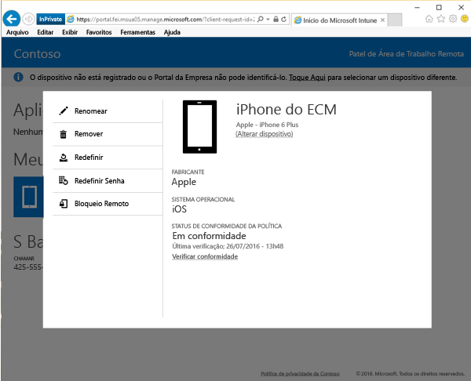

# Bloquear remotamente seu dispositivo do site do Portal da Empresa

Acidentes acontecem e, às vezes, dispositivos podem desaparecer. Se seu dispositivo tiver sido perdido ou roubado, a primeira preocupação que você terá é que as informações contidas nele poderiam ser acessadas por qualquer pessoa, onde quer que ele esteja.

[!INCLUDE[wit_nextref](includes/end-user-password-guidance.md)]

Para ficar seguro, você pode bloqueá-lo usando a opção de Bloqueio Remoto no [site do Portal da Empresa](https://portal.manage.microsoft.com). O Bloqueio Remoto funciona para:

* Android
* iOS
* macOS
* Windows 10 Mobile (se o dispositivo já tinha uma senha definida)
* Windows Phone 8.1 (se o dispositivo já tinha uma senha definida)

## Para usar o Bloqueio Remoto para bloquear seu dispositivo

1.  No [site do Portal da Empresa](https://portal.manage.microsoft.com), toque no botão de __menu__  e, em seguida, selecione __Meus Dispositivos__.

  

2. Na página __Meus Dispositivos__, selecione o nome do dispositivo que você deseja bloquear.

  

3.  O dispositivo será aberto em uma janela pop-up. Toque no botão **Bloqueio Remoto**.

    

4.  Aparecerá um aviso informando que você está prestes a bloquear seu dispositivo. Toque em **Bloqueio Remoto** e o site do Portal da Empresa tentará bloquear seu dispositivo.

    Depois de selecionar **Bloqueio Remoto**, uma mensagem “Bloqueio remoto pendente” será exibida.  Quando o Bloqueio Remoto for bem-sucedido, o status é alterado para "Bloqueio remoto bem-sucedido."

    O status do Bloqueio Remoto aparece em três locais:

    * A área de notificações do site.
    * A página **Detalhes** do dispositivo.
    * O bloco que mostra o nome do dispositivo na seção **Meus Dispositivos** da página.

> [!Note]
> Se você receber uma notificação "Bloqueio Remoto com falha", aguarde alguns minutos e tente bloquear seu dispositivo novamente. Após começar a tentar novamente, o status será alterado para “Bloqueio remoto pendente”. Se a nova tentativa não funcionar, será necessário entrar em contato com suporte de sua empresa.

Se você encontrar seu dispositivo e desejar desbloqueá-lo depois de usar o Bloqueio Remoto, basta inserir sua senha.

Ainda precisa de ajuda? Contate o suporte da sua empresa. Para obter as informações de contato, consulte o [site do Portal da Empresa](https://portal.manage.microsoft.com).
