# Sincronizar o dispositivo Windows manualmenteSync your Windows device manually

Às vezes, tentar instalar um aplicativo no dispositivo Windows pode levar mais tempo do que o esperado.Sometimes trying to install an app on your Windows device may take longer than you think it should. Se isso acontecer, você poderá tentar sincronizar o dispositivo Windows manualmente.If this happens, you can try to manually sync your Windows device. A sincronização pode ajudar a acelerar a instalação.Syncing may help speed up the installation.

> [!Note]
> Os aplicativos poderão levar algum tempo para serem instalados se você estiver em uma rede com velocidades mais lentas ou se houver uma quantidade maior de dispositivos baixando conteúdo ao mesmo tempo.Apps could take awhile to install if you are on a network with slower speeds or higher amounts of devices downloading content at the same time.

As versões do Windows a seguir podem ser sincronizadas manualmente.The following versions of Windows can sync manually. Infelizmente, se o dispositivo estiver usando outra versão do Windows, não será possível iniciar uma sincronização manual.Unfortunately, if your device is using a different version of Windows, you can't start a manual sync.

* [Sincronizar Windows 10 DesktopSync Windows 10 desktop](#windows-10-desktop)
* [Sincronizar Windows 10 MobileSync Windows 10 Mobile](#windows-10-mobile)
* [Sincronizar Windows Phone 8.1Sync Windows Phone 8.1](#windows-phone-81)

## Windows 10 DesktopWindows 10 desktop

Há mais de uma versão do Windows 10, portanto, há dois conjuntos de etapas.There is more than one version of Windows 10, so there are two sets of steps. Para descobrir quais etapas usar, examine as capturas de tela e siga as etapas que se parecem com o que você vê em seu dispositivo.To figure out which steps to use, look at the screenshots, and then follow the steps that look like what you see on your device.

1. Clique no botão **Iniciar** e, em seguida, escolha **Configurações**.Choose the **Start** button, and then choose **Settings**.

    

2. Na página **Configurações**, escolha **Contas**.On the **Settings** page, choose **Accounts**.

    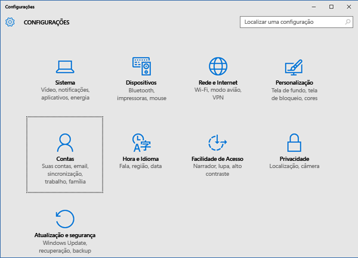

3. Examine as duas próximas telas e localize a que é semelhante ao que você vê em seu dispositivo.Look at the next two screens, and find the one that looks like the one you see on your device. Siga as etapas fornecidas com a tela que você vê em seu dispositivo.Follow the steps that go with the screen that you see on your device.

    Se você vir esta tela, que exibe “Acessar conta corporativa ou de estudante”, siga as instruções em [As etapas a serem seguidas se você vir Acessar conta corporativa ou de estudante](#steps-to-follow-if-you-see-access-work-or-school).If you see this screen, which shows "Access work or school," follow the instructions in [Steps to follow if you see Access work or school](#steps-to-follow-if-you-see-access-work-or-school).

    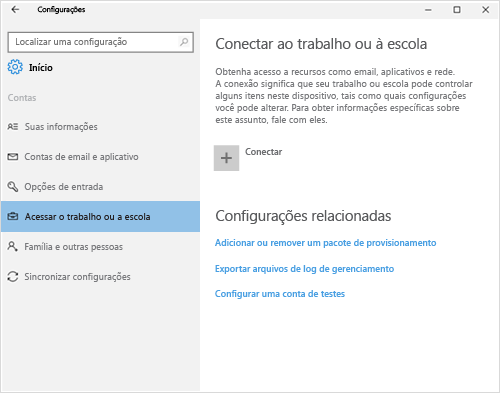

    Se você vir essa tela, que exibe “Acessar conta corporativa”, siga as etapas em [As etapas a serem seguidas se você vir Acessar conta corporativa](#steps-to-follow-if-you-see-work-access).If you see this screen, which shows "Work access," follow the steps in [Steps to follow if you see Work access](#steps-to-follow-if-you-see-work-access).

    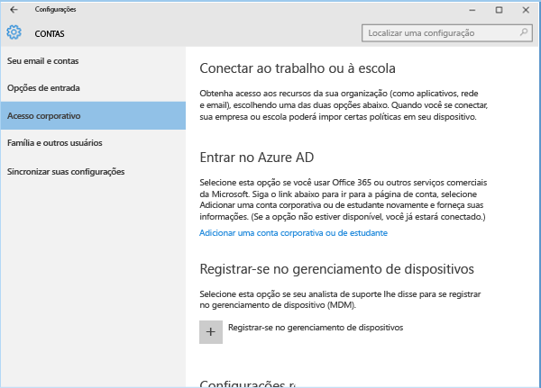

### As etapas a serem seguidas se você vir Acessar conta corporativa ou de estudanteSteps to follow if you see Access work or school

1. Na página **Contas**, escolha **Acessar conta corporativa ou de estudante**.On the **Accounts** page, choose **Access work or school**.

    

2. Escolha sua conta corporativa ou de estudante.Choose your work or school account. Dependendo de como o administrador de TI tiver configurado as coisas, você poderá ver duas contas semelhantes ao exemplo a seguir.Depending on how your IT admin has set things up, you might see two accounts that look similar to the example shown below. Ao lado de uma conta, há uma pasta, ao lado da outra há um logotipo da Microsoft.One account has a briefcase next to it, and the other has the Microsoft logo next to it.

    - Se vir a conta com a pasta, selecione-a e procure um botão de **Informações** abaixo dela.If you see the account with the briefcase, select it, and look for an **Info** button under it.
    - Se vir apenas a conta com o logotipo da Microsoft, selecione a conta e procure um botão de **Informações** abaixo dela.If you see only the account with the Microsoft logo, select the account, and look for an **Info** button under it.

    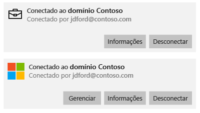

3. Escolha o botão de **Informações**.Choose the **Info** button. É aberta uma caixa de diálogo semelhante ao exemplo a seguir.A dialog opens that looks similar to the example below.

    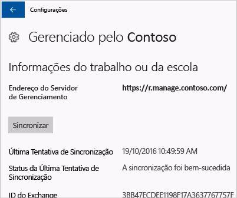

4. Escolha o botão **Sincronizar**.Choose the **Sync** button. O dispositivo será sincronizado com o Intune.Your device will be synced with Intune.

### Etapas a serem seguidas se você vir Acesso corporativoSteps to follow if you see Work access

1. Na página **Contas**, escolha **Acesso corporativo**.On the **Accounts** page, choose **Work access**.

    

2. Na seção **Registrar-se no gerenciamento de dispositivo**, escolha o nome da sua empresa.Under the section **Enroll in to device management**, choose the name of your company.

    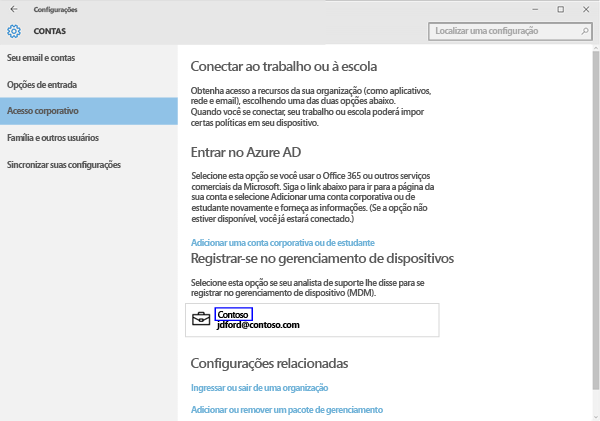

3. Escolha o botão **Sincronizar**.Choose the **Sync** button.

    

   O botão fica esmaecido até que a sincronização seja concluída.The button becomes grayed out until the sync is finished.

### Windows 10 MobileWindows 10 Mobile

Para sincronizar manualmente seu dispositivo Windows 10 Mobile e acelerar uma instalação de aplicativo que está lenta:To manually sync your Windows 10 Mobile device to speed up a slow app installation:

   1. Vá para **Todos os aplicativos** > **Configurações** > **Contas**.Go to **All apps** > **Settings** > **Accounts**.

       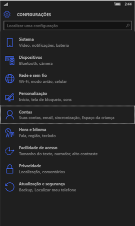

   2. Escolha **Acesso corporativo**.Choose **Work access**.

       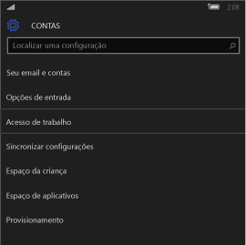

   3. Em **Registrar-se no gerenciamento de dispositivo**, escolha no nome da sua empresa.Under **Enroll in to device management**, choose your company name.

       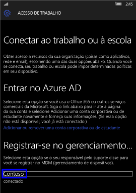

   4. Escolha o ícone **Sincronizar**.Choose the **Sync** icon.

       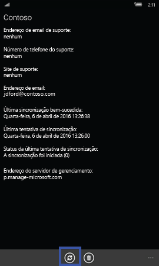

       A mensagem “Estamos sincronizando sua conta” aparece na parte superior da tela.The message “We’re synching your account” appears at the top of the screen. O botão **Sincronizar** fica esmaecido até que o dispositivo termine a sincronização.The **Sync** button is grayed out until your device finishes syncing.

## Windows Phone 8.1Windows Phone 8.1

Para sincronizar manualmente seu dispositivo Windows Phone 8.1 e acelerar uma instalação de aplicativo que está lenta:To manually sync your Windows Phone 8.1 device to speed up a slow app installation:

1. Vá para **Todos os aplicativos** > **Configurações** > **Local de trabalho**.Go to **All apps** > **Settings** > **workplace**.

    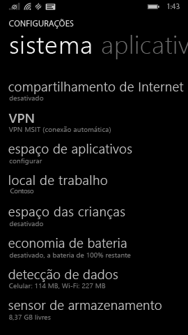

2. Escolha o nome da sua empresa.Choose the name of your company.

    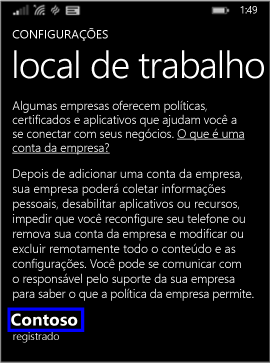

3. Escolha o ícone **Sincronizar**.Choose the **Sync** icon.

    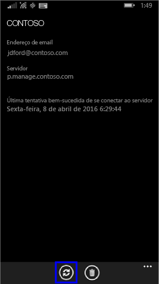

   A mensagem “Estamos sincronizando sua conta” aparece na parte superior da tela até que o dispositivo conclua a sincronização.The message “We’re synching your account” appears at the top of the screen until your device finishes syncing.

Ainda precisa de ajuda?Still need help? Entre em contato com o administrador de TI.Contact your IT admin. Para obter as informações de contato, consulte o [site do Portal da Empresa](http://portal.manage.microsoft.com).For contact information, check the [Company Portal website](http://portal.manage.microsoft.com).
