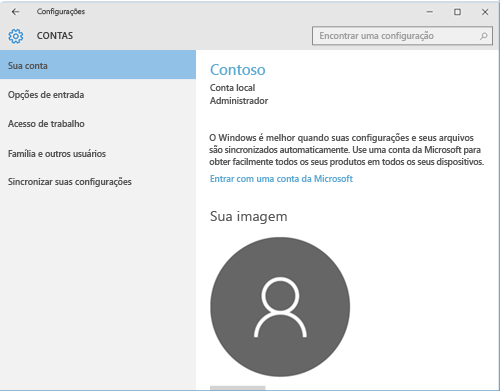
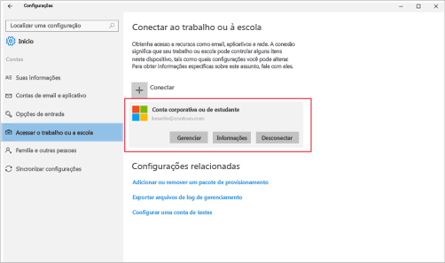

# Solucionar problemas de registro de dispositivo do Windows 10
Se você seguiu as etapas em [Registrar seu dispositivo Windows Mobile 10 ou de área de trabalho do Windows 10 no Intune](enroll-your-w10-phone-or-w10-pc-windows.md), mas ainda não consegue acessar seu email ou arquivos corporativos ou de estudante, tente estas etapas de solução de problemas.

1.  Examine as duas próximas telas e localize a que é semelhante ao que você vê em seu dispositivo. Siga as etapas fornecidas com a tela que você vê em seu dispositivo.

    Se você vir essa tela, siga as etapas em [Etapas de solução de problemas a serem seguidas se você vir Acessar conta corporativa ou de estudante](#troubleshooting-steps-to-follow-if-you-see-access-work-or-school).

    

    Se você vir essa tela, siga as etapas em [Etapas de solução de problemas a serem seguidas se você vir sua conta](#troubleshooting-steps-to-follow-if-you-see-your-account).

    

## Etapas de solução de problemas a serem seguidas se você vir “Acessar conta corporativa ou de estudante”

1.  Se você seguiu as etapas acima, mas ainda não consegue acessar seus emails e arquivos corporativos ou de estudante, vá para **Acessar conta corporativa ou de estudante**.

2. Realize um dos seguintes procedimentos:

    - Se você vir uma conexão semelhante à imagem abaixo, toque nela e verifique se vê as opções Gerenciar, Informações e Desconectar. Se você vir essa opção, estará agora registrado e conectado.

    

    - Se você não vir as informações de conexão mostradas acima ou se as vir, mas não algumas das opções estiverem ausentes, toque em **Conectar** e entre com suas credenciais corporativas ou de estudante. Agora você deve estar conectado.

## Etapas de solução de problemas a serem seguidas se você vir “Sua conta”

Se tiver seguido as etapas acima, mas não conseguir acessar seu email corporativo ou de estudante, arquivos e outros dados, volte para **Contas** e toque em **Acesso corporativo**.

- Se você vir seu trabalho ou conta da escola, parabéns. Você está conectado.

- Se você não ver a sua conta do trabalho ou de estudante, toque em **Conectar** e entre com as suas credenciais corporativas ou de estudante.

## Etapas de solução de problemas a serem seguidas se você vir “Configurar uma conta corporativa ou de estudante”

Se você vir uma mensagem que diz __Não foi possível descobrir automaticamente um ponto de extremidade de gerenciamento correspondente ao nome de usuário inserido. Verifique seu nome de usuário e tente novamente. Se você souber a URL do ponto de extremidade de gerenciamento, insira-o.__, deverá tentar inserir seu nome de usuário e senha novamente. Se ainda não funcionar, verifique com o suporte de sua empresa para obter o site que você precisa fornecer na caixa de texto **Ponto de extremidade de gerenciamento**. Este é um site que provavelmente é semelhante a **www.yourcompany.onmicrosoft.com**.

Ainda precisa de ajuda? Contate o suporte da sua empresa. Para obter as informações de contato, consulte o [site do Portal da Empresa](https://portal.manage.microsoft.com#HelpDeskDialog).
