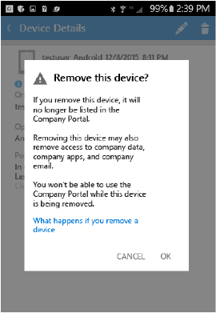

# Como cancelar o registro do dispositivo Android do Intune

Ao cancelar o registro do dispositivo Android do Intune, você não poderá mais acessar os recursos da empresa.  Para obter mais informações sobre o que acontece quando você cancela o registro, confira [What happens if you unenroll your device from Intune?](what-happens-if-you-unenroll-your-device-from-intune-android.md) (O que acontece quando você cancela o registro do seu dispositivo do Intune?)

Para cancelar o registro do dispositivo do Intune e desinstalar o aplicativo Portal da Empresa, siga estas etapas ou assista a este vídeo:

<iframe width="675" height="379" src="https://www.youtube.com/embed/K-Vi7lNfaMk" frameborder="0" allowfullscreen></iframe>

1. Abra seu aplicativo de **Configurações**, abra **Administradores do dispositivo** e desligue o **Portal da Empresa**. Dependendo de seu dispositivo, a configuração **Administradores do dispositivo** pode ser ligeiramente diferente quanto ao nome ou localização na lista de preferências.

2.  Entre no aplicativo Portal da Empresa.

3.  Toque em **Meus Dispositivos** e selecione o dispositivo cujo registro deseja cancelar.

    

4.  Toque no ícone de lixeira.

    

5.  Na página de aviso, toque em **OK** para cancelar o registro de seu dispositivo.

    

Ainda precisa de ajuda? Entre em contato com o administrador de TI. Para obter as informações de contato, consulte o [site do Portal da Empresa](http://portal.manage.microsoft.com).

