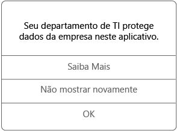

# Usar aplicativos gerenciados no seu dispositivo iOSUse managed apps on your iOS device

Aplicativos gerenciados são aplicativos que o administrador de TI pode configurar para ajudar a proteger os dados da empresa que você pode acessar nesse aplicativo.Managed apps are apps that your IT admin can set up to help protect company data that you can access in that app. Ao acessar dados da empresa em um aplicativo gerenciado no seu dispositivo iOS, você pode perceber que o aplicativo funciona um pouco diferente do esperado.When you access company data in a managed app on your iOS device, you may notice that the app works a little differently than what you expect. Por exemplo, não é possível copiar e colar os dados da empresa protegidos, ou você pode não conseguir salvar esses dados em determinados locais.For example, you might not be able to copy and paste protected company data, or you might not be able to save that data to certain locations.

Diferentes aplicativos gerenciados também podem trabalhar juntos no seu dispositivo para permitir que você possa fazer as tarefas diárias mantendo dados corporativos protegidos.Different managed apps can also work together on your device to allow you to do your daily tasks, while keeping corporate data protected. Por exemplo, se você abre um arquivo da empresa em um aplicativo gerenciado, e o outro aplicativo gerenciado é necessário para exibir o arquivo, o aplicativo gerenciado que permite que você exiba o arquivo é aberto automaticamente.For example, if you open a company file in one managed app, and another managed app is required to view that file, the managed app that allows you to view the file opens automatically. Se um aplicativo necessário não estiver disponível, determinadas ações, como abrir um documento ou acessar um link da Web de dentro de um documento gerenciado, poderão não estar disponíveis.If a required app is not available, certain actions, like opening a document or accessing a web link from within a managed document, might not be available.

Ao acessar dados da empresa em um aplicativo gerenciado, você verá uma mensagem como a mostrada abaixo, que permite que você saiba que o aplicativo que você está abrindo é gerenciado.When you access company data in a managed app, you see a message like the one below, which lets you know that the app you are opening is managed.

### Como obtenho os aplicativos gerenciados?How do I get managed apps?

Você pode obter aplicativos gerenciados de duas maneiras diferentes:You get managed apps in a couple of different ways:

-   Quando o dispositivo é registrado no Microsoft Intune, você instala o aplicativo do seu aplicativo Portal da Empresa ou um site do Portal da Empresa, ou seu administrador de TI pode instalá-lo em seu dispositivo.When your device is enrolled in Microsoft Intune, you either install the app from your Company Portal app or Company Portal website, or your IT admin might install it on your device. Para saber mais sobre o registro, consulte [Registrar o dispositivo iOS no Intune](enroll-your-device-in-intune-ios.md) ou [Registrar o dispositivo macOS no Intune](enroll-your-device-in-intune-macos.md).To learn about enrolling, see [Enroll your iOS device in Intune](enroll-your-device-in-intune-ios.md) or [Enroll your macOS device in Intune](enroll-your-device-in-intune-macos.md).

-   Instale um aplicativo da Windows Store e entre com sua conta de usuário corporativo que é gerenciada pelo Intune.You install an app from the App Store, and then sign in with your corporate user account that is managed by Intune.

### O que meu administrador de TI pode gerenciar em um aplicativo?What can my IT admin manage in an app?

Aqui estão alguns exemplos de opções que seu administrador de TI pode gerenciar em um aplicativo e que podem afetar suas interações com os dados da empresa no dispositivo:Here are some examples of options that your IT admin can manage in an app, and that can affect your interactions with company data on your device:

-   Acesso a sites específicosAccess to specific websites

-   Transferências de dados entre aplicativosTransfers of data between apps

-   Salvando arquivosSaving files

-   Operações de copiar e colarCopy and paste operations

-   Requisitos de acesso do PINPIN access requirements

-   Suas credenciais, usando as credenciais da empresaYour sign in, using company credentials

-   Capacidade de fazer backup para a nuvemAbility to back up to the cloud

-   Capacidade de fazer capturas de telaAbility to take screenshots

-   Requisitos de criptografia de dadosData encryption requirements

Para obter mais informações sobre os aplicativos gerenciados em seu dispositivo, entre em contato com seu departamento de TI.Contact your IT admin for more information about the managed apps on your device. Para obter as informações de contato, consulte o [site do Portal da Empresa](http://portal.manage.microsoft.com).For contact information, check the [Company Portal website](http://portal.manage.microsoft.com).
