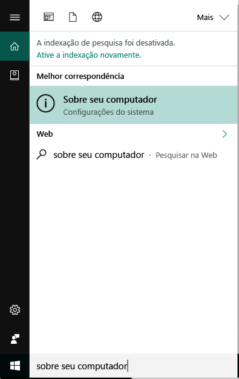
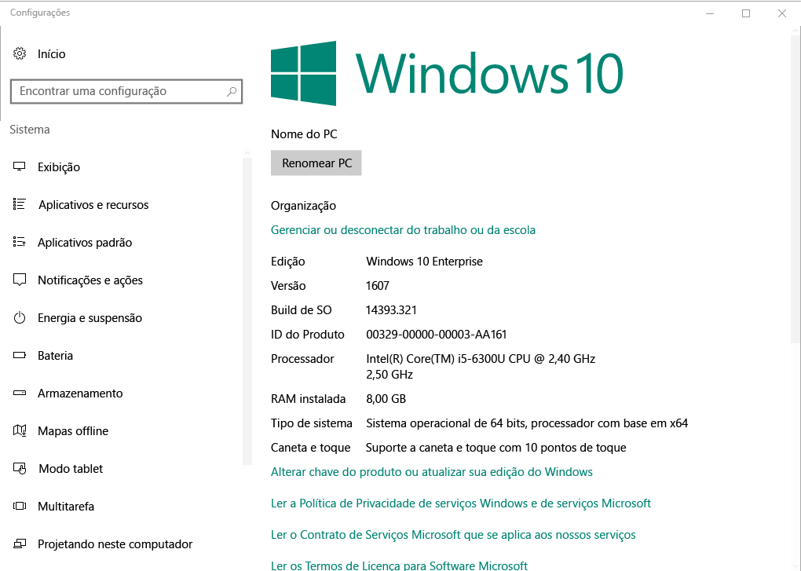

# Registro de dispositivo Windows no Portal da Empresa do Intune  

Registre seu dispositivo Windows no aplicativo do Portal da Empresa do Intune para obter acesso seguro aos aplicativos de trabalho e escola, emails e arquivos. Se sua organização exigir ou recomendar determinados aplicativos, como o Office ou o OneDrive, você vai recebê-los durante o registro ou eles estarão disponíveis no Portal da Empresa após o registro.  

Você pode registrar dispositivos Windows 10 por meio do site do Portal da Empresa *ou* aplicativo. Se você estiver registrando um dispositivo com uma versão anterior do Windows, deverá registrar o dispositivo por meio do site do Portal da Empresa.  

## Instalar o aplicativo do Portal da Empresa  
Talvez você já tenha o aplicativo do Portal da Empresa instalado no seu dispositivo. Procure o aplicativo na sua lista __Todos os aplicativos__.  Se você não vir o Portal da Empresa na sua lista de aplicativos, siga essas etapas para instalá-lo.  

1. Abra a **Microsoft Store** em seu dispositivo.

2. No campo **Pesquisar**, digite **Portal da Empresa**.

3. Na lista de resultados, selecione **Portal da Empresa** > **Instalar**.

4. Selecione **Instalar** ou **Gratuito**. Não há nenhuma diferença entre essas duas opções. As palavras aparecem com base em como a sua organização configura o aplicativo.  

## Localizar o número de versão do Windows 10  
Etapas de registro variam para diferentes versões de dispositivos Windows 10. As etapas a seguir descrevem como localizar o número de versão em dispositivos móveis e desktop Windows 10. Após saber qual é sua versão, continue para as etapas de registro recomendadas.  

### Dispositivos com Windows 10 Desktop  

1. Vá até **Iniciar**.

2. Na barra de pesquisa, digite a frase "sobre seu PC." Selecione __Sobre seu PC__ nos resultados.  

     

3. Role para baixo até **Especificações do Windows** para localizar a **Versão** do Windows 10 que está instalada em seu computador.  

     

4. Se a sua versão for  

    * __1607 ou posteriores__: registre seu dispositivo por meio da rota [**Configurações** > **Conta** > **Acessar o trabalho ou a escola**](enroll-windows-10-device.md#enroll-windows-10-version-1607-and-later-device).   
    * __1511 ou anteriores__: registre seu dispositivo por meio da rota [**Configurações** > **Conta** > **Suas contas**](enroll-windows-10-device.md#enroll-windows-10-version-1511-and-earlier-device).  

### Dispositivos com Windows 10 Mobile

1. Acesse __Todos os aplicativos__ e selecione o aplicativo __Configurações__.
2. Selecione __Sistema__ > __Sobre__.
3. Em __Informações do Dispositivo__, localize a __Versão__.  
4. Se a sua versão for  

    * __1607 ou posteriores__: registre seu dispositivo usando a rota [**Configurações** > **Acessar o trabalho ou a escola**](enroll-windows-10-device.md#enroll-windows-10-version-1607-and-later-device).   
    * __1511 ou anteriores__: registre seu dispositivo usando a rota [**Configurações** > **Contas**](enroll-windows-10-device.md#enroll-windows-10-version-1511-and-earlier-device).  

## Registrar dispositivos não Windows 10  
Use os artigos a seguir para registrar outros dispositivos compatíveis com Windows por meio do site do Portal da Empresa:   
* [Dispositivo Windows 8.1 ou Windows RT 8.1](enroll-your-W81-or-rt81-windows.md)  
* [Dispositivo Windows Phone 8.1](enroll-your-wp81-windows.md)    

## Suporte do administrador de TI  
Se você for um administrador de TI e encontrar problemas durante o registro de dispositivos, confira [Solucionando problemas de registro de dispositivo do Windows no Microsoft Intune](https://support.microsoft.com/help/4469913). Este artigo lista erros comuns, suas causas e etapas para resolvê-los.  

## Próximas etapas  
Agora que você sabe que os dispositivos compatíveis e o número de versão do seu Windows 10, vá para o artigo de registro recomendado.  
 
Para obter mais informações sobre o gerenciamento de dispositivo, o Portal da Empresa e como ambos são usados nas escolas e no trabalho, consulte os seguintes artigos:  
* [Usar dispositivos gerenciados para acessar recursos corporativos ou de estudante](use-managed-devices-to-get-work-done.md)  
* [O que acontece quando você registra seu dispositivo no Intune](what-happens-if-you-install-the-company-portal-app-and-enroll-your-device-in-intune-windows.md)  
* [Quais informações minha organização poderá ver quando eu registrar meu dispositivo?](what-info-can-your-company-see-when-you-enroll-your-device-in-intune.md)  

Precisa de ajuda? Contate o suporte da sua empresa. [Acesse o site do Portal da Empresa](https://go.microsoft.com/fwlink/?linkid=2010980) para localizar as informações de contato da equipe de TI da sua organização.  
