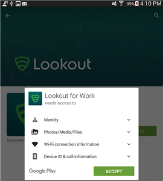
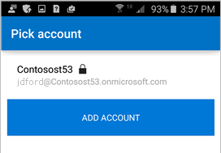

# Instalar o Lookout for Work

Antes de poder acessar seu trabalho, o suporte de sua empresa exige que você instale o aplicativo Lookout for Work, que ajuda a proteger seu dispositivo localizando possíveis ameaças à segurança.

Se tiver problemas com a instalação, tente seguir as etapas de solução de problemas no final deste tópico.

## O que você deve fazer

1.  Arraste para baixo da parte superior da tela para abrir a barra de Notificações e toque em **Aplicativo necessário – Instalar Lookout for Work da Play Store**.

  

2.  Você será levado à página de instalação do Lookout for Work na Play Store. Instale o Lookout for Work e toque em **ACEITAR** para permitir que o Lookout for Work acesse seu dispositivo.

  

3. Abra o Lookout for Work e toque em **ATIVAR**.

  

4. Toque em **Entrar no Azure Active Directory** e digite a conta que você usa para acessar email e arquivos corporativos ou de estudante.

  

5. Selecione a conta que você usa para acessar seus arquivos e email corporativo ou de estudante e toque em **ADICIONAR CONTA**.

  

6. Toque em **Aceitar** para dar ao Lookout for Work permissão para entrar e ler seu perfil. Será exibida uma tela mostrando que o Lookout for Work está se conectando com a Lookout Security Cloud.

  

7. Examine os itens sobre como o Lookout protege seu dispositivo e toque em **OK**.

  

  Quando você vir a tela a seguir, o Lookout está instalado e conectado.

  

  O Lookout for Work começa imediatamente a verificar se há ameaças à segurança em seu dispositivo. Se nenhuma ameaça for encontrada, você verá a tela a seguir.

  

  A tela Detalhes do Dispositivo no Portal da Empresa mostra que agora você está em conformidade com os requisitos de segurança da empresa.

    

  Se o Lookout for Work encontrar uma ameaça à segurança em seu dispositivo, você verá instruções para corrigir o problema.

## Se a instalação não funcionar

Às vezes, as instalações podem falhar devido a problemas técnicos fora de seu controle. Se isso acontecer, tente instalar o Lookout for Work [manualmente na Play Store](https://play.google.com/store/apps/details?id=com.lookout.enterprise).

Ainda precisa de ajuda? Contate o suporte da sua empresa. Para obter as informações de contato, consulte o [site do Portal da Empresa](https://portal.manage.microsoft.com#HelpDeskDialog).

