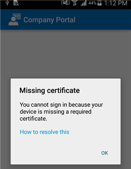

# Seu dispositivo Android não tem um certificado que normalmente vem instalado no telefoneYour Android device is missing a certificate that usually comes installed on your phone

Se o dispositivo não estiver registrado no Intune e não tiver um certificado que normalmente vem instalado no telefone, você não conseguirá entrar no aplicativo Portal da Empresa.If your device isn’t enrolled in Intune, and it’s missing a certificate that usually comes installed on your phone, you won’t be able to sign in to the Company Portal app. Quando você tentar entrar, verá a seguinte mensagem:When you try to sign in, you’ll see the following message:

É possível corrigir esse problema obtendo o certificado necessário na [página de certificados do Digicert](https://www.digicert.com/digicert-root-certificates.htm).You can fix this issue by getting the required certificate from [Digicert's certificate page](https://www.digicert.com/digicert-root-certificates.htm).

1. Encontre e baixe o certificado __Baltimore CyberTrust Root__.Find and download the __Baltimore CyberTrust Root__ certificate. Também é possível baixá-lo diretamente [aqui](https://www.digicert.com/CACerts/BaltimoreCyberTrustRoot.crt).You can also download it directly from [here](https://www.digicert.com/CACerts/BaltimoreCyberTrustRoot.crt).

2. Arraste para baixo da parte superior da tela para exibir a lista das notificações recentes e toque em **BaltimoreCyberTrustRoot.crt**.Drag down from the top of the screen to display the list of your recent notifications, and tap **BaltimoreCyberTrustRoot.crt**.

3. Seu dispositivo solicitará que você **Nomeie o Certificado**.Your device will ask you to **Name the Certificate**. Não altere o nome padrão do certificado exibido.Do not change the default certificate name that appears.

4. Certifique-se de que o **Uso da Credencial** é definido como **Usado para aplicativos e VPN**, e, em seguida, toque em **OK**.Ensure that **Credential Use** is set to **Used for VPN and apps**, and then tap **OK**.

    

5. Feche o navegador e o aplicativo Portal da Empresa.Close your browser and the Company Portal app.

6. Abra o aplicativo Portal da Empresa.Reopen the Company Portal app. Agora, você poderá entrar no aplicativo Portal da Empresa.You should now be able to sign in to the Company Portal app. Se você ainda não conseguir usar o aplicativo Portal da Empresa, contate o administrador de TI usando as informações fornecidas no [site do Portal da Empresa](http://portal.manage.microsoft.com) para obter mais instruções.If you still cannot use the Company Portal app, contact your IT admin using the information provided on the [Company Portal website](http://portal.manage.microsoft.com) for further instructions.

>[!NOTE]
> Se a instalação desse certificado não resolver o problema e você receber outra mensagem “Certificado ausente”, será necessário realizar etapas adicionais para [instalar o certificado ausente](your-device-is-missing-an-IT-required-certificate-android.md).If installing this certificate doesn't solve the issue, and you see a different "missing certificate" message, you will need to take additional steps to [install the missing certificate](your-device-is-missing-an-IT-required-certificate-android.md).

Ainda precisa de ajuda?Still need help? Entre em contato com o administrador de TI.Contact your IT admin. Para obter as informações de contato, consulte o [site do Portal da Empresa](http://portal.manage.microsoft.com).For contact information, check the [Company Portal website](http://portal.manage.microsoft.com).
