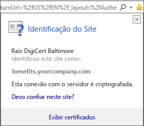
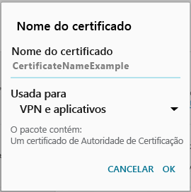

# O dispositivo Android não tem um certificado exigido pelo suporte de sua empresa

Se o dispositivo não estiver registrado no Intune e não tiver um certificado específico exigido pelo suporte de sua empresa, você não conseguirá entrar no aplicativo Portal da Empresa. Quando você tentar entrar, verá a seguinte mensagem:

Para corrigir esse problema e obter o certificado necessário, há duas etapas principais que você deve realizar:

- Identificar o certificado que está faltando procurando em um computador corporativo ou de estudante.
- Usar seu dispositivo para baixar o certificado que está faltando da Internet.

## Identificar o certificado que está faltando procurando em um computador corporativo ou de estudante

1. Em um computador, abra o Internet Explorer. Se você não tiver um computador para usar para essa finalidade, entre em contato com o suporte de sua empresa. Para obter as informações de contato do suporte de sua empresa, consulte o [site do Portal da Empresa](https://go.microsoft.com/fwlink/?linkid=2010980).

2. Acesse o [site do Portal da Empresa](https://go.microsoft.com/fwlink/?linkid=2010980) e entre usando suas credenciais corporativas ou de estudante.

3. Na extremidade direita da barra de endereços do navegador, escolha o símbolo que se parece com um cadeado, conforme mostrado a captura de tela abaixo.

    

    Se você não vir o símbolo de cadeado, pare e entre em contato com o suporte de sua empresa. O cadeado significa que você está conectado com segurança, portanto, você não deve continuar a menos que veja esse símbolo.

4. Escolha **Exibir certificados**.

    

5. Na caixa de diálogo **Certificado**, escolha a guia **Caminho de certificação** e identifique o certificado que precisa ser obtido da Internet. O nome do certificado de que você precisa estará na mesma posição que o que está realçado na captura de tela de exemplo anterior.

## Baixar e instalar o certificado que está faltando em seu dispositivo móvel Android

1. Usando um mecanismo de pesquisa como o Bing ou o Google, pesquise o nome do certificado que está faltando identificado na seção anterior. O certificado pode terminar com “extensões” diferentes, como ".crt" ou ".pem" etc.

2. Baixe o certificado raiz do site.

3. Após o certificado ser baixado, arraste a parte superior da tela para baixo para abrir suas notificações e toque no nome do certificado na lista de notificações.

4. Na caixa de diálogo **Nome do Certificado** mostrada na captura de tela abaixo, aceite o nome de certificado padrão.

5. Certifique-se de que o **Uso da Credencial** é definido como **Usado para aplicativos e VPN**, e, em seguida, toque em **OK**.

    

6. Feche o aplicativo Portal da Empresa.

7. Abra o aplicativo Portal da Empresa. Agora, você poderá entrar no aplicativo Portal da Empresa. Se precisar de ajuda, entre em contato com o suporte de sua empresa.

Se você vir a mesma mensagem de “certificado faltando” mostrada acima e já tiver seguido o procedimento, provavelmente ainda há outro certificado que o suporte de sua empresa precisará ajudá-lo a instalar. Contate o suporte de sua empresa para obter ajuda usando as informações de contato disponíveis no [site do Portal da Empresa](https://go.microsoft.com/fwlink/?linkid=2010980).
